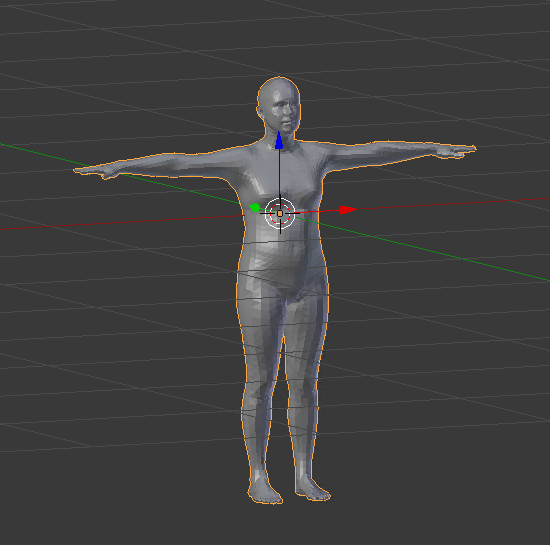
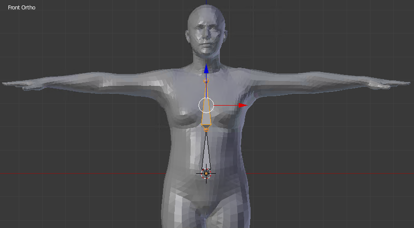
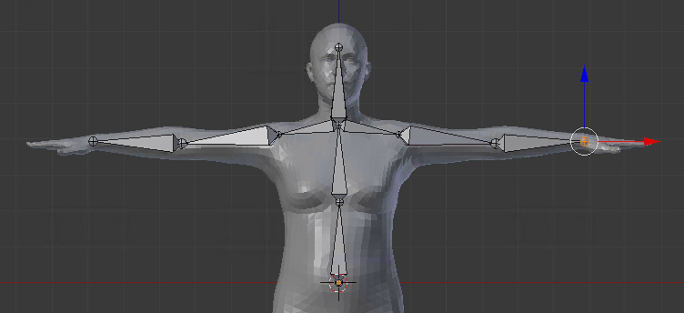
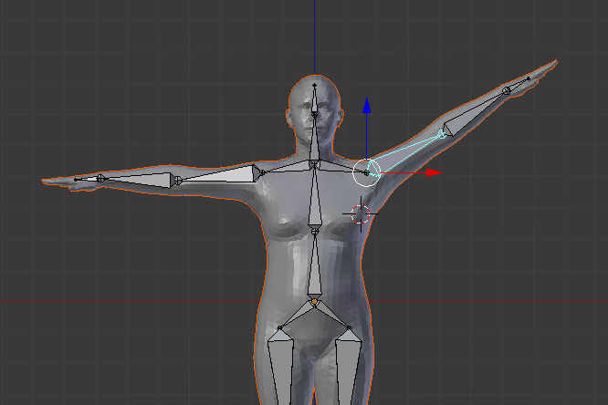
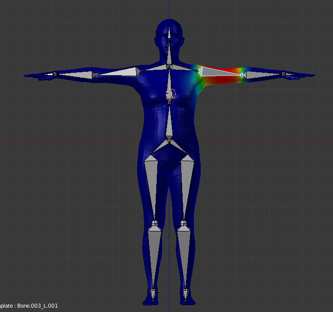
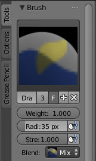

基于静态模板的方法是2010年左右人体重建领域最具代表性的方法。在这篇文章里，我们使用Blender2.79对人体网格模型进行骨架绑定，并使用Linear Blending Skinning（LBS）实现骨架驱动网格模型变形。

## 骨架构建

首先，我们要按照人体网格模型构建一个合适的骨架。我们以SMPL模型作为例子，将初始的SMPL obj模型导入Blender工作台。（这里也可以使用[PhotoScan](https://www.agisoft.com/)等三维扫描软件生成自己想要的个性化模型）



可以看到初始导入的SMPL模型原点是位于胸口正中间，为了让绑定的模型更加统一，我们要将模型原点放到根节点位置。所以，我们首先将模型沿Z轴移动一段距离，让盆骨（pelvis）大致落在坐标轴的原点。然后我们将Blender的游标也放置在坐标轴原点。在物体模式下选择我们的obj模型，**ctrl+shift+alt+c**选择将原点置于游标处。这样obj模型就以盆骨为原点了。

接下来开始建立骨骼。在坐标原点处按**shift+A**，添加一段骨骼。为了更好地进行可视化，我们在右侧的工具栏中打开透视模式。然后选择骨骼后按**TAB**键可以对骨骼的大小和方向进行操作。另外，按**N**键可以显示当前选择的骨骼的各项参数。




完成第一根骨骼的大小调整后，选择骨骼的尾端，按**E**可以生成子级骨骼，然后将子级骨骼调整到脖子的位置。

我们用同样的方法生成头部骨骼后，需要对手臂和腿进行骨骼生成。由于手臂是左右对称的，所以我们选择骨骼按**T**，在选项中打开X轴镜像。生成子级骨骼时使用**shift+E**。可以看到同时生成的是对称的骨骼。



同样的方式生成腿部骨骼后，骨骼的构建就完成了。


## 骨架绑定

完成骨骼构建后，我们首先选择OBJ模型，然后再选中的状态下按**shift**并点击选择骨架


然后按**Ctrl+P**，选择骨架形变-自带权重绑定。点击之后Blender会自动计算模型顶点与骨骼的权重。此时，我们已经利用Blender实现了骨骼与人体模型的绑定。选中骨骼后选择姿态模式，拉动骨骼，我们可以看到模型也随之发生了形变。形变之后，我们可以选择骨骼按A键选中所有骨骼，**Alt+R**可以将变形后的骨骼恢复到初始状态。



## 权重绘制

由于SMPL是一个裸体模型，因此没有类似裙子之类的非刚性部分。但如果有的话，用之前的自动权重计算可能会导致裙子之类的部分权重不正确，导致不正常的形变。因此，还需要手动对权重进行调整。我们首先选中物体，然后选择权重绘制模式。此时，我们选择每一根骨骼的时候，对应的部分就出出现由蓝到红的颜色。越红表示权重越大，其顶点位置的变化也受该骨骼的影响越大。



按T打开工具中的笔刷，调整权重。其中1代表红色，0代表蓝色。然后按F调整笔刷大小，然后使用笔刷对想要调整的部分进行调整。



## 导出参数

在绑定骨架后，我们已经完成了使用Blender来自动计算蒙皮权重，接下来可以使用自己编写的脚本来按照自己的方式导出各项参数，用于其他任务。 在Blender中，所有的对象都在bpy模块中，我们可以调用这个模块来导出我们想要的参数。

```
import bpy
a = bpy.data.objects[skeleton] # skeleton为定义的骨骼名称
ob_main = bpy.data.objects[mesh] # mesh为定义的网格模型名称
```

## 蒙皮

导出参数后，我们可以用代码来控制模型，用于优化匹配等任务，此处是用LBS来变形模型的结果。

