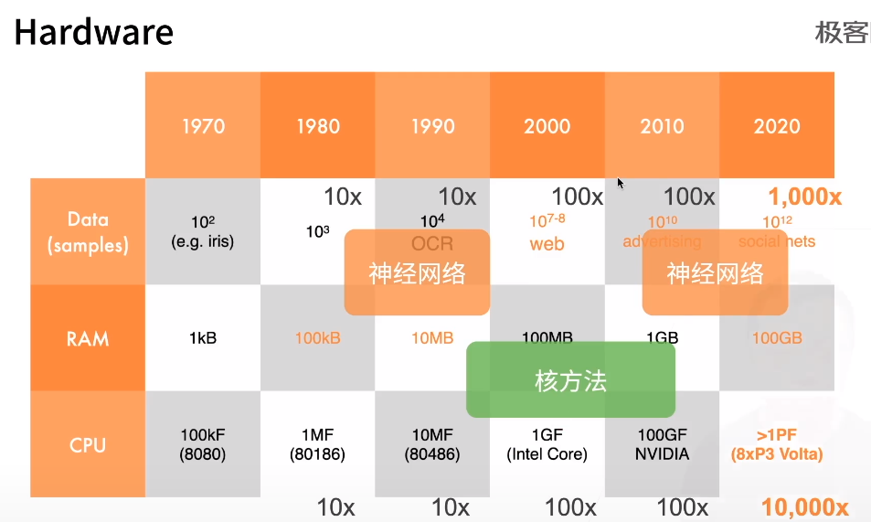
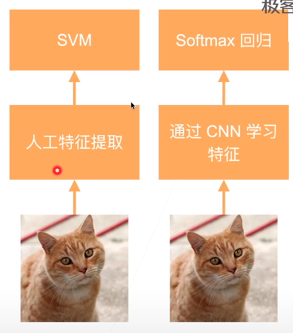
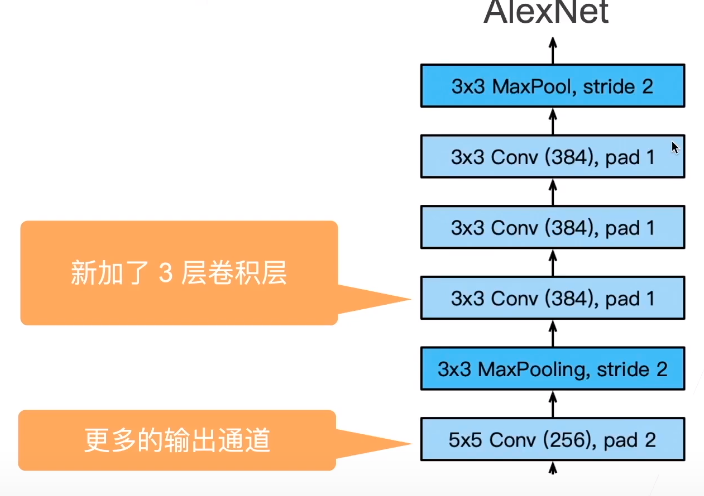
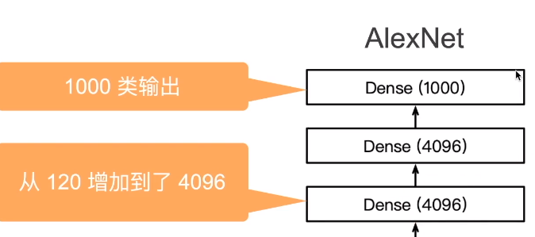
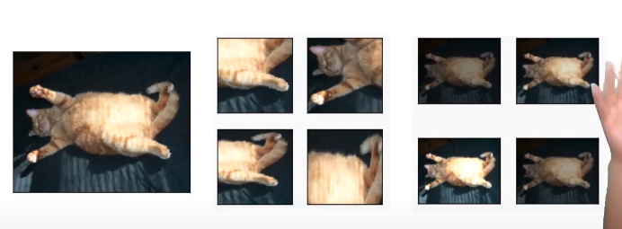
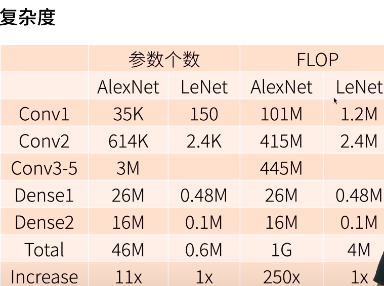

* 2000年的机器学习

  * 特征提取
  * 选择核函数计算相关性
    * 怎么判断在高维空间两个点相关
      * 线性模型 -- 累积
      * 核方法 -- 变换空间成需要的
  * 凸优化问题
  * 漂亮的定理

* 计算机视觉

  * 几何学
    * 抽取特征
    * 描述几何（例如多相机拍摄）
    * （非）凸优化
    * 漂亮定理
    * 如果假设满足，效果好

* 硬件发展

  * 

* 数据

  * ImageNet（2010）

    * 与mnist对比

    * | 图片   | 自然物体的彩色图片 | 手写数字的黑白图片 |
      | ------ | ------------------ | ------------------ |
      | 大小   | 469x387            | 28x28              |
      | 样本数 | 1.2m               | 60k                |
      | 类别数 | 1000               | 10                 |

  * AlexNet
    * 赢了2012年ImageNet竞赛
    * 更深更大的LeNet
    * 主要改进
      * 丢弃法
      * ReLu
      * MaxPooling
    * 计算机视觉方法论的改变
      * 

* 架构

  * 与LeNet的区别
  * 更大的池化窗口，使用最大池化层
  * 更大的核窗口和步长，因为图片更大了
  * 
  * 
  * 更多细节
    * 激活函数从sigmoid变成了ReLu（减缓梯度消失）
    * 隐藏全连接层后加入了丢弃层
    * 数据增强
    * 
  * 复杂度
    * 

* 总结

  * AlexNet是更大更深的LeNet，10x参数个数，260x计算复杂度
  * 新加入丢弃法，ReLU，最大池化层和数据增强
  * AlexNet赢了2012ImageNet竞赛，标志新一轮神经网络热潮开始

