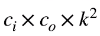
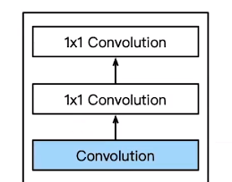
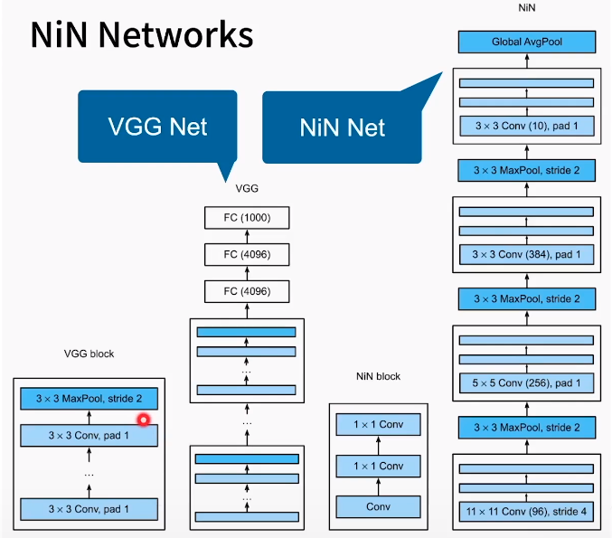

* 全连接层的问题

  * 卷积层参数较少
  * 但卷积层后第一个全连接层参数
    * LeNet 165x5x5x120 = 48k
    * AlexNet 256x5x5x4096 = 26m
    * VGG 512x7x7x4096 = 102m
  * 带来的问题
    * 占用很多内存
    * 占用很多计算带宽
    * 容易过拟合

* NiN思想：不使用全连接层

  * NiN块

    * 一个卷积层后跟两个全连接层

      * 步幅1，无填充，输出形状跟卷积输出一样

      * 起到全连接层的作用

      * 

        * 唯一的作用：通道做一些混合

        * 唯一不同：对每个像素进行全连接

          

* NiN架构
  * 无全连接层
  * 交替使用NiN块和步幅为2的最大池化层
    * 逐步减小高宽和增大通道数
  * 最后使用全局平均池化得到输出
    * 其输入通道数是类别数
  * 

* 总结
  * NiN块使用卷积层加两个1x1卷积层
    * 后者对每个像素增加非线性 性质
  * NiN使用全局平均池化层来替换VGG和AlexNet中的全连接层
    * 不容易过拟合，更少的参数个数

