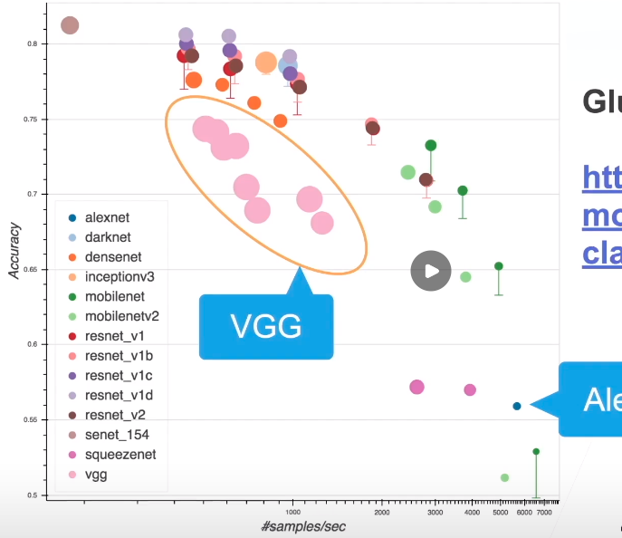

* AlexNet的问题
  * 不规则（一个变大的LeNet） 结构不够清晰
* VGG -- 重新定义更大更深的规则
  * AlexNet比LeNet更深更大得到更好的精度
  * 选项
    * 更大的全连接层（参数多，内存消耗大）
    * 更多的卷积层
    * 将卷积层组合成块

* VGG块（将相同的层堆积起来，参考了AlexNet的结构，实际上对输入输入大小没有影响）
  * 深 vs 宽？
    * 5x5卷积
    * 3x3卷积
    * 深但窄效果更好（3x3）
  * VGG块采用形式
    * 3x3卷积（填充1）（n层，m通道） 第一部分
    * 2x2最大池化层（步幅2） 第二部分
* VGG架构
  * 多个VGG块后接全连接层
  * 不同次数的重复块得到不同架构VGG-16（16个卷积层），VGG-19...
  * 最大的改进：将Alex中相对于LeNet新加的一块抽出来当做一个模式VGG块，接着去除最后那两个不那么规则的东西 替换成全连接层 

---

* 进度
  * LeNet（1995）
    * 2卷积+池化
    * 2全连接层
  * AlexNet
    * 更大更深
    * ReLu，Dropout，数据增强
  * VGG
    * 更大更深的AlexNet（重复VGG块）
* Model Zoo  评价一个模型的好坏
  * x轴是每秒能处理的数据个数
  * y轴是准确度
  * 
* 总结
  * VGG使用可重复使用的卷积块来构建深度卷积神经网络
  * 不同的卷积块个数和超参数可以得到不同复杂度的变种

