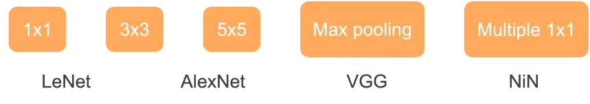
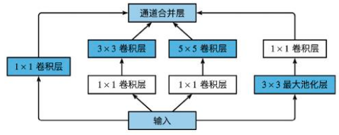
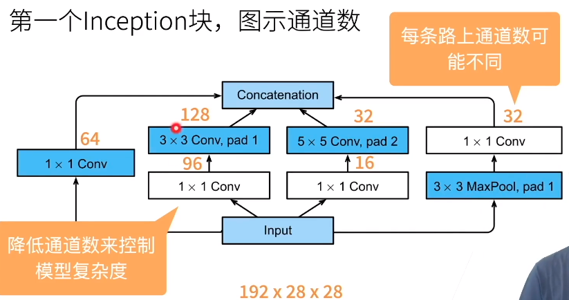
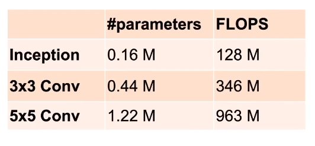
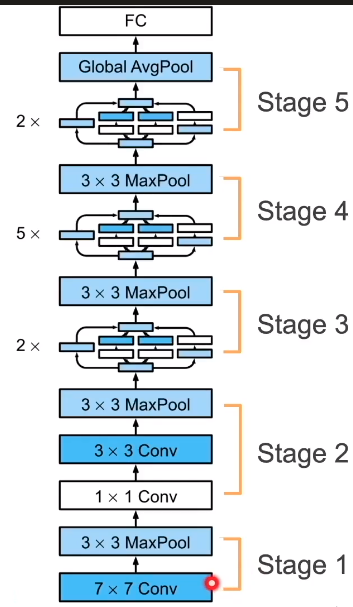
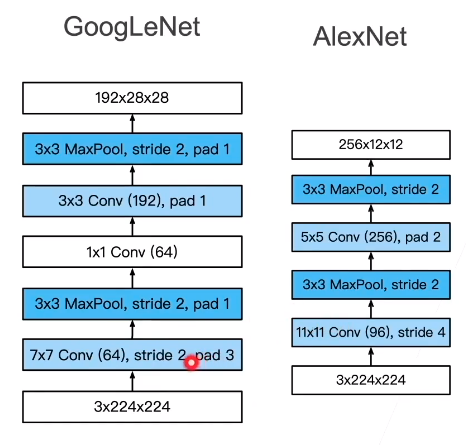
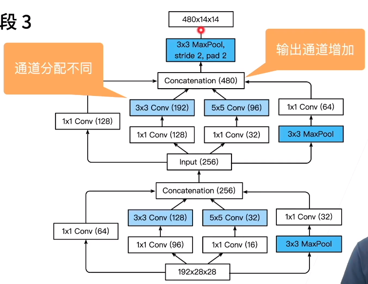
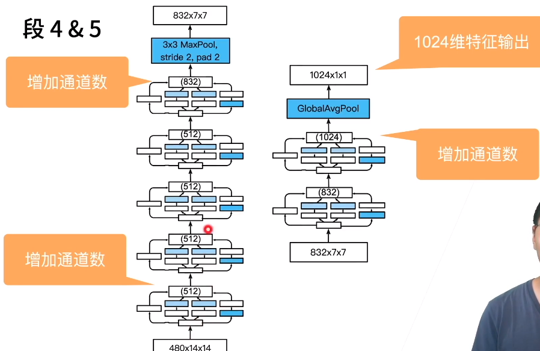

##### 含并行连结的网络（GoogLeNet）

* 最好的卷积层超参数？
  * 
  * 这么多东西，到底用谁最好呢？
* Inception块（全都要）
  * 出自盗梦空间，一层嵌套一层
  * 4个路径从不同层面抽取信息，然后在输出通道维合并
    * 
    * 输入处copy成四块
      * 输入接到一个1x1的卷积层
      * 通过1x1卷积层对通道数进行变换（不改变高和宽），再输入到一个3x3的卷积层（pad=1，使得输出和输入等高宽）
      * 通过1x1卷积层做通道变换，再输入到一个5x5的卷积层使得第一个输入输出等高宽
      * 通过3x3最大池化（pad=1），再加一个1x1卷积层
    * 最后在输出的通道数上合并

---

* 第一个Inception块
  * 
  * 白色框==变化通道数
  * 蓝色框==抽取信息
  * 数字怎么来的呢
    * 64+128+32+32=256
    * 192--->256
    * 每个通道==识别模式
    * 重要的数据给重要的通道
  * 跟单3x3或5x5卷积层相比，Inception块有更少的参数个数和计算复杂度
    * 
    * 并且增加了多样性
* 整体设计
  * 5段，9个Inception块
    * 
    * 段1&2
      * 更小的窗口 更多的通道
      * 
      * 更多的保留宽和高，能支撑用更深的网络
    * 段3
      * 超参数的搜索，所以没有规律可言
      * 
    * 段4&5
      * 
      * 超参数过多，难以复现
      * 最后将一张图片抽取成一个1024维的向量

---

* Inception的后续变种
  * Inception-BN（v2）- 使用batch normalization（后续有）
  * Inception-V3 - 修改了Inception块
    * 替换5x5为多个3x3卷积层
    * 替换5x5为1x7和7x1卷积层
    * 替换3x3为1x3和3x1卷积层
    * 更深
  * Inception-V4 - 使用残差连接（后面讲解）

* 总结
  * Inception块用4条不同超参数的卷积层和池化层来抽取不同信息
    * 一个主要优点是模型参数小，计算复杂度低
  * GoogLeNet使用了9个Inception块，是第一个达到上百层的网络
    * 后续有改进