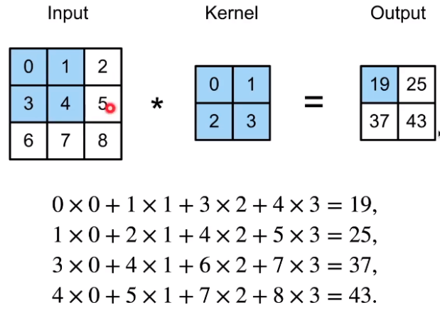
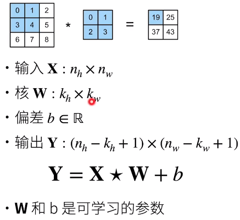
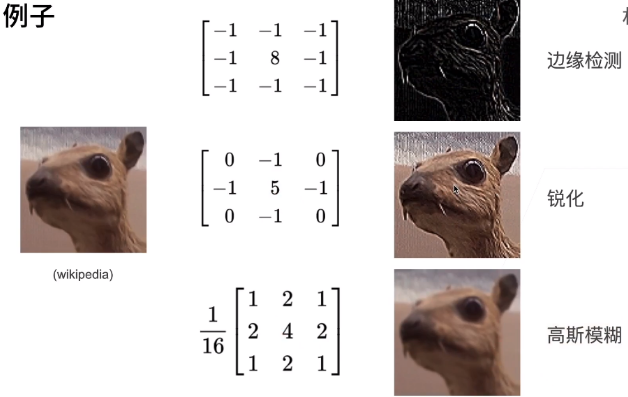
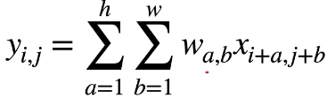
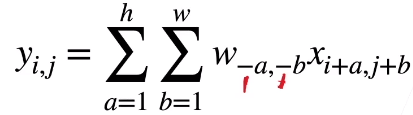
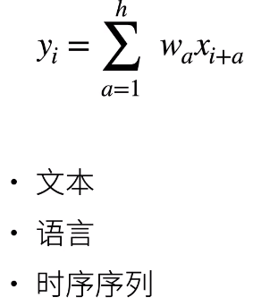
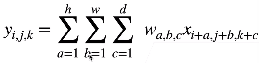

* 二维交叉相关
  * 
  * 核心不变 -- 平移不变性（核与输入的位置无关）
  * 输出只用了2x2的窗口 -- 局部性（只看了一部分）
* 二维卷积层
  * 
    * 输出丢掉kh-1和kw-1
  * 
* 交叉相关 VS 卷积
  * 二维交叉相关
    * 
  * 二维卷积
    * 
  * 由于对称性，实际使用中没有任何区别
* 一维和三维交叉相关
  * 一维	
    * 
  * 三维
    * 
      * 视频
      * 医学图像
      * 气象地图

* 总结
  * 卷积层将输入和核矩阵进行交叉相关，加上偏移后得到输出
  * 核矩阵和偏移都是可学习的参数
  * 核矩阵的大小是超参数

