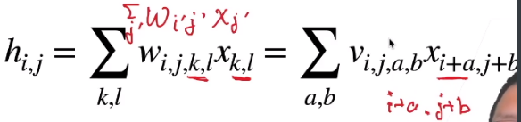
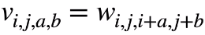
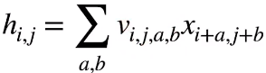
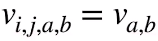
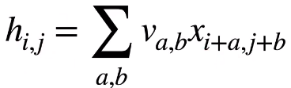
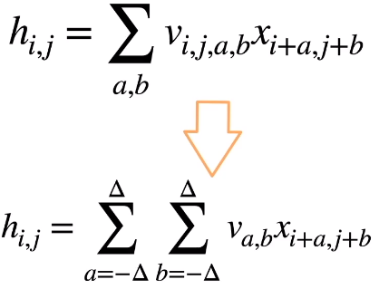

* 分类猫和狗的图片
  * 使用一个还不错的相机采集图片（12m像素）
  * RGB图片有36m元素（3600万，36million百万）
  * 使用100大小的单隐藏层MLP，模型有3.6B（3.6billion，billion10亿）元素
    * 每个隐藏层单元接收36m的特征
    * 远多于世界上所有猫和狗的总数（900m狗，600m猫）
* 回顾：单隐藏层MLP（数量级太大，做不了）

* 图片识别器找模式的特征：
  * 平移不变性
    * 在图片的任何地方，能够识别出一个东西
  * 局部性
    * 看局部的信息就能识别出
* 卷积：特殊的全连接层
  * 重新考察全连接层
    * 将输入和输出变形为矩阵（宽度，高度）
    * 将权重变形为4-D张量（h，w）到（h',w'）
      * 输入的高宽 -> 输出的高宽
      * 
    * V是W的重新索引
* 运用原则#1 平移不变性
  * x的平移导致了h的平移
    * v是用来识别图片的识别器（权重）
    * i,j变化不能引起v发生变化
  * v不能依赖与(i,j)
  * 解决方案：
    * 
    * 把前两个维度抹去
    * 对权重做出限制  -> 模型复杂度降低
* 运用原则#2 局部性
  * 
  * 评估hi,j时，不应该使用原理xi,j的参数
  * 解决方案：取其邻域范围即可。当|a| , |b| > △，使得va,b= 0

* 总结
  * 对全连接层使用平移不变性和局部性得到卷积层
    * 
