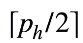
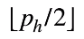
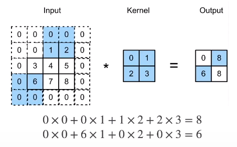
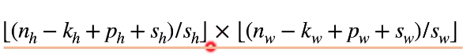
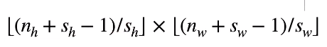

* 控制输出大小的两个超参数
  * 填充
    * 问题所在
      * 给定输入图像（32x32）
      * 应用5x5大小的卷积核
        * 第一层得到输出为28x28（32-5+1）
        * 第七层得到输出为4x4
      * 更大的卷积核可以更快的减小输出大小
        * 形状从nhxnw减少到（nh-kh+1）x（nw-kw+1）
    * 使用方法
      * 在输入周围添加额外的行/列
        * 填充ph行和pw列，输出形状为（nh-kh+ph+1）x（nw-kw+pw+1）
        * 通常取ph=kh-1，pw=kw-1
          * 当kh为奇数：在上下两侧填充ph/2
          * 当kh为偶数：在上侧填充，在下侧填充
  * 步幅
    * 问题所在
      * 填充减小的输出大小与层数线性相关
        * 给定输入大小为224x224，在使用5x5卷积核的情况下，需要44层将输出降低到4x4
        * 需要大量计算才能得到较小的输出
    * 使用方法
      * 步幅是指行/列的滑动步长
        * 例如：高度3 宽度2的步幅
          * 
      * 给定高度sh和宽度sw的步幅，输出形状是
        * 
      * 如果ph=kh-1，pw=kw-1
        * 
      * 如果输入高度和宽度可以被步幅整除
        * （nh/sh）x（nw/sw）
* 总结
  * 填充和步幅都是卷积层的超参数
  * 填充在输入周围添加额外的行/列，来控制输出形状的减少量
  * 步幅是每次滑动核窗口时的行/列的步长，可以成倍的减少输出形状

