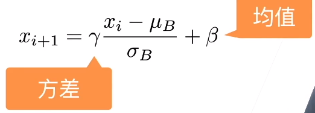

#### 深层神经网络

* 损失函数在最后，后面的层训练较快
  * 下面数据往上走forward函数
  * 上面往下面求导backward
    * 梯度在上面时会比较大
    * 越往下越小
      * 很多时候是n个很小的数字相乘  肯定是越来越小
* 数据在最底部
  * 底部层训练较慢
    * 上层梯度大，训练很快就收敛
  * 底部一变化，上面层也要跟着重新学习多次
  * 导致整体收敛变慢
* 怎么在学习底部层的时候避免变化顶部层？

---

* 批量归一化
  * 核心思想：
    * 整个数据的分布在不同层之间有会有变化
    * 把分布限定住
  * 固定小批量里面的均值和方差
    * 
  * 然后在再做额外的调整（可学习的参数）
    * 

* 批量归一化层
  * 可学习的参数为γ和β
  * 作用于
    * 全连接层和卷积层输出上，激活函数前
      * 放在relu前，防止又被置为正数
    * 全连接层和卷积层输入上
  * 对全连接层，作用于特征维
    * 对每一个特征计算一个标量的均值、方差
    * 将这个特征分布变成均值为0，方差为1
  * 对卷积层，作用于通道维
    * 样本数=批量大小x高x宽
    * 整个批量中所有的像素都是一个样本（对这个分布做一个归一化）
    * 对应的通道就是特征  
    * 1x1卷积就是将其拉成一个二维矩阵然后再做一个全连接层

* 具体是在做什么？
  * 最初是想用来减少内部协变量转移
    * 用今天的数据拟合明天，可能整个分布变化
  * 后来支持可能通过在每个小批量中加入噪音来控制模型复杂度
    * 
  * 没必要与丢弃法混合使用

* 总结
  * 固定小批量中的均值和方差，然后学习出适当的偏移和缩放
  * 可以加速收敛时间，但一般不改变模型精度