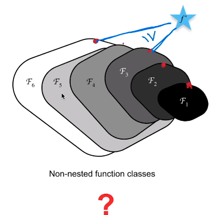
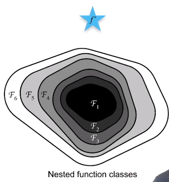
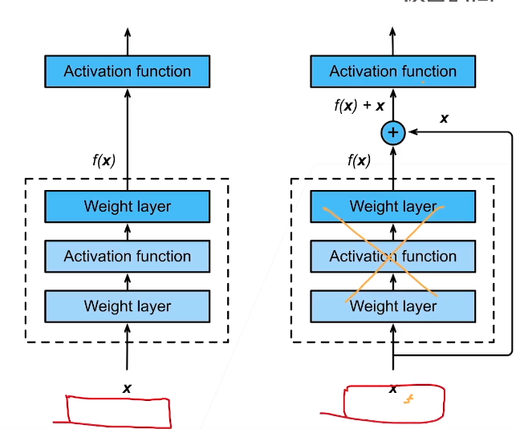
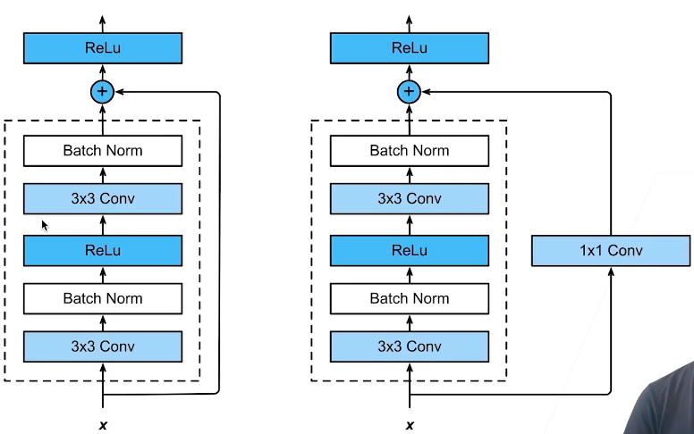
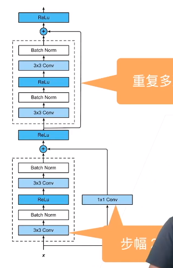
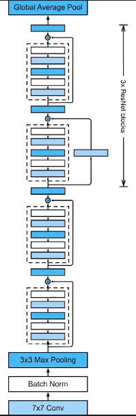

##### 加更多的层总是改进精度吗？

* 
  * f*是最优值，f1是函数，函数大小代表函数的复杂程度
  * 若模型很简单，只能覆盖住f1的一块区域
  * 可以将模型变复杂， 学习到更多区域
  * 这里最好的点离最优值越来越远了
    * 模型偏差
* 更好的方法
  * 每次都包含上次的模型，严格意义上学到的模型都会比前面要大
  * ResNet的想法，永远不会变得更差
  * 

---

#### 残差块

* 串联一个层改变函数类，希望能扩大函数类
* 残差块加入快速通道（右边）来得到f(x)=x+g(x)结构
  * 还是能得到原来的x，g(x)随便做一点有用的事情，就能把区域变大
    * 
    * 这里的f(x)是新加的层，即使不用这层，也能得到原来的输出x
* ResNet本身的定义
  * 把残差直接传递过去，使得梯度计算更快
  * 可以看做这个网络允许嵌入比之前更小一点的网络
* 细节
  * 
  * 1x1卷积做通道变换
* ResNet块
  * 高宽减半ResNet块（步幅2）
  * 后接多个高宽不变ResNet块
  * 

* ResNet架构
  * 类似VGG和GoogLeNet的总体架构
  * 但替换成了ResNet块
  * 

* 总结
  * 残差块使得很深的网络更加容易训练
    * 甚至可以训练一千层的网络
  * 残差网络对随后的深层神经网络设计产生了深远影响，无论是卷积类网络还是全连接类网络