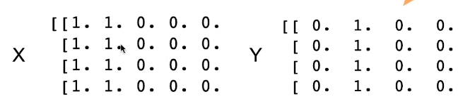
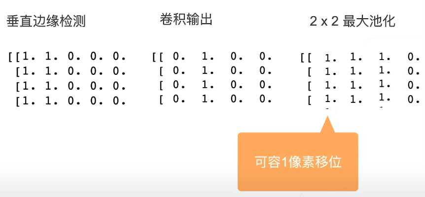
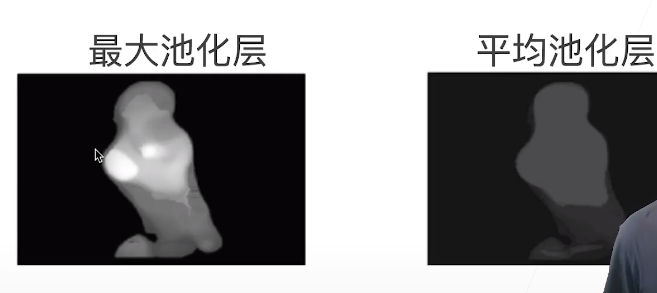

* 池化层 产生原因
  * 卷积层对位置很敏感
    * eg：检测垂直边缘
      * 
      * 这里使用1x2的卷积核（1，-1），就会将0-1的边缘检测出来 如Y
  * 我们又需要一定程度的平移不变性
    * 照明、物体位置、比例和外观等等因图像而异

* 二维最大池化
  * 返回滑动窗口中的最大值
    * 
    * 
      * ps：这里进行了卷积之后再进行池化，第三列都是0而不是1（图片错误）
* 填充、步幅和多个通道
  * 池化层和卷积层都有填充和步幅
  * 没有可以学习的参数
  * 每个输入通道应用池化层以获得响应的输出通道
  * 输出通道数=输入通道数
    * 多通道融合可以交给卷积层

* 最大池化层：每个窗口中最强的模式信号
* 平均池化层：将最大池化层中的“最大”操作替换成“平均”
  * 

* 总结
  * 池化层返回窗口中最大或者平均值
  * 缓解卷积层对位置的过于敏感
  * 同样有窗口大小、填充和步幅作为超参数