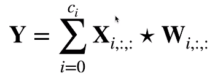
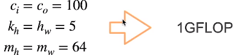

* 多输入通道
  * 特点
    * 彩色图像可能有RGB三个通道
    * 转换为灰度会丢失信息
  * 每个通道都有一个卷积核，结果是所有通道卷积结果的和
    * 
    * 输入X：ci x nh x nw
    * 核心W：ci x kh x kw
    * 输出Y：mh x mw
      *  
  * 无论有多少输入通道，目前为止我们只用到单输出通道
  * 可以有多个三维卷积核，每个核生成一个输出通道
    * 
* 多输入和输出通道
  * 每个输出通道可以识别特定模式
    * 
  * 输入通道核识别并组合输入中的模式
* 1x1卷积核
  * 不识别空间模式，只融合通道
  * 
  * 相当于输入形状为nh nw x ci，权重为co x ci的全连接层

---

* 二维卷积层 Y = X ☆ W + B
  * 输入X：ci x nh x nw
  * 核W：co x ci x kh x kw
  * 偏差B：co x ci
  * 输出Y：co x mh x mw
  * 计算复杂度（浮点计算数FLOP）O（cicokhkwmhmw）
    * 
  * 10层，1M样本，10PFlops

* 总结
  * 输出通道数是卷积层的超参数（可以通过1x1卷积核来控制）
  
  * 每个输入通道有独立的二维卷积核，所有通道结果相加得到一个输出通道结果
  
  * 每个输出通道有独立的三维卷积核
  
    

