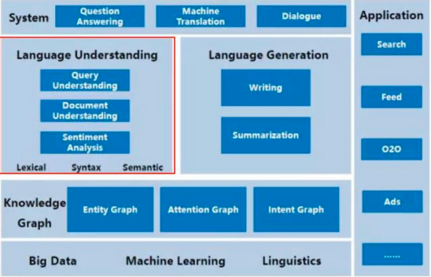
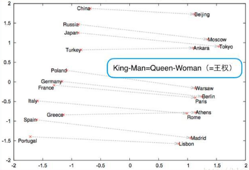
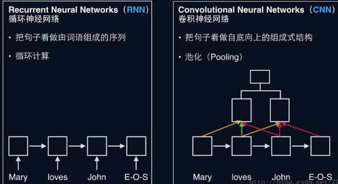

* NLP（自然语言处理）目的：让计算机理解和生成人类语言
  * NLU（自然语言理解）
    * 目标：让机器具备人的语言理解能力
    * 分类：
      * 文本分类/情感分析
        * 本质是分类问题，较为成熟，难点在于多标签分类（即一个文本对应多标签，把所有标签找到）以及细粒度分类（二极情感分类精度最高，即好中差三类，而五级情感分类精度仍然低，即好、较好、中、较差和差）
      * 信息抽取
        * 从不规则文本中抽取需要信息，包括命名实体识别、关系抽取、事件抽取等
      * 序列标注
        * 文本中每一个字/词打标签，如粉刺、词性标注、关键词抽取、命名实体识别、语义角色标注
        * 稳定为BiLSTM-CRF体系
      * 指代消歧
        * 将文本中的代词（他，这个等等），还原成其所指实体
      * 句法分析
        * 分为**句法结构分析**和**依存句法分析**两种
      * 机器阅读理解
      * 文本聚类
        * 如何表示文本以及如何度量文本间的距离
  * NLG（自然语言生成）
    * 自动摘要
      * 给定文本，聚焦最核心部分，自动生成摘要
    * 机器翻译
      * 跨语种翻译，较为成熟
    * 问答系统
      * 接受自然语言表达问题，返回自然语言表达回答。
      * 常见形式
        * 检索式、抽取式和生成式
        * 交互式  典型应用 智能客服
    * 对话系统
      * 与问答系统很多相通
      * 区别 
        * 问答要给出精确回答，不要求回答的口语化
        * 对话要用口语化的自然语言方式解决用户问题
      * 类型
        * 闲聊式
          * siri、小冰
        * 任务导向式
          * 车载聊天机器人

---

##### 自然语言处理架构图

* 
  * NLP=处理阶段+NLU（自然语言理解）+理解后的应用
  * 上面图片的理解
    * 最底部：基础，作为支撑：大数据、机器学习和语言学
    * 往上：知识图谱
      * 含义：从不规则文本中提取结构化信息，并以可视化的形式将实体间以某种方式联系
      * 本身不具有应用意义，建立在其基础的知识检索、知识推理和知识发现才是研究方向
        * 实体图谱
        * 注意力图谱
        * 意图图谱
    * 再往上：左侧语言理解、右侧语言生成
    * 最上方：系统层面，包含问答系统、机器翻译和对话系统
    * 最右侧：各种应用场景：搜索、feeds流、O2O、广告等等
* NLP难点
  * 语言歧义性
    * 我要去拉萨
      * 火车票？
      * 飞机票？
      * 音乐？
      * 景点查询？
  * 语言鲁棒性
    * 错字
    * 多字/少字
    * 别称（“熊大熊二”--熊出没）
    * 不连贯（“我要看那个恩琅琊榜”）
    * 噪音
  * 知识依赖
    * 大鸭梨（水果/餐厅）
    * 七天（时间/酒店）
  * 语境
    * 对话上下文
    * 用户画像
* NLP的解决方案
  * 规则方法（CFG、JSGF）
    * CFG. Context-Free Grammer 上下文无关语法
  * 统计方法  Word Embedding的作用
    * 词汇的语言属性
      * 
  * 深度学习 句子表示的方法
    * 
* NLP是AI的最大瓶颈；语言生成是NLP最前沿 

