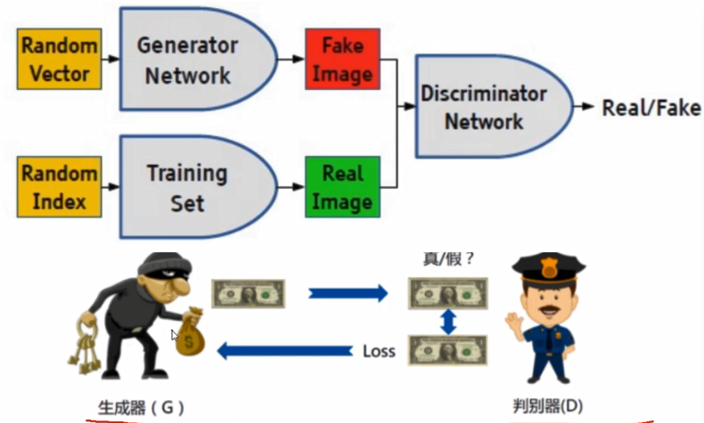
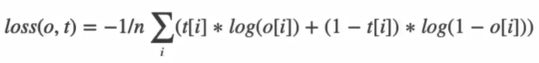
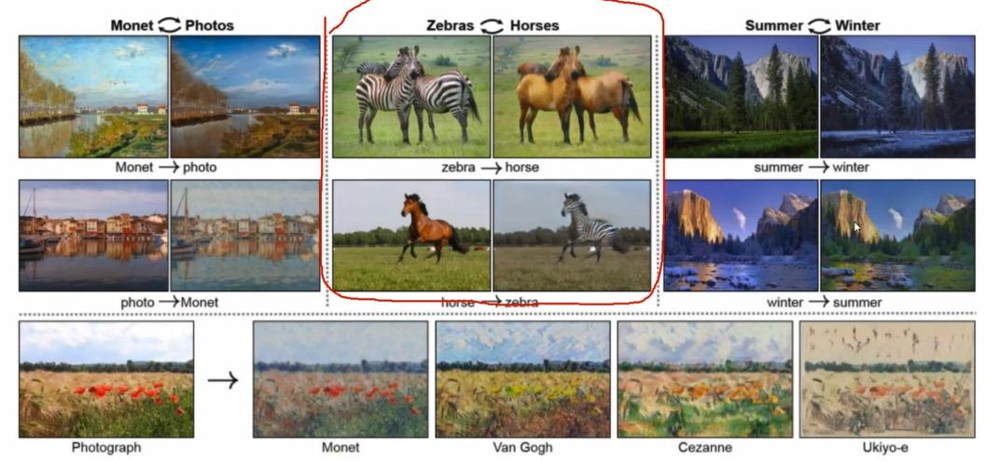
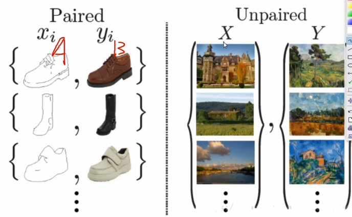
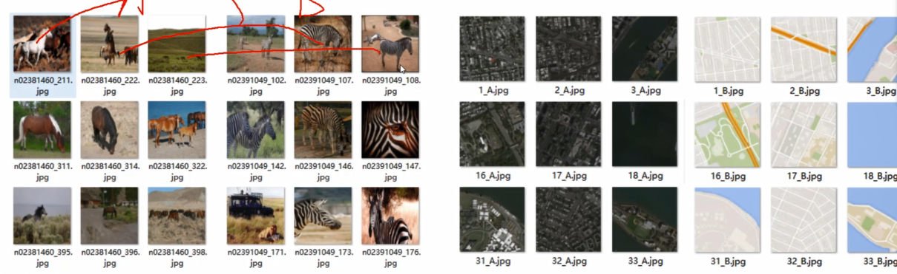
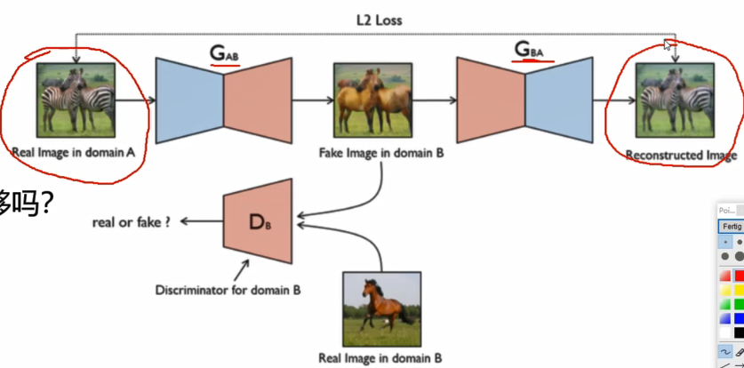
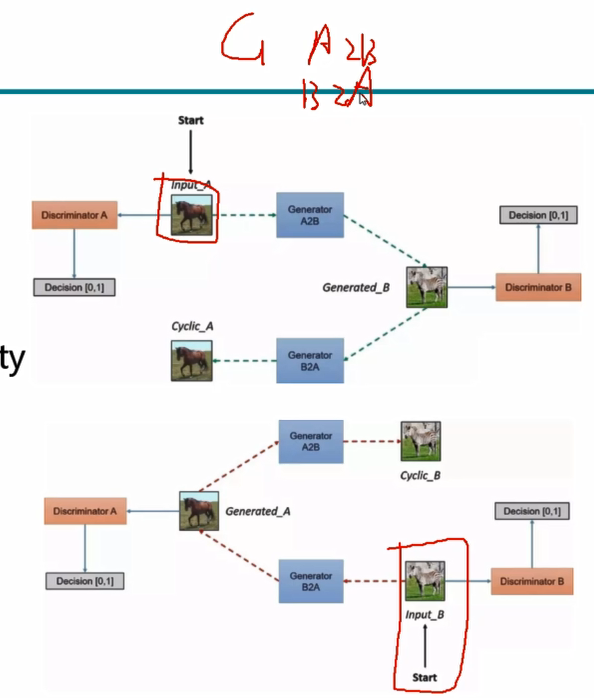
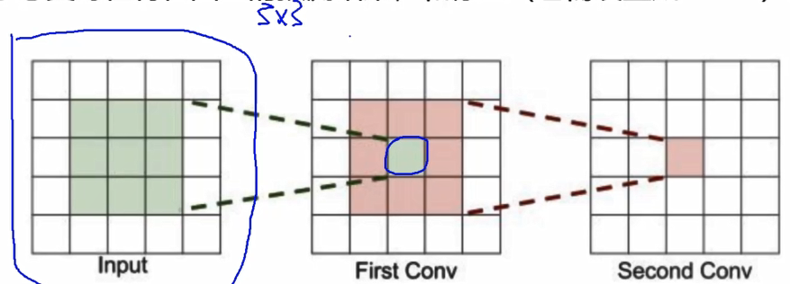

##### 对抗生成网络

* 生成
  * 给定目标和数据
  * 计算机学习

* 生成器目标
  * 骗过判别器（越真越好）
* 判别器目标
  * 判别出真假

> 二分类任务

#### loss损失函数决定网络真正要做的事情（走向）

* 交叉熵

#### CycleGan

* 达到效果
  * 
* 数据构建
  * 需要配对的AB图像？
    * 
  * 不配对怎么训练？
  * 输入数据
    * 只需要两组图像数据集即可，无需指定对应关系，例如马和斑马
    * 
  * 对抗网络如何学习？
    * 需要2对G和D网络
    * 一个单项网络足够
    * 
    * Gab将斑马合成马，Gba将马还原成斑马
      * L2 loss输入和输出之间逐像素点之间的差异（作为损失项）

* 整体网络架构
  * 
  * 四个网络
    * Gab，Gba，Da，Db
      * Gab a->b的生成网络
      * Gba b->a的生成网络
      * Da 判别a的判别网络
      * Db 判别b的判别网络
    * 4个损失函数
      * G，D网络
      * Cycle 
        * G网络生成后恢复的图像与原始输入图像逐像素对比
      * Identity 映射
        * G(马->斑马)要能识别出输入是斑马，这是生成的斑马图像和输入斑马图像应该越小越好
      * D网络与之前不太一样，PatchGAN
        * PatchGAN输出NxN的矩阵，基于感受野来计算损失
        * 基于感受野在特征图上的预测结果和标签（也需设置为nxn）
          * 感受野
            * 最后特征图中一个点，能看到原始输入的区域
          * 构造标签时，需要跟结果是
        * 

##### visdom可视化

> 1. pip install visdom
> 2. python -m visdom.server