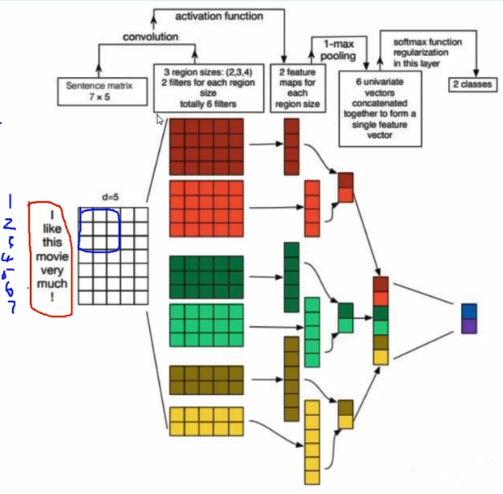

##### CNN用于文本分类

> CNN并没有要求输入为图像，3维即可

* 构建输入数据
* 卷积

###### 步骤

1. 将每个词语转换成同一个维度的向量
   1. 一行表示一个词语
2. 指定卷积核为nx5
   1. 按照词向量长度固定
   2. 2x5则会存在一个上下文
   3. 选定3种规则的卷积核（进行不同的特征提取）
      1. 得到不同的特征图
         1. 相同规格卷积核（不同参数也可以进行不同的特征提取）
   4. 得到特征图规则不同
      1. 进行最大池化（与当前特征图大小一致）
      2. 得到相同规格特征
3. 连接一个全连接层或是什么层
   1. 进行分类还是预测任务