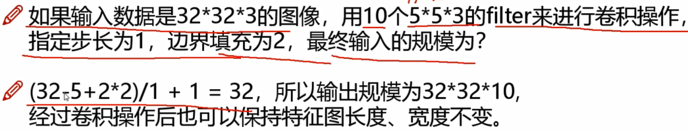
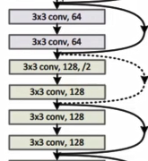

#### 卷积网络与传统网络区别

* 
  * 处理的都是三维数据h  w  c

##### 整体架构

* 输入层
  * 原始图像数据
* 卷积层
  * 提取特征
* 池化层
  * 压缩特征
* 全连接层

---

##### 卷积做了什么事？

* 对图像进行分割成多个小区域
* 选择一种计算方法（卷积核）对每个小区域计算其特征值
  * 随机初始化一种权重参数（卷积核）
  * 权重参数w可学习
  * 内积==对应位置相乘，所有值相加
* 得到特征图

##### 图像颜色通道

* 对RGB三个通道分别做卷积运算
* 最后将三个特征值相加
* 

##### 特征图个数

* 不同的filter计算得到不同的特征图（特征提取）

* 

  

##### 只做一次卷积就ok？

* 堆叠的卷积层
  * 
  * 中间卷积层使用6/10个不同的filter执行卷积，得到6/10个不同的特征图

##### 重要参数

* 滑动窗口步长
  * 
  * 步长小==慢慢提取特征（细粒度）
  * 得到特征比较丰富
* 卷积核尺寸
  * 选择区域大小
  * 卷积核越小==细粒度提取
* 边缘填充
  * 越往边界的点，被最终结果利用的次数越少
  * 使得其被利用的更多
  * 为什么是0填充
    * 让填充的东西不会对结果产生影响
* 卷积核个数
  * 要得到的特征图个数
  * 每个卷积核参数都不一样

##### 卷积结果计算公式

* 长度：
* 宽度：
* w1、h1表示输入宽度、长度；w2、h2表示输出特征图宽度、长度；F表示卷积核长和宽的大小；s表示滑动窗口的步长；p表示边界填充（几圈0）
* 

##### 卷积参数共享

* 用同样一组卷积核，对图像中每个小区域进行特征提取，核中的值不变
* 

---

#### 池化层（筛选操作）

* 
  * 下采样/特征压缩
  * 将重要的特征留下来 （筛选）
* 最大池化
  * 将小区域中最大的值留下（大的值说明该值比较重要）（权重计算出来的）
  * 
* 平均池化（不太行）

---

##### 网络架构

* 
* 带参数计算才算一层（权重与偏置）
* 特征图变化
  * 
    * 转换：将3维转成向量输入全连接层

#### 经典网络

* Alexnet
  * 
  * 
* VGG
  * 卷积核3x3（细粒度特征提取）
  * 在池化后会损失特征，通过下次卷积增加通道数弥补
  * 
* Resnet √（当作特征提取的方法）
  * 深层遇到的问题
    * VGG20层比56层效果更好
    * 
  * 解决方案
    * 既要保持层数，也不能让表现差的层影响
    * 
    * 同等映射(identity)
      * 如果加进这一层效果不好（loss高）， 将这层参数为0（不用这一层）
        * 效果至少不会比原来差
      * 同等映射==兵分两路
        * 一个跳过（不用）该层，一个使用（相加）该层
    * 
      * 特征图个数发生改变
        * 虚线代表进行一个1x1卷积（特征图个数翻倍）

---

#### 感受野

* 
  * 当前值是由前面多少个值参与计算得到
* 若堆叠3个3x3的卷积层，保持滑动窗口步长为1，其感受野就是7x7的，跟使用一个7x7卷积核结果一样，为什么非要堆叠3个小卷积
* 

