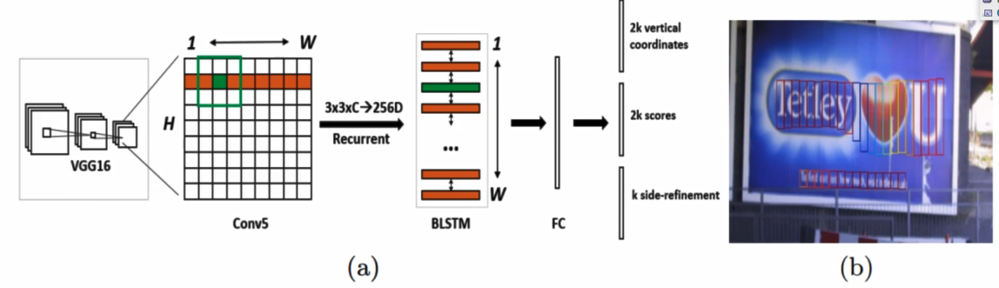

#### 能做什么

* 提取图像中文字，转换成文本形式，供后续NLP任务使用

#### 怎么提取

* 检测文字所在位置（定位）（CTPN）
* 识别文本区域内容（CRNN）

---

* CTPN（connectionist text proposal network）算法
  * 文本检测本质上算物体检测，但文本与常规物体有较大区别
  * 特点
    * 文本通常水平书写，字之间宽度大致相同
    * 固定宽度，检测文本高度即可，如何应对变长序列？
    * 本质是RPN方法（参考faster-rcnn），可将检测到的框拼在一起
  * 网络架构
    * VGG提取特征，BLSTM融合上下文信息，基于RPN检测
      * BLSTM双向序列神经网络
    * 
    * 

