#### 递归神经网络

> 考虑时间序列
>
> 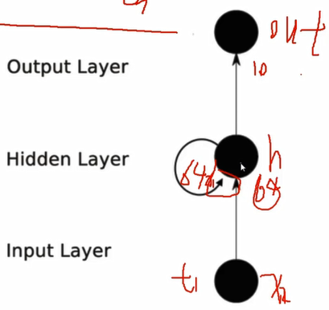
>
> * 隐层中多了一个往回连的圈
> * 前一个时刻隐层产生的特征（数据的一种特殊表达） 会对后一时刻产生影响
>   * x2输入到隐层时，x1产生的中间特征（h1）也会输入，同时决定x2的隐层输出
> * 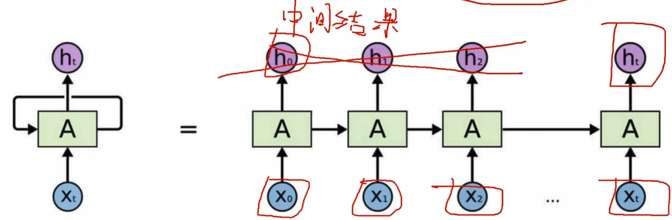

##### LSTM网络

> RNN记忆能力太强（最后结果会把前面所有结果都记忆）
>
> LSTM让其忘记一些特征
>
> 在RNN基础上进行**改进**，加上**C参数（控制单元：模型复杂度）**

* 重要组件
  * 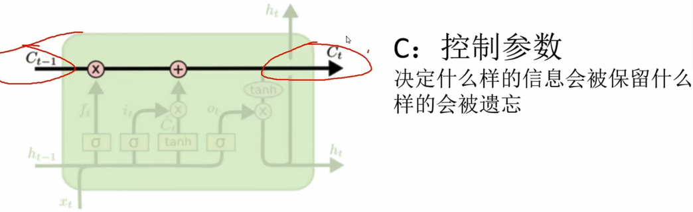
  * 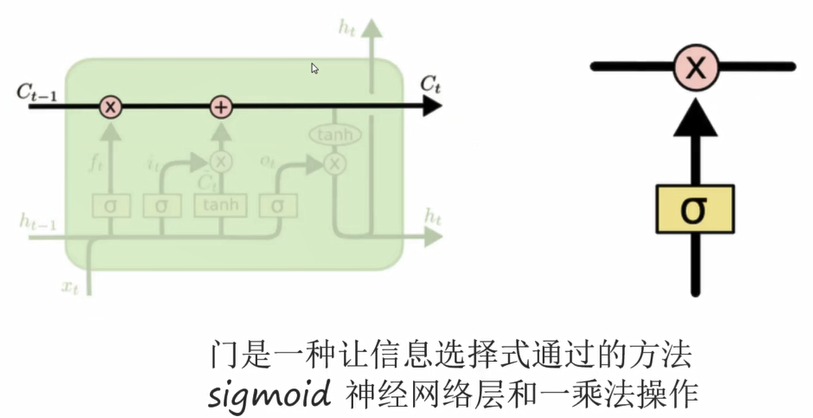
  * 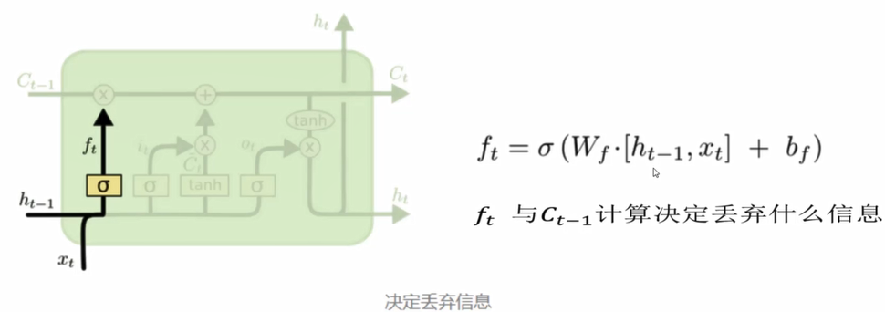

##### 自然语言处理 --- 词向量模型 -- Word2Vec

> 让计算机更好的认识文本
>
> 1. 考虑词之间有**前后顺序**
> 2. 考虑**词之间相关性**
>    1. 词义越相近，特征间距离越小

* 实现以上目标的做法
  * 文本向量化
    * 描述一个事物 -- 50-300维
    * 维度越高，提供信息越多，计算结果越可靠
    * 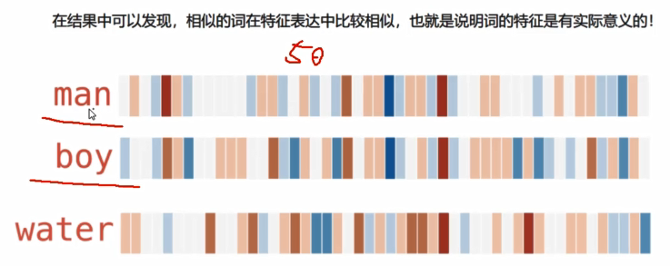

* 训练词向量
  * 模型去学一个词用什么样的向量表达是最**合适**
    * 满足上面两个要求
  * 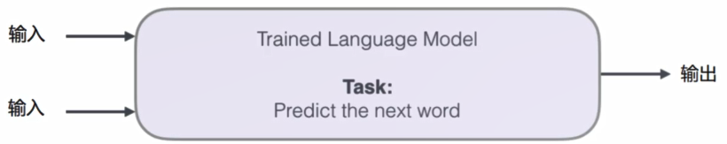
  * 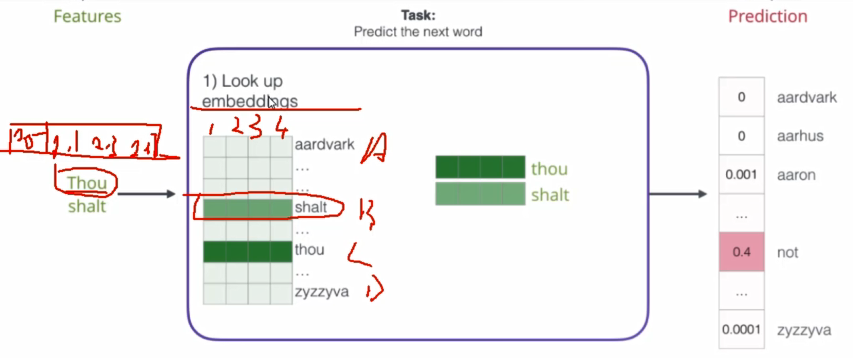
    * look up embeddings
      * 在语料库大表中找到词的对应词向量
      * 大表怎么来的
        * 随机初始化
          * 前向传播计算loss，方向传播通过loss更新权重参数
            * 也会更新输入（大表）

> 数据从哪里来？
>
> 构建训练数据
>
> * 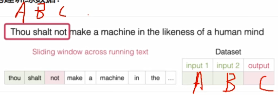
> * 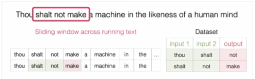
>   * 指定滑动窗口（奇数），自己指定输入输出（标签）

##### 不同模型对比

* CBOW
  * 输入上下文，输出中间词
  * 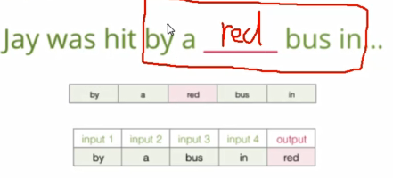
    * 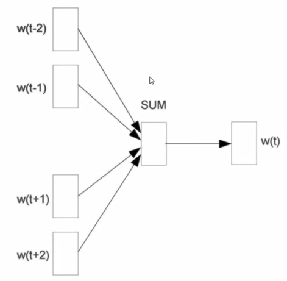
    * 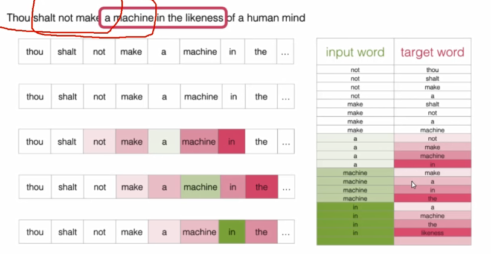
* Skipgram
  * 知道当前词，预测上下文
  * 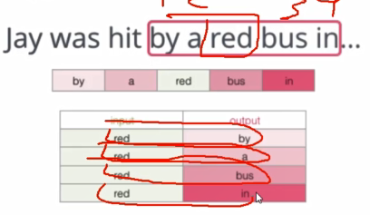
  * 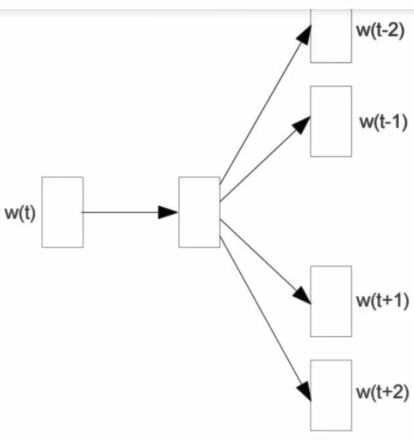
  * 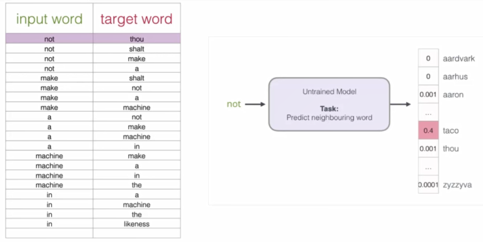

> 当语料库过大，可能分类太多，最后一层softmax，计算十分复杂，如何解决？

* 初始方案：输入两个单词，看他们是否是前后对应的输入输出，相当于二分类
  * 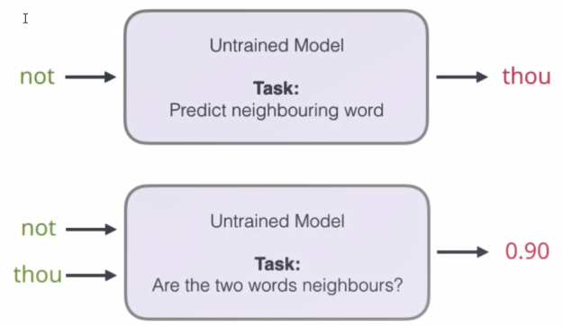
    * 通过A预测B，可能性太多
    * 改为输入AB，判断AB相邻可能性（二分类0/1）
  * 出发点很好，但是此时训练集构建出来的标签全是1，无法进行较好训练
    * 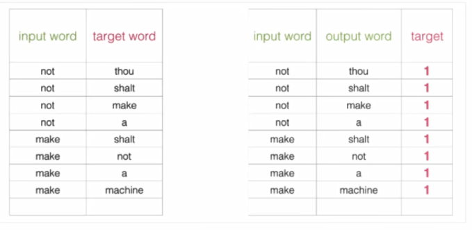
* 改进方案：加入负样本（负采样模型）
  * 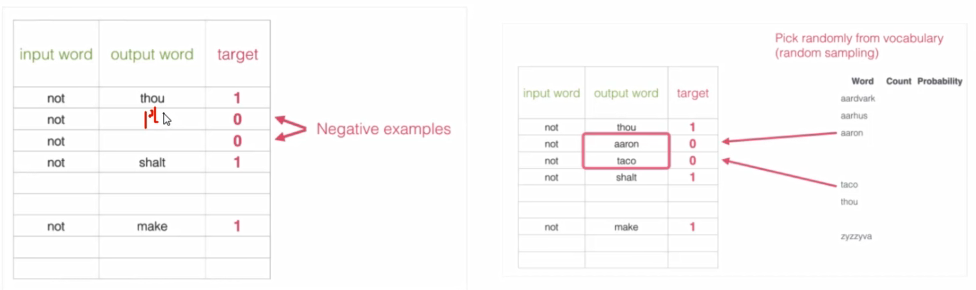
  * 负样本：人为构建，不是训练集数据中的
    * 5个
  * 正样本：是训练集当中，有上下文关系的

##### 词向量训练过程

1. 初始化词向量矩阵
   1. 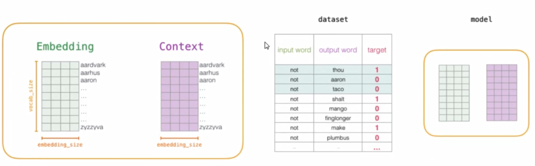
      1. Embedding -- 要维护的词向量大表
      2. Context -- 对于output word的结果,更新过程中只更新输入的
   2. 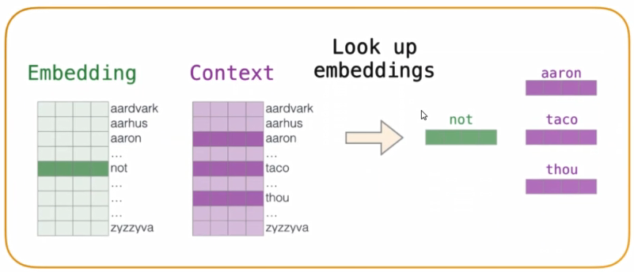
      1. 找到其对应的矩阵
2. 通过神经网络反向传播计算更新,不仅更新权重参数矩阵w,也会更新输入数据
   1. 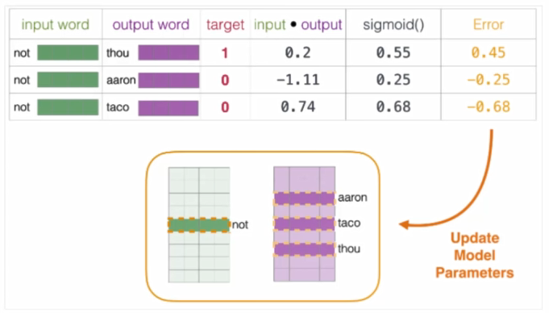
   2. 当作nn在做的事情

#### RNN模型输入格式解析

* 接收定长时间序列
  * 预处理

> 1. 分词
>    1. 将一句话中最小的单位（词）拿出来，组成一句话
>    2. 中华，专业，招收，。。。
> 2. 每句话长度一致（超参数）
> 3. 词嵌入
>    1. 将词语转成向量
>    2. 向量规格要一致（维度一致300）google
>
> * batch_size
>   * 一次处理多少个文章（项目中是标题）
> * max_L
>   * 序列最大长度
> * feature_size
>   * 向量长度

##### tensorboardx可视化展示模块

