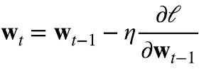
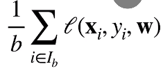

* 梯度下降  一个模型没有显示解时做法
  * 挑选一个初始值 **w0**
  * 重复迭代参数t=1,2,3
    *  
      * -梯度指向函数值减少最快的方向
      * lita指的是走的步伐
    * 沿梯度方向将增加损失函数值
    * 学习率：步长的超参数
      * 不能太小（计算梯度代价太高），不能太大（步子太大，使得震荡）
  * 小批量随机梯度下降
    * 在整个训练集上算梯度代价太高
      * 一个深度神经网络模型可能需要数小时
    * 可以随机采样b个样本i1,i2,...ib来计算近似损失
      * 
      * b是批量大小，另外一个重要的超参数
        * 不能太大（每次计算量太小，不适合并行最大利用计算资源）
        * 不能太大（内存消耗增加，浪费计算，例如如果所有样本都是相同的）
  * 总结
    * 通过不断沿着反梯度方向跟新参数求解
    * 小批量梯度下降是深度学习默认的求解算法
    * 两个重要超参数是批量大小和学习率
* 未完待续

