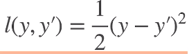
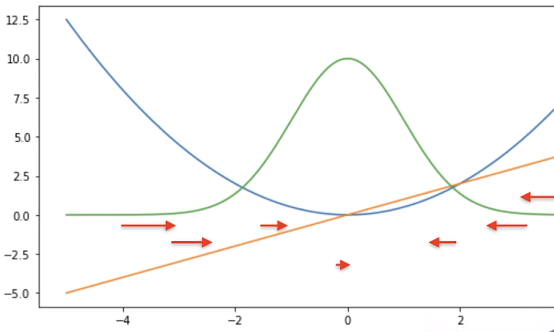
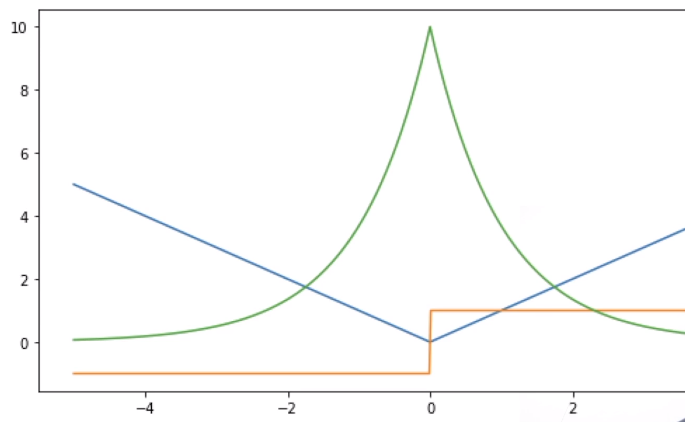
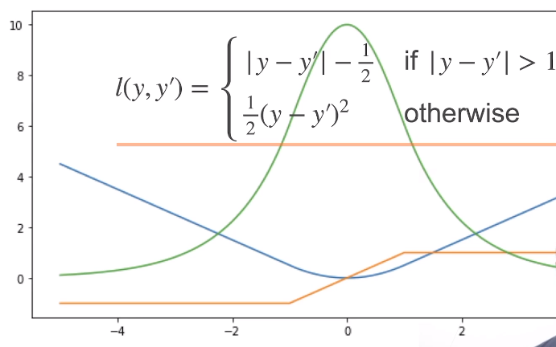

#### 衡量预测值和真实值之间的区别

* 均方损失 L2 loss   
  * 
    * 蓝色 当y等于0时，变换y'时，函数值变化
    * 绿色 似然函数 1^(-l)
    * 橙色 损失函数的梯度
      * 使用梯度下降时，使用-梯度方向更新参数
      * 梯度 决定如何更新参数
        * 预测值y'和真实值y隔的比较远的时候，梯度大，参数更新多
        * 靠近原点时，梯度越来越小，对参数更新幅度越来越好
* 绝对值损失函数L1 loss      
  * 
    * 当预测值和真实值隔比较远时，梯度永远是常数，权重更新不会特别大
    * 很稳定，但是零点出不可导
      * 预测值和真实值比较近的时，不太稳定
* 混合损失函数Huber's Robust Loss
  * 
  * 两者差的比较大时，使用绝对值误差；两者比较近时，使用平方误差

