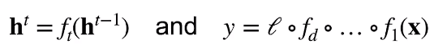
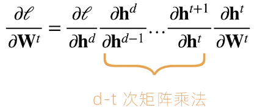
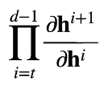

* 神经网络的梯度
  * 考虑如下有d层的神经网络
    * 
      * ht-1是t-1层的隐藏层的输出，再经过一个ft得到第t层的输出ht
  * 计算损失l关于参数Wt的梯度
    * 
      * 进行了太多次矩阵乘法
      * 数值不稳定
* 数值稳定性的常见问题  
  * 梯度爆炸	1.5^100=4x10^17
  * 梯度消失    0.8^100=2x10^(-10)
  * 例子：MLP
    * 

