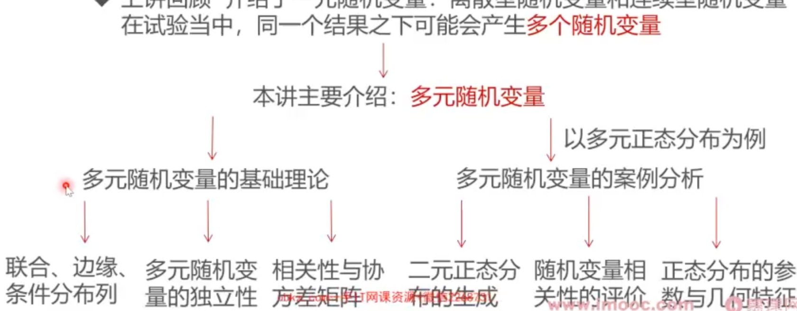

### 这一讲将要学到什么？

* 上讲回顾介绍了一元随机变量：离散型随机变量和连续型随机变量在试验当中，**同一个结果之下可能会产生多个随机变量**

### 大纲

* [多元随机变量的重要分布列](多元随机变量的重要分布列.md)
* [随机变量的独立性与条件独立性](随机变量的独立性与条件独立性.md)
* [多元随机变量的相关性与协方差矩阵](多元随机变量的相关性与协方差矩阵.md)
* [二元正态分布：从标准到一般](二元正态分布_从标准到一般.md)
* [协方差与相关性的一个小问题](协方差与相关性的一个小问题.md)
* [相关系数的概念和特性](相关系数的概念和特性.md)
* [随机变量独立与相关的概念辨析](随机变量独立与相关的概念辨析.md)
* [多元高斯分布的参数特征](多元高斯分布的参数特征.md)
* [二元高斯分布几何特征实证分析](二元高斯分布几何特征实证分析.md)