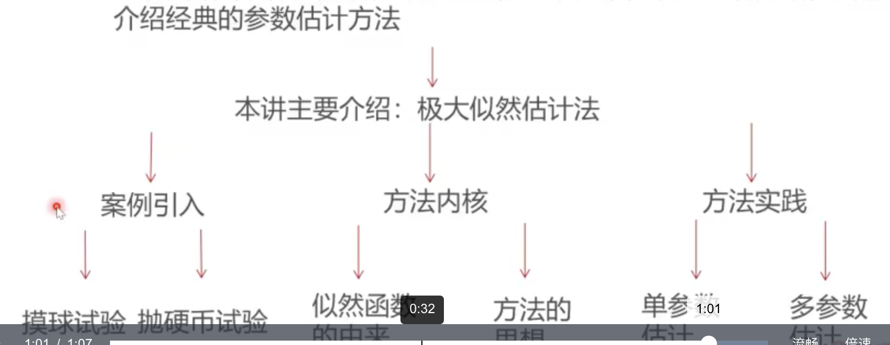

### 这一讲将要学到什么？

* 上讲回顾介绍了统计推断的理论和基本框架，从这一讲开始，我们介绍经典的参数估计方法
* 

### 大纲

* [极大似然估计法的引例](极大似然估计法的引例.md)
* [似然函数的由来](似然函数的由来.md)
* [极大似然估计的思想](极大似然估计的思想.md)
* [极大似然估计值的计算](极大似然估计值的计算.md)
* [单参数极大似然估计案例](单参数极大似然估计案例.md)
* [多参数极大似然估计案例](多参数极大似然估计案例.md)
* 总结
  * 这一讲，我们围绕极大似然估计法，介绍了似然函数的由来以及方法的核心思想
  * 然后我们具体介绍了利用极大似然估计法进行单参数估计和多参数估计的方法和案例
  * 下一讲：另一种参数估计方法：贝叶斯统计推断方法

