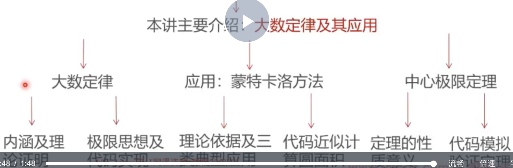

### 大数定律与极限思维

* 上讲回顾介绍了多元随机变量的有关内容，，当样本数非常大的时候，我们就拥有一个有用的工具和武器：大数定律

### 大纲

* [从平均身高问题引入大数定律](从平均身高问题引入大数定律.md)
* [大数定律背后的理论支撑](大数定律背后的理论支撑.md)

* [样本均值与随机变量期望的关系](样本均值与随机变量期望的关系.md)
* [样本均值的方差与分布](样本均值的方差与分布.md)
* [蒙特卡罗方法的应用背景](蒙特卡罗方法的应用背景.md)
* [用蒙特卡罗方法近似计算圆面积](用蒙特卡罗方法近似计算圆面积.md)
* [中心极限定理的基本概念和工程背景](中心极限定理的基本概念和工程背景.md)