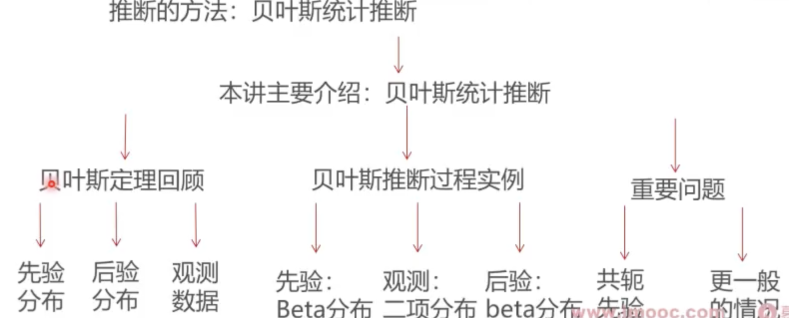

### 这一讲将要学到什么？

* 上讲回顾介绍了极大似然估计方法，这一讲我们介绍另外一种统计推断的方法：贝叶斯统计推断
* 

### 大纲

* [回顾贝叶斯定理](回顾贝叶斯定理.md)
* [贝叶斯推断的理论过程](贝叶斯推断的理论过程.md)
* [贝叶斯推断实战-选取先验分布](选取先验分布.md)
* [选择观测数据的分布](选择观测数据的分布.md)
* [计算后验分布](计算后验分布.md)
* [贝叶斯推断全过程模拟验证](贝叶斯推断全过程模拟验证.md)
* [关于共轭先验的问题](关于共轭先验的问题.md)
* 总结
  * 这一讲，我们基于贝叶斯定理，介绍了统计推断中的第二种方法： 贝叶斯统计推断
  * 我们以一个具体实例演示了贝叶斯推断的完整流程，重点展示了先验分布的选取、观测数据的获取以及后验分布的推断和处理方法
  * 下一讲：更加一般的场景：利用近似采样的方法解决不满足共轭先验的统计推断问题