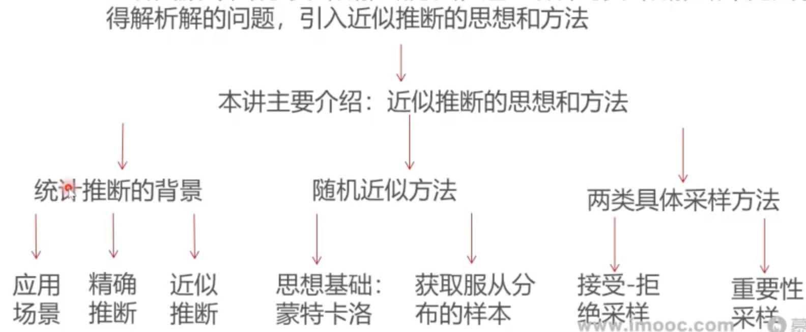

### 这一讲将要学到什么？

* 上讲回顾介绍了贝叶斯推断方法，这一讲针对贝叶斯推断中无法求得解析解的问题，引1入近似推断的思想和方法

### 大纲

* [统计推断的场景与关注重点](统计推断的场景与关注重点.md)
* [精确推断与近似推断的概念](精确推断与近似推断的概念.md)
* [随机近似方法的理论基础](随机近似方法的理论基础.md)
* [接受-拒绝采样方法](接受拒绝采样方法.md)
* [接受-拒绝采样的实践](接受-拒绝采样的实践.md)
* [接受-拒绝采样过程实践](接受-拒绝采样过程实践.md)
* [接受-拒绝采样的方法内涵分析](接受-拒绝采样的方法内涵分析.md)
* [重要性采样的方法介绍](重要性采样的方法介绍.md)
* [两类采样方法的问题与思考](两类采样方法的问题与思考.md)
* 总结
  * 这一讲，我们分析和总结了统计推断中：精确推断和近似推断的不同应用场景和方法特点
  * 具体展开介绍了接受-拒绝采样和重要性采样这两种近似采样方法， 同时分析了这两种方法所固有的不足之处
  * 下一讲：马尔科夫链引入近似采样