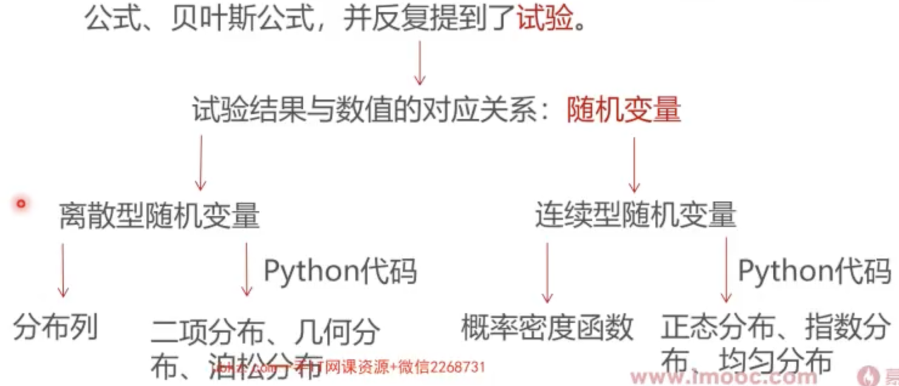

### 这一讲将要学到什么？

* 上讲回顾介绍了事件概率的核心概念：条件概率、独立性、全概率公式、 贝叶斯公式，并反复提到了试验。

### 大纲

* [离散随机变量及其分布列](离散随机变量及其分布列.md)
  * [二项分布及其随机变量](二项分布及其随机变量.md)
  * [二项分布采样与数字特征](二项分布采样与数字特征.md)
  * [几何分布的性质与采样](几何分布的性质与采样.md)
  * [泊松分布的性质与采样](泊松分布的性质与采样.md)

* [连续随机变量及其分布列](./连续随机变量及其分布列.md)
  * [正态分布的性质与采样](正态分布的性质与采样.md)
  * [指数分布的性质与采样](指数分布的性质与采样.md)