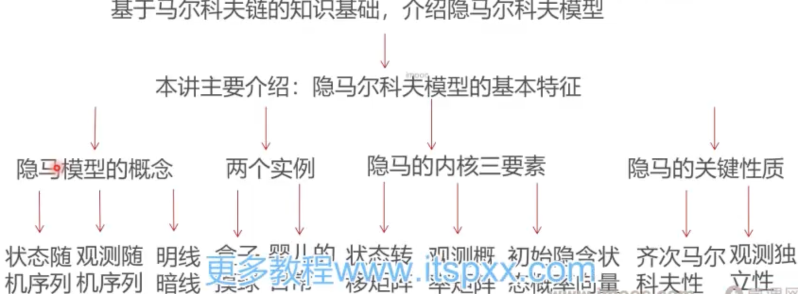

### 这一讲将要学到什么？

* 上讲回顾通过两讲的篇幅，介绍了马尔科夫链的有关内容，这一讲基于马尔科夫链的知识基础，介绍隐马尔科夫模型
* 

### 大纲

* [隐马尔科夫模型导引](隐马尔科夫模型导引.md)
* [隐马尔科夫典型案例1：盒子摸球试验](盒子摸球试验.md)
* [实例2：婴儿的日常生活](婴儿的日常生活.md)
* [隐马尔科夫模型的外在特征和内核三要素](隐马尔科夫模型的外在特征和内核三要素.md)
* [齐次马尔可夫性和观测独立性](齐次马尔可夫性和观测独立性.md)
* 总结
  * 这一讲首先介绍了隐马尔科夫模型的明暗两条线：状态随机序列和观测随机序列，并且以两个实例进行了模型的演示
  * 然后介绍了隐马尔科夫模型的内核三要素：状态转移矩阵、观测概率矩阵和初始隐含状态概率向量
  * 最后介绍了隐马尔科夫模型的关键性质：齐次马尔科夫性和观测独立性
  * 下一讲：隐马尔科夫模型应用：概率估计与状态解码