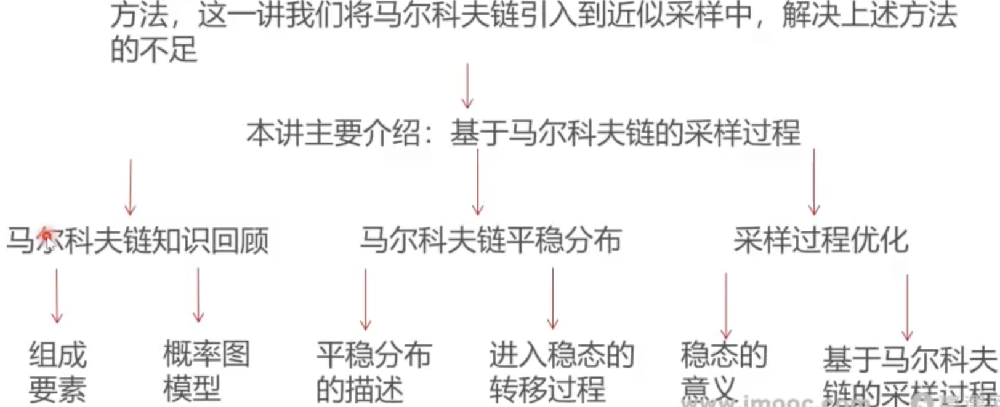

### 这一讲将要学到什么？

* 上讲回顾介绍了近似采样中的接受-拒绝采样和重要性采样这两种方法，这一讲我们将马尔科夫链引入到近似采样中，解决上述方法 的不足

### 大纲

* [马尔科夫链重点内容回顾](马尔科夫链重点内容回顾.md)
* [马尔科夫链平稳分布的理解](马尔科夫链平稳分布的理解.md)
* [马尔科夫链进入稳态的过程演示](马尔科夫链进入稳态的过程演示.md)
* [马尔可夫链稳态的价值与意义](马尔可夫链稳态的价值与意义.md)
* [基于马尔科夫链的采样过程](基于马尔科夫链的采样过程.md)
* [基于马尔科夫链的采样过程实践](基于马尔科夫链的采样过程实践.md)
* [一个显而易见的难题](一个显而易见的难题.md)
* 总结
  * 这一讲，我们讲解了如何借助马尔科夫链的稳态特性，实现近似采样方法
  * 针对性的抛出问题：对于任意给定的目标分布Pi，如何找到一个马尔科夫链，保证目标分布是他的唯一平稳分布，并且能够方便的按照这个马尔科夫链的转移概率矩阵进行状态转移和样本采样
  * 下一讲，我们将为大家详细讲述马尔科夫链-蒙特卡洛方法中的 Metropolis-Hastings采样方法，最终解决近似采样中的所有遗留问题