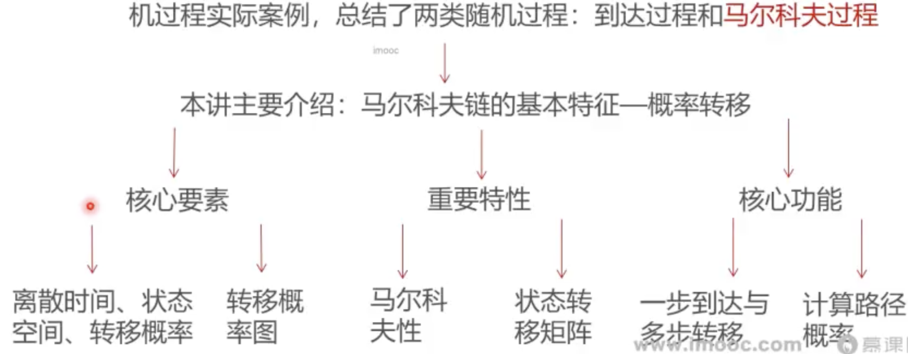

### 这一讲将要学到什么？

* 上讲回顾对随机过程进行了导引介绍，利用蒙特卡洛方法模拟了随机过程实际案例，总结了两类随机过程：到达过程和马尔科夫过程
* 

### 大纲

* [离散时间马尔科夫链的三要素](离散时间马尔科夫链的三要素.md)
* [马尔科夫链的基本性质和矩阵表示](马尔科夫链的基本性质和矩阵表示.md)
* [多步转移概率的计算](多步转移概率的计算.md)
* [多步转移与概率乘法](多步转移与概率乘法.md)
* [路径概率问题](路径概率问题.md)
* 总结
  * 这一讲首先介绍了马尔科夫链的核心要素：离散时间、状态空间、 转移概率，并且利用转移概率图对马尔科夫链进行了形象表示
  * 然后重点介绍了马尔科夫链的重要特性：马尔科夫性，同时学习了如何使用状态转移矩阵对马尔科夫链进行表示，最后基于状态转移矩阵进行多步转移概率和路径概率的计算
  * 下讲：马尔科夫链的极限与稳态

