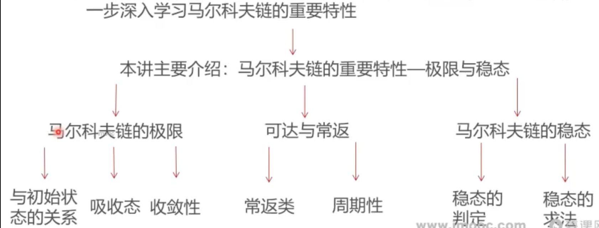

#### 这一讲将要学到什么？

* 上讲回顾介绍了马尔科夫链的核心要素和基本特征，这一讲我们进一步深入学习马尔科夫链的重要特性

### 大纲

* [马尔可夫过程的两种典型极限状态](马尔可夫过程的两种典型极限状态.md)
* [马尔可夫链中的常返类和周期性](马尔可夫链中的常返类和周期性.md)
* [马尔科夫链的稳态分析和判定](马尔科夫链的稳态分析和判定.md)
* 总结
  * 这一讲首先介绍了马尔科夫链极限的概念，讨论了极限与初始状态的关系，并且介绍了马尔可夫链的吸收态与收敛性
  * 然后围绕马尔科夫链的可达与常返，剖析了他的常返类与周期性
  * 最后国绕马尔科夫链的稳态，学习了稳态的判定和求解方法
  * 下一讲从马尔科夫链的概念出发，介绍包含隐含状态序列的模型：隐马尔科夫链

