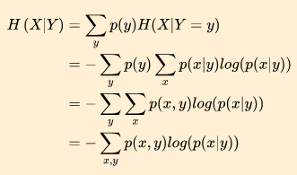

#### 模拟人类决策过程

> * 询问很多问题
>   * 挑瓜
>   * 

#### 使用机器来决策

* 本质
  * 问题序列（Q1，Q2...）
  * 不同的答案引领不同的路径
* 如何构建树
  * Qn：对特征n进行枚举（符合某个条件时）
    * 特征1 == 1
    * 特征1 == 2
* 确定问题序列顺序（重要的问题先问）
  * 让机器知道哪个最重要

> ##### 基于统计信息
>
> 
>
> ##### 熵（entropy）~ 信息的缺失
>
> * **不确定性程度**
>   * 随机性
> * 混乱度
>   * 事件可能性越多，S越大
>
> 
>
> * P(xi)代表随机事件X为xi时的概率
> * xi代表随机事件X的某一种可能
> * 对其所有可能性求和取负
>
> 1. 对于嫁与不嫁（发生可能性为0.5 0.5）
>    1. S=-([P(嫁)lnP(嫁)] + [P(不嫁)lnP(不嫁)]) = 0.69 （最不确定）
> 2. 对于嫁与不嫁（发生可能性为1 0）
>    1. S=-1ln1-0ln0=0
>    2. 此时不确定性为0（完全确定）
> 3. 

##### 用熵选择问题

* 使得**熵下降最多**的问题
  * 通过这个问题**提供**的**缺失的信息越多**
* **条件熵**
  * H( X | Y ) 在已知随机变量X的条件下，随机变量X的不确定性
    * 
  * **越小**，提供的**信息越多** 
  * 信息增益 
    * gain = S(Y) - H(Y | X)
* 选择特征
  * **遍历**所有**特征**，选择**信息增益最高**的特征

> 
>
> 使用上面的公式计算条件熵，选择最小的特征

##### 构建何时停

* 停止条件 leaf node
  * 内生（自然）
    * 在一个**问题答案**上得到**确定回答**
    * 没有信息增益
  * 附加（自加）
    * 设置阈值 叶片处样本过多 过拟合 
      * 样本数 < n
    * 层数 到达限定值
      * 层数 > n
    * 信息增长不明显
* 调参
  * 叶片上样本数
  * 层数
  * 基尼系数
    * 
    * 任何节点都可计算，与熵一样可以判定数据的不确定性
    * 
    * 样本纯度
      * gini -> 0 纯
      * gini -> 1 杂
* gini
  * CART
* Entropy
  * C4.5 ID3

---

##### 应对连续特征

* 两个特征
* 类似磁盘分区
  * 选定阈值
    * 能将两类分开（条件熵最小、gini系数小）
    * 遍历阈值
    * min(gini) ~ thetaD
  * 比较哪个特征下的gini最小 -- 选定为第一个特征
  * 
  * 四次分区后的效果

---

##### 应对过拟合

* 层数太多，容易过拟合
* 
* 控制模型复杂度

---

##### 随机森林 == 集群

* 多颗决策树，做平均
* 稳定性更好

