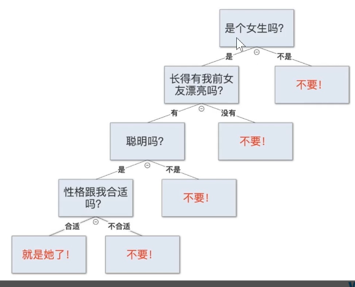
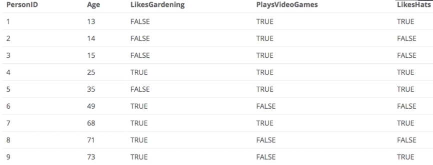
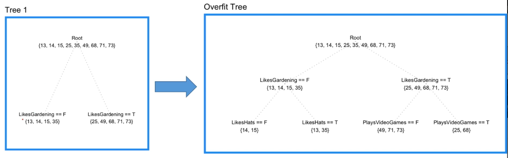
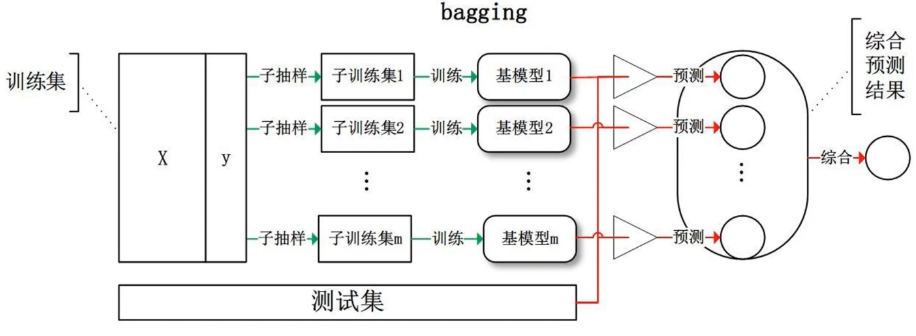
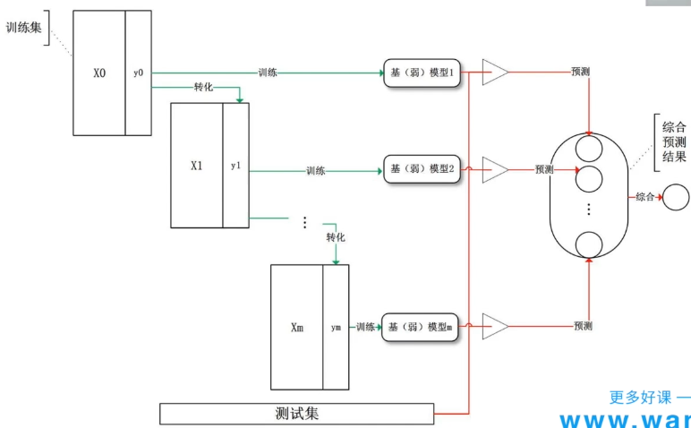
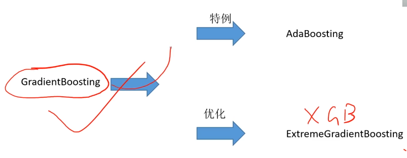
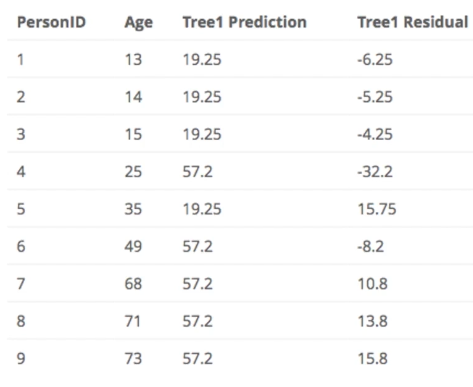
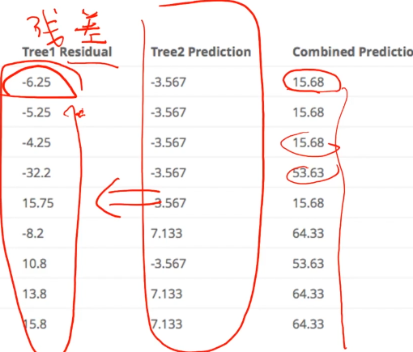
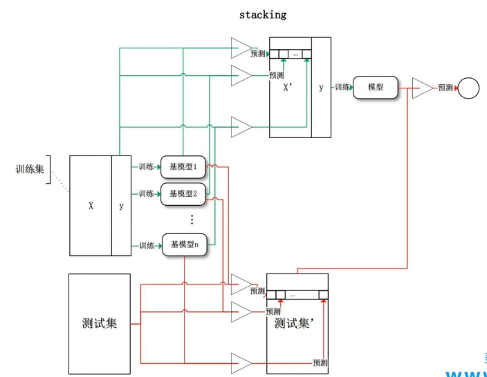

##### 模型集群方法

* Bagging
* Boosting
* Stacking

---

##### 决策树适合使用模型集群

* 
  * 问题序列和答案
  * 容易**过拟合**
* 
  * 分类年轻和年老
  * 第三个特征是用来混淆，验证其容易过拟合
* 
  * 第一个特征通过gini系数选择了正确问题，第二个问题开始过拟合
  * 关注的区间越来越小 --> 容易过拟合

---

##### Bagging 并列模型

* 

  * **一系列**模型**独立完成**同一个任务，最后**投票选出最后结果**

* 随机森林 和而不同

  * 随机

    * 随机选择数据（有放回抽样）
    * 随机抽取特征

  * 效果

    * **减少模型方差**

      

##### Boosting 串行模型

* 
  * 站在巨人肩膀 **三个臭皮匠，顶个诸葛亮**
* 效果 
  * **减小模型偏差**
* 三种方法
  * 

> 分析刚才的年轻年老问题
>
> 使用梯度增强方法
>
> * 拟合残差
>   * 树1对年龄进行预测（回归）
>     * 
>       * 对特征空间进行分割，实际上是做了一个分类
>   * 得到一个残差
>   * 用树2来拟合残差
>     * 
>     * 比第一次得到的残差更接近0（分类效果更好）
>
> * 类似残差的思路，每次添加一点，使得其向着当前状态能达到的最好方向前进

##### Stacking 两者结合

* 
  * 很多模型**先并行**，出一个结果，再串行综合分析

---

##### 建立损失函数

1. 衡量真实和预测值间距离
2. 连续可微可导
   1. 可以使用数学技巧
3. 根据数据分布设定
   1. 理想数据分布，具有先验信息
4. 具有对噪音的鲁棒性
   1. 考虑噪声大小
5. 合理加入正则项
   1. 限制模型取得范围