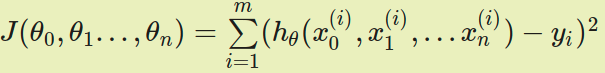

#### 原始模型：线性回归（linear regression）

* 优点：**便于解释**

> ##### 线性回归的模型函数和损失函数
>
> * 问题：有`m`个样本，每个样本对应`n`维特征和一个结果输出
>
>   * 
>
>   * 对于新的一个`n`维特征向量，其对应的输出`y`是多少？
>     * `y`连续，回归问题
>     * `y`离散，分类问题
>
> * 模型
>
>   * 
>   * 其中为模型参数，为每个样本的`n`个特征值，这里可以简化为增加一个特征`x0=1`，进一步简化模型为
>   * 使用矩阵形式的简单表达
>     * 这里的是`mx1`的向量，是`nx1`的向量，`X`是`mxn`维的矩阵。`m`代表样本的个数，`n`代表样本的特征数
>
> * 损失函数
>
>   * 线性回归一般使用均方误差
>     * 
>   * 矩阵形式
>     * 
>
> ##### 损失函数（目标函数）最小化
>
> * 目标：得到使得目标函数最小化时的拟合函数的模型
> * 梯度下降法
>   * 
> * 最小二乘法
>   * 
>   * 
>   * 损失函数的矩阵形式对参数求偏导取0
>     * 
>       * 用到两个矩阵求导公式
>         * 
>     * 求导过程整理后得到
>       * 
>     * 两边同时左乘以
>       * 
>     * 得到最终结果
>       * 

##### 最小二乘法的几何意义

* 线性回归数学表达
  * 
  * 改写其表达
    * 
  * 输出是
    * 每个包含若干输入属性和一个输出结果的**样本都被视为一个整体**，**误差分散在不同的样本点上**
  * 输出是
    * **每个单独属性在所有样本点上的取值被视为一个整体，误差分散在每个不同的属性上**

> 假设数据集中共有 N 个样本，那么  就变成了 N(n+1) 维的数据矩阵 X，它的**每一行**表示的都是**同一个样本的不同属性**，**每一列**则表示**不同样本中的相同属性**。如果**待拟合数据的特性**完美到**任意两个属性都线性无关**的话，X 就可以看成一个由它的**所有列向量所张成的空间**
>
> * 属性的数目 n 会远远小于数据的数目 N，因此 X 张成的是 N 维空间之内的**n 维生成子空间**，或者叫**n 维超平面**
>   * 超平面每个维度对应数据集的一个列向量
>   * **理想条件下**，**输出 y 作为属性的线性组合**，也应该**出现在由数据属性构成的超平面**
>     * 受噪音影响，真正的 y 是超平面之外的一个点，这是需要在超平面上找到一个离 y 最近的点作为 y 的近似

* 黄色区域表示由所有属性张成的超平面；黑色向量 x_1 和天蓝色向量 x_2 表示输入属性；红色实线 y 表示真实输出，水平的红色虚线 hat y 表示数据的最优估计值（属性的线性组合）；垂直的红色虚线表示 y 与 hat y 的残差，它与超平面正交
  * 最佳近似就是 y 在超平面上的投影
  * 最佳近似对应的系数就是线性回归的解，
  * 点和 y 之间的距离就是估计误差==残差（residual)，同时也是最小二乘法最小化的对象，其表达式是
  * 对求导不难得到，能使得均方误差最小化的参数应该满足
* 几何意义：**计算高维空间上的输出结果在由所有属性共同定义的低维空间上的正交投影**（orthogonal projection）
  * 投影操作意味着**残差不会在数据维度上遗留任何分量**，这种基于误差和数据正交性的最优解也经常出现在信号处理当中

##### 实际应用中解释线性回归结果

> 数据网站 WhoScored 对每场比赛结束后根据球员表现给出评分，0 分最低，10 分最高。如果 WhoScored 的评分足够合理，那**球员的评分就应该和球队的成绩呈现出正相关**，而**线性又是正相关最直接的描述**。为了验证球队赛季积分 y 和所有球员的赛季平均评分 x 之间是否存在线性关系，我从网站上复制了 2017~18 赛季英超联赛的相关数据，这个包含 20 个样本的小数据集就是训练集。在拟合数据时，我使用的第三方库是 StatsModels，之所以选择这个库是因为它能够给出更多统计意义上的结论，这些结论对于理解线性回归模型大有裨益。
>
> * 预处理输入数据
>   * 将因变量从球队的赛季总积分转换成场均积分
>   * 在足球联赛中，一场比赛的胜 / 平 / 负分别对应 3/1/0 分，因此计算场均积分可以看成是某种意义上的**归一化**，使数据在 [0, 3] 这个一致的较小尺度上得到更加直观的比较
> * 使用 StatsModels 拟合模型，用 add_constant 函数在每个输入数据的后面添加一个 1，借此把**常数项纳入模型之中**
> * 调用 OLS 普通最小二乘法（ordinary least squares）作为拟合对象，计算线性模型的参数
> * 使用 fit 函数获取拟合结果
>
> 
>
> * coef 表示的是参数的**估计值**，也就是通过最小二乘计算出的权重系数
> * 球队场均积分 y 和球员平均评分 x 之间的关系可以近似表示为回归式 y = 3.0685x - 19.4345
>   * 所有球员共同努力将平均评分拉高 0.1 的话，球队在每场比赛中就能平均多得 0.306 分
> * 右边 std err 表示参数估计的**标准误**（standard error）
>   * 虽然最小二乘得到的是无偏估计量，意味着估计结果中不存在系统误差，但每一个特定的估计值结果依然会在真实值的附近波动，标准误度量的就是估计值偏离真实值的平均程度
> * 最后两列 [0.025 0.975] 给出了 95% 置信区间：每个参数真实值落在这个区间内的可能性是 95%。对于线性回归而言，置信下界和上界分别是估计值减去和加上二倍的标准误，也就是 coef  std err。
>   * 置信区间告诉我们，平均评分拉高 0.1 并不意味着球队每场一定能多得 0.306 分，但多得的分数基本在 0.258 到 0.356 之间。如果用 2016-17 赛季的数据作为训练数据的话，这个数据的计算结果就变成了 0.33——也落在置信区间之内，这也验证的估计结果的波动性。
> * 中间两列中的 t 和 P>|t|都是统计学中的关键指标，它们评估的是拟合结果的统计学意义。t 代表 t 统计量（t-statistic），表示了参数的估计值和原始假设值之间的偏离程度。在线性回归中通常会假设待拟合的参数值为 0，此时的 t 统计量就等于估计值除以标准误。当数据中的噪声满足正态分布时，t 统计量就满足 t 分布，其绝对值越大意味着参数等于 0 的可能性越小，拟合的结果也就越可信。
>   * P>|t|表示的则是统计学中争议最大的指标——**p 值**。**p 值（p-value）是在当原假设为真时，数据等于观测值或比观测值更为极端的概率**。简单地说，p 值表示的是数据与一个给定模型不匹配的程度，p 值越小，说明数据和原假设的模型越不匹配，也就和计算出的模型越匹配。在这个例子里，原假设认为待估计的参数等于 0，而接近于 0 的 p 值就意味着计算出的参数值得信任。
> * R-squared 表示的是 R ^ 2 统计量，也叫作**决定系数**（coefficient of determination），这个取值在 [0, 1] 之间的数量表示的是输出的变化中能被输入的变化所解释的部分所占的比例。在这个例子里，R ^ 2 = 0.905 意味着回归模型能够通过 x 的变化解释大约 91% 的 y 的变化，这表明回归模型具有良好的准确性，回归后依然不能解释的 9% 就来源于噪声。
>   * R ^ 2 统计量具有单调递增的特性，即使在模型中再添加一些和输出无关的属性，计算出来的 R ^ 2 也不会下降。Adj. R-squared 就是校正版的 R ^ 2 统计量。当模型中增加的变量没有统计学意义时，多余的不相关属性会使校正决定系数下降。校正决定系数体现出的是正则化的思想，它在数值上小于未校正的 R ^ 2 统计量。

* 图形结果和数值指标都表明线性回归能够较好地拟合两者之间的关系，这说明 WhoScored 的评分系统是值得信任的
* 但这里只是线性回归的一个特例，它特殊在输出的因变量只与单个的输入自变量存在线性关系，这种模型被称为**简单线性回归**（simple linear regression）。更一般的情况是因变量由多个自变量共同决定，对这些自变量同时建模就是**多元线性回归**（multivariate linear regression）
  * 多元线性回归中的参数也要用最小二乘法来估计

> 以积分和评分的关系为例，在简单线性回归中，**自变量是所有球员在所有比赛中评分的均值**，但是**球场上不同位置的球员发挥的作用也不一样**。为了进一步分析不同位置球员对球队表现的影响，就要**将单个自变量替换成不同位置球员（门将 / 后卫 / 中场 / 前锋）在整个赛季中的平均评分，再使用多元回归进行拟合。**
>
> * 多元回归的属性，也就是**自变量被设置为每队每个位置上出场时间较多的球员的赛季平均评分的均值，所有选中球员的出场时间都在 1000 分钟以上**
> * 利用 OLS 模型可以得到多元回归的结果
>   * 多元模型的**校正决定系数是 0.876**，**意味着所有位置评分共同解释了输出结果的大部分变化**，这也可以从预测值与真实值的**散点图上观察出来**
>   * **后卫评分和前锋评分的 p 值低于 0.05**，似乎球队的**战绩只取决于这两个位置的表现**
>
> 
>
> * 校正决定系数和 p 值给出了自相矛盾的解释，这时就需要观察另外一个重要的指标：**F 统计量**
>   * F 统计量（F-statistic）**主要应用在多元回归中**，它检验的原**假设是所有待估计的参数都等于 0，这意味着只要有一个参数不等于 0，原假设就被推翻**
>   * F 统计量**越大意味着原假设成立的概率越低**，理想的 F 值应该在百千量级。可在上面的多元回归中，**F 统计量仅为 34.57，这就支持了 p 值的结论：估计出的参数的统计学意义并不明显**
> * 英超数据集在统计上的非显著性可能源自过小的样本数导致的过拟合，也可能源自不同属性之间的共线性（collinearity）。可在更广泛的意义上，它揭示的却是多元线性回归无法回避的一个本质问题：**模型虽然具有足够的精确性，却缺乏关于精确性的合理解释**
>   * 假定数据共有 10 个属性，如果只保留 10 个属性中的 5 个用于拟合的话，肯定会有不止一个 5 元属性组能够得到彼此接近的优良性能，可对不同 5 元组的解读方式却会大相径庭。这种现象，就是统计学家莱奥·布雷曼口中的“罗生门”（Rashomon）。
> * **当不同的多元线性模型性能相近，却公说公有理婆说婆有理时，到底应该如何选择？**
>   * **统计学讲究的是“知其然，知其所以然”**，它不仅要找出**数据之间的关联性，还要挖出背后的因果性，给计算出的结果赋予令人信服的解释才是统计的核心**
>   * **机器学习只看重结果**，只要**模型能够对未知数据做出精确的预测，那这个模型能不能讲得清楚根本不是事儿**。四十年前那句名言说得好：不管白猫黑猫，抓住耗子就是好猫。这句话用在机器学习上再合适不过了

* 总结
  * 线性回归拟合的是高维空间上的输出结果在由所有属性共同定义的低维空间上的正交投影
  * 简单线性回归的统计意义可以用 t 统计量和 p 值等指标描述
  * 多元线性回归的统计意义可以用 F 统计量描述，但回归结果可能缺乏对模型的解释能力
  * 机器学习与统计学的区别在于机器学习重于预测，统计学则重于解释