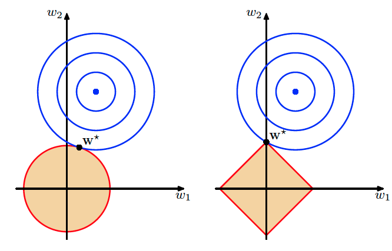
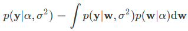

##### 正则化 == 刮骨疗伤

> * 过拟合
>   * **模型过于复杂，削弱了它的泛化性能**
>   * 由于训练数据的数目是有限的，因此我们总是可以通过增加参数的数量来提升模型的复杂度，进而降低训练误差
>     * 学习的本领越专精，应用的口径就越狭窄，过于复杂的模型就像那个御膳房里专门切黄瓜丝的御厨，让他改切萝卜就下不去刀了

* 正则化（regularization）：**抑制过拟合的方法的统称**

  * 动态调整**估计参数的取值**来**降低模型的复杂度**，以**偏差的增加**为代价来**换取方差的下降**
    * 当一些**参数足够小**时，它们**对应的属性对输出结果的贡献就会微乎其微**，**去除了非相关属性的影响**

  * 线性回归
    * 损失函数（loss function）中添加**正则化项**（regularizer）	
      * 是估计参数的`p-范数`
        * 将**均方误差和参数的范数之和**作为一个整体来进行**约束优化**，相当于额外**添加了一重关于参数的限制条件**，**避免大量参数同时出现较大的取值**
      * 正则化作用：让参数估计值的幅度下降，统计学中它也被称为**系数收缩方法**（shrinkage method）

* 应用于基于最小二乘法的线性回归中，**得到线性回归的不同修正（penalized linear regression）**。添加正则化项后的损失函数写成拉格朗日乘子形式

  * 
  * `λ`是用来平衡均方误差和参数约束的超参数
  * 当正则化项为 1- 范数时，修正结果就是**LASSO**；当正则化项为 2- 范数的平方时，修正结果就是**岭回归**；当正则化项是 1- 范数和 2- 范数平方的线性组合时，修正结果就是**弹性网络**（elastic net)
  * 
    * 岭回归（左）和 LASSO（右）
    * 图中的蓝色点表示普通最小二乘法计算出的最优参数，外面的每个蓝色圆圈都是损失函数的等值线，每个圆圈上的误差都是相等的，从里到外误差则越来越大
    * 红色边界表示的则是正则化项对参数可能取值的约束，这里假定了未知参数的数目是两个
      * 岭回归中要求两个参数的平方和小于某个固定的取值
        * 
      * LASSO 要求两个参数的绝对值之和小于某个固定的取值
        * 
    * 不管采用哪种正则化方式，最优解都只能出现在浅色区域所代表的约束条件下，因而**误差等值线和红色边界的第一个交点就是正则化处理后的最优参数**
      * 交点出现的位置取决于**边界的形状**，圆形的**岭回归边界是平滑的曲线**，**误差等值线可能在任何位置和边界相切**
      * 方形的 LASSO 边界是有棱有角的直线，因此**切点最可能出现在方形的顶点上，这就意味着某个参数的取值被衰减为 0**
  * **岭回归**的作用是**衰减不同属性的权重，让所有属性一起向圆心收拢**；**LASSO** 则直接将**某些属性的权重降低为 0**，完成的是**属性过滤**的任务
  * **弹性网络**作为**两者的折中**，结合了不同的优点：**它不会轻易地将某些属性抛弃，从而使全部信息得以保留，但对不重要的特征也会毫不手软地大幅削减其权重系数**
    * 从概率的角度看，岭回归是当参数 w 满足**正态分布**时，用**最大后验概率进行估计**得到的结果；LASSO 是当参数 w 满足**拉普拉斯分布**时，用**最大后验概率进行估计**得到的结果

* **正则化就是引入关于参数的先验信息**

  * 贝叶斯的术语里，将未知随机变量按照其概率分布积分成常量的过程叫**边际化**（marginalization）。边际化是贝叶斯估计中非常重要的核心概念，它起到的正是正则化的作用
  * 线性回归
    * 假定每个输出 y 都是其属性 x 的线性组合与服从正态分布  的噪声的叠加，属性的权重系数 w 则服从  的先验分布
    * 那么利用训练数据 y 估计测试数据  时，输出的预计分布（predictive distribution)就可以写成以下的条件概率
      * 
      * α和都是独立于训练数据的超参数
      * 在频率主义的最大似然估计中，预测结果并不会将参数 w 的估计准确性表示到结果中
      * 贝叶斯主义则根据 w 每一个可能的取值计算出对应结果 ，再对连续分布的 w 取平均，得到的概率分布，也就是上面的表达式
    * **对于预测结果来说，不确定性既来自于训练数据y，也来自于未知的超参数α和**
      * **超参数**只是**人为设定的数值**，在真实的估计任务中，我们需要得到**与任何多余参量都没有关系的**
      * 贝叶斯框架下，**要积分掉超参数的影响**，就必须一视同仁地对超参数进行概率分布α和的建模，这些**超参数的先验信息就被叫作超先验（hyperprior)**

* 引入超先验后，目标概率就可以写成

  * 
  * 利用近似技巧
    * 首先，利用条件概率的性质，上式中的第二个积分项，也就是已知训练数据时参数和超参数的条件概率可以改写成
      * 
      * 等式右侧的第一项其实就是岭回归的最优参数，可以证明这个概率服从参数已知的正态分布，因而可以看成一个确定项。
      * 计算第二项，也就是根据训练数据确定超参数时，就只能将实数域上的概率密度近似为最可能（most probable）的取值  和 ，用点估计结果代替原始的概率分布
      * 利用贝叶斯定理可以得出，最可能的超参数取值应该让下面的后验概率最大化
        * 
        * 分母上的 与超参数无关，因此可以忽略不计
        * 超参数的取值是任意的，将它们的超先验分布设定为**无信息的先验**（uninformative prior）就是合理的选择， 和  也就会以常数形式的均匀分布出现
        * 寻找最可能的  和 就变成了计算**边际似然概率**（marginal probability） 的最大值
        * 把边际似然概率对待估计的参数进行展开，就可以将后验概率最大化等效成似然概率最大化
          * 
          * 积分的第一项是最大似然估计的解，第二项则是参数满足的先验分布，经过复杂的计算可以得出，积分结果仍然具有正态分布的形式，下面的任务就是找到使训练数据 y 出现概率最大的一组超参数 α和
          * 表示噪声的强度的超参数 其实是个固定的取值，通常可以通过多次试验直接测出。在确定  之后，就可以用梯度下降法来找到最优的 α 了

* **总结利用贝叶斯概率来确定最优参数的步骤**

  * **求解的对象是已知训练数据时，测试数据的条件概率 ，要计算这个条件概率就要对所有未知的参数和超参数进行积分，以消除这些变量**
    * **在已知的数据和未知的超参数之间搭起一座桥梁的，正是待估计的参数 w，它将  的求解分解成两部分，一部分是根据已知数据推断参数，另一部分是根据参数推断未知数据**
      * **在根据已知数据推断参数时，又要先推断超参数，再利用超参数和数据一块儿推断参数。对超参数的推断则可以通过边际似然概率简化**
      * 

* 复杂计算的意义：**计算出的结果就是最优的结果**

* 频率主义的正则化只是引入了一个正则化系数 λ，但 其的最优值到底是多少呢？只能靠重复试验确定，这就需要用验证数据集（validation set）来评估每个备选 λ 的最优性

* 贝叶斯主义的边际化就简化了最优化的过程，让边际似然概率最大的超参数就是最优的超参数。

  * 好处在于**所有数据都可以用于训练**，不需要额外使用验证集，这在**数据较少时是非常有用的**

* 编程过程中，很多第三方的 Python 库都可以直接实现不同的正则化处理
  * 在 Scikit-learn 库中，线性模型模块 linear_model 中的 Lasso 类和 Ridge 类就可以实现 l_1 正则化和 l_2 正则化
    * 使用这两个类对上一篇文章中拟合出来的多元线性回归模型进行正则化处理，将两种算法中的正则化项参数均设置为 λ = 0.05，就可以得到修正后的结果
    * 
  * 线性系数的变化直观地体现出两种正则化的不同效果。在**未经正则化的多元线性回归中**，用红框圈出来的系数比较**反直觉，因为它意味着门将的表现对球队积分起到的是负作用，这种结论明显不合常理**
    * 这个问题在两种正则化操作中都得以解决
      * LASSO 将 4 个特征中 2 个的系数缩减为 0，这意味着一半的特征被淘汰掉了，其中就包括倒霉的守门员。在 LASSO 看来，对比赛做出贡献的只有中场和前锋球员，而中场的作用又远远不及前锋——这样的结果是否是对英超注重进攻的直观印象的佐证呢？
      * 岭回归保留了所有的特征，并给门将的表现赋予了接近于 0 的权重系数，以削弱它对结果的影响，其它的权重系数也和原始多元回归的结果更加接近。但 LASSO 和岭回归的均方误差都高于普通线性回归的均方误差，LASSO 的性能还要劣于岭回归的性能，这是抑制过拟合和降低误差必然的结果
    * 

* 总结
  * 正则化的作用是抑制过拟合，通过增加偏差来降低方差，提升模型的泛化性能
  * 正则化项的作用是对解空间添加约束，在约束范围内寻找产生最小误差的系数
  * 频率视角下的正则化与贝叶斯视角下的边际化作用相同
  * 边际化对未知的参数和超参数进行积分以消除它们的影响，天然具有模型选择的功能
    * 正则化的最优参数通常会通过交叉验证进行模型选择来产生，也就是在从不同数据子集上计算出的不同 λ 中择优取之。由于英超数据集的样本数目较少，所以没有添加交叉验证的过程

> 当参数的数目远远大于样本的数目的高维统计问题，并且参数的选择比较简单粗暴，其中有不少参数存在相关性时，比较建议用LASSO回归来降低参数数目。这样处理后才能做矩阵求逆运算。
>
> LASSO回归会让很多参数的系数变成零，只保留一部分参数，一般是保留系数最大的，系数小的因子很可能是噪音。参数取值的幅度有可能不一样，比如有的参数是-1到1，有的是-10到10，那么系数也会受影响。因此，在使用LASSO之前，需要对参数的取值幅度进行调整，这样计算出来的系数才具有可比性。
>
> 当样本数远大于参数的数目时，岭回归计算更快。如果参数数量少而精，数值都调整好，偏度、峰度、正态化、去极值等等，而且普遍适用多种场景，参数可解释，这时比较适合用岭回归。
>
> 岭回归不会删除参数，会对参数的取值幅度进行压缩。特征值小的特征向量会被压缩得最厉害，因此，它也要求参数取值幅度最好差不多，这样系数差不多，压缩起来才更有意义。

