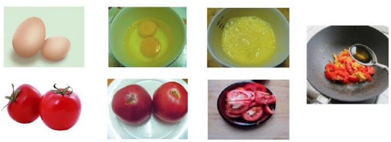

#### 什么是机器学习？

* 对于给定的**任务T**，在合理的**性能度量方案P**的前提下，某计算机程序自主学习**任务T**的**经验E**;随着提供合适、优质、大量的**经验E**，该程序对于**任务T**的**性能**逐步提高
* 学习的**对象**
  * 任务Task T，一个或多个
  * 经验Experience，E
  * 性能Performance，P
* 随着任务的不断执行，经验的累积带来计算性能的提升

#### 另一种表述

* 人工智能的分支。使用计算机设计一个**系统**，让它能够根据提供的**训练数据**按照一定的方式来**学习**；随着训练次数的增加，该系统可以在**性能**上不断学习和改进；通过参数优化的学习模型，能用于**预测**相关问题的输出

---

##### 机器学习的内涵与外延

* 机器学习解决问题
  * 给定数据预测
    * 数据清洗/特征选择
    * 确定算法模型/参数优化
    * 结果预测
* 不能解决
  * 大数据存储/并行计算
  * 做一个机器人
* 举例
  * 机器学习：“盯住二号位，很容易起快球”
    * 基于数据的预测
  * 传统算法：排球规则

##### 机器学习的一般流程

> 数据收集 --> 数据清洗 -->  特征工程  -->  数据建模
>
> 

#### 机器发现新词

* 频数：Count（x）
* 凝固程度
  * X=A.B
  * P(A)P(B) vs P(X)
* 自由程度
  * aXb
  * 信息熵H(a)、H(b)
  * 