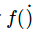

> 机器学习学的是输入输出之间的映射关系，学到的映射（函数）会以模型的形式出现

#### 机器学习任务

* 大多数情况
  * 求解**输入输出单独或者共同符合的概率分布**
  * 或者**拟合输入输出之间的数量关系**
* 数据角度
  * 如果待求解的**概率分布或者数量关系**可以用一组**有限且固定数目的参数完全刻画**，求出的模型就是**参数模型（parametric model）**
    * 有限的参数就能够描述无限的数据呢？这样的便捷来自于**超强的先验假设**：所有**数据符合特定类型的概率分布**
    * **先验知识并不源于对数据的观察，而是先于数据存在，参数模型恰恰就是先验知识的体现与应用**。
      * 先验知识会**假定**数据满足**特定的先验分布**，学习的过程就是利用训练数据**估计未知参数**的过程，一旦得出未知参数的**估计结果**，估计出的**参数**就是**训练数据的浓缩**
      * 先验知识确定了假设空间的取值范围，学习算法（比如最大似然估计或是最大后验概率估计）则在给定的范围内求解最优化问题。
    * **严重依赖**于先验知识的可信度，也就是**先验分布的准确程度**
      * 如果说训练数据和测试数据确实满足二项分布或者正态分布，那么学习算法只需付出较小的计算代价就可以从假设空间中习得一个较好的模型。可**如果先验分布本身就不符合实际**，那么**不管训练数据集的体量多大**，学习算法的性能多强，学习出来的结果都会与事实真相**南辕北辙，背道而驰。**
  * 反过来，**不满足这个条件**的模型就是**非参数模型（non-parametric model**）
    * 模型**参数数量不固定**，极有可能是无穷大
    * **不存在**关于**数据**潜在模式和结构化特性的**任何假设**，数据的所有**统计特性**都**来源于数据本身**
    * 时空复杂度更高
    * 但可以证明的是，当**训练数据趋于无穷多**时，非参数模型可以**逼近任意复杂的真实模型**

##### 参数模型和非参数模型区别

> 假定一个训练集中有 99 个数据，其均值为 100，方差为 1。那么对于第 100 个数据来说，它会以 99% 的概率小于哪一个数值呢？
>
> * 使用**参数模型**解决这个问题时，可以**假设**所有**数据都来自于同一个正态分布 N(μ,σ)**。利用训练数据构造关于正态分布均值和标准差的**无偏估计量**，**可以得到相应的估计值 μ^=100,σ^=1**。如此就不难计算出，新数据会以 99% 的概率小于 102.365，其意义是均值加上 2.365 倍的标准差，这就是参数模型计算出的结果。
> * 对于**非参数模型**而言，**不关心**数据来源，只是做出所有数据**来源于同一个分布**这个**最基础的假设**。在这个假设之上，99 个训练数据和 1 个测试**数据一视同仁**的。如果把它们视为一个整体，那么在测试之前，**所有数据的最大值可能是其中的任何一个**。正因如此，测试数据有 1% 的可能性比之前的 99 个都要好，也就是有 **99% 的可能性小于训练数据中的最大值**。

* **非参数模型其实可以理解为一种局部模型**，就像战国时代每个诸侯国都有自己的国君一样，每个局部都有支配特性的参数。在局部上，相似的输入会得到相似的输出，而全局的分布就是所有局部分布的叠加。相比之下，**参数模型具有全局的特性**，所有数据都满足统一的全局分布，这就像履至尊而制六合得到的扁平化结构，一组全局分布的参数支配着所有的数据。

##### 数据构造角度分类模型

> 侧重于**模型对数据**的**拟合能力**和**预测能力**
>
> 论文《统计模型：两种思路》（[Statistical Modeling: The Two Cultures](http://www2.math.uu.se/~thulin/mm/breiman.pdf)），提出了数据模型和算法模型的区分方法。
>
> 看重学习算法从数据中**获取有用结论和展示数据规律的能力**
>
> 他将从输入 x 到输出 y 的关系看成黑盒
>
> 两种分类是**另一种形式的参数模型和非参数模型**
>
> * 数据模型和参数模型类似，都是通过调整大小和颜色把一件固定款式的衣服往模特身上套，即使给高大威猛的男模套上裙子也没关系——没见过苏格兰人吗？
> * 算法模型和非参数模型则是调了个个儿，充分发挥量体裁衣的精神，目标就是给模特穿上最合身的衣服，至于红配绿或是腰宽肩窄什么的都不在话下——只要穿着舒服，还要什么自行车？

* **数据模型**（data model）
  * 黑盒里装着**一组未知的参数 θ**，学习对象是这组**参数**
* **算法模型**（algorithm model）
  * 黑盒里装着**一个未知的映射 ，学习对象是这个映射**。

##### 典型应用及问题

* 数据模型
  * **线性回归**

> 将**输出结果**表示为**输入特征的线性加权组合**，算法通过**训练数据来学习权重系数**
>
> 线性回归的**含义**：**输入数据**每个单位的变化**对输出**都会产生**同步的影响**，影响的**程度取决于这个特征的权重系数**，不同特征对结果的贡献 == 该特征的权重系数
>
> ###### 问题
>
> * 如何确定**输入与输出之间**真实的对应关系**是否满足特定的假设**？
> * 当某个数据模型被以先验的方式确定后，**学习的对象**就不再是输入输出之间的作用机制，而是这个**数据模型本身**。绝大部分**数据模型都有简明的解释**方式，可如果**简单模型不能充分体现出复杂作用机制**（比如医学数据或经济数据）时，它的预测精度就会不堪入目。这种情况下，**再漂亮的解释又有什么意义呢？**

* 算法模型
  * 随机森林

> 一种**集成学习**方法，构成这座森林的**每一颗树都是决策树**，每一棵决策树都用**随机选取数据和待选特征构造出来**，再按照**少数服从多数的原则**从**所有决策树的结果中得到最终输出**。
>
> **决策树本身**是具有较好**可解释性数据模型**，它表示的是**几何意义**上对**特征空间的划分**，但是**精确度却不甚理想**。
>
> **随机森林**通过综合使用**建立在同一个数据集上**的**不同决策树**达到出人意料的良好效果，在很多问题上都将精确度提升了数倍。但精确度的提升换来的是**可解释性的下降**。每个决策树对特征空间的单独划分共同织成一张剪不断理还乱的巨网，想要理解这张巨网背后的语义无异于水中望月、雾里看花。

##### 学习对象角度划分

* **生成模型（generative model）**
  * **学习的对象是输入 x 和输出 y 的联合分布 p(x,y)**
* **判别模型**
  * **学习的是已知输入 x 的条件下，输出 y 的条件分布 p(y|x)**。
* 区别

> 假如我被分配了一个任务，要**判断一个陌生人说的是什么语言**。如果用**生成模型**来解决的话，我就需要把这个老外**可能说的所有语言都学会，再根据他的话来判定语言的种类**。但可能等我学完这些语言时，这个陌生人都说不出话了。可是用**判别模型**就简单多了，我只需要**掌握不同语言的区别**就足够了。即使不会西班牙语或者德语的任何一个单词，单凭语感也可以区分出这两种语言，这就是**判别模型的优势**。
>
> 针对生成模型和判别模型的利弊，支持向量机的奠基者弗拉基米尔·瓦普尼克（Vladimir Vapnik）有句名言：“（解决分类问题）应该直截了当，**不要用兜圈子的方式**，搞一个更难的问题（比如**求解似然概率**）做为**中间步骤**”。一般来说，**生成模型的求解更加复杂**，当数据量趋于无穷大时，渐进条件下的**精确性也更差**，但其**收敛的速度更快**，在较少数据的训练后就可以收敛到错误的下界。相比之下，**判别模型的形式更加简单**，在分类问题上的表现也更出色，却**不能提供关于数据生成机制的信息**。有些情况下，生成模型和判别模型会成对出现。例如在分类问题中，**朴素贝叶斯和逻辑回归就是一对生成 - 判别分类器**。

