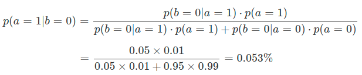
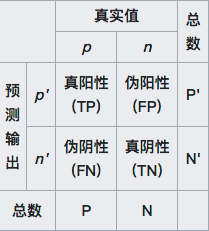
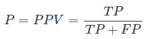
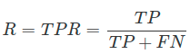
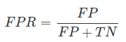
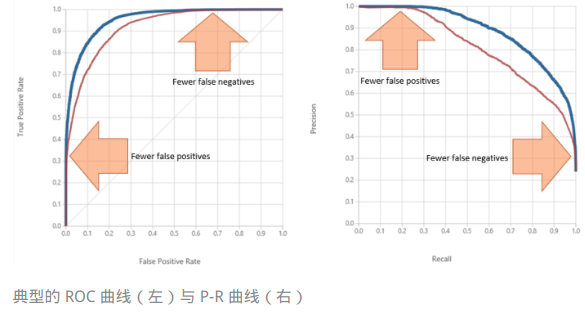

##### 机器学习过程

* **训练数据集** 拟合 **备选模型** **参数**
* **验证数据集** 选出 **最优模型**
* **模型评估**  √
  * **测试数据集** 衡量模型在**从未出现过的数据上的性能**来估计模型的**泛化特性**

> ###### 二分类任务为例 
>
> * ###### 度量模型性能的不同指标
>
> * **最直观**的指标：**分类准确率**
>   * 将**训练数据中**一部分**正例（标签为1）**误判为反例**，也会将一部分**反例（标签为0）**误判为正例
>   * **分类正确的样本（正例分类成正例，负例分类成负例）占样本总数的比例是精度（accuracy）**
>   * **分类错误的样本（误判的样本）占样本总数的比例是错误率（error rate），两者之和等于 1**
>
> 一个实际应用就是疾病的诊断。你可以回忆一下在“贝叶斯视角下的机器学习”中提到的例子：“Jo 去进行某种疾病的检查。已知检查的准确率是 95%，也就是此病患者的检查结果 95% 会出现阳性，非此病患者的检查结果 95% 会出现阴性，同时在 Jo 的类似人群中，此病的发病率是 1%。如果 Jo 的检查结果呈阳性，那么她患病的概率是多大呢？”
>
> 这个例子就是一个典型的二分类问题。根据之前的分析结果，即使 Jo 的检查结果呈现阳性，她患病的概率也只有 16%，如果一个庸医完全按照检查结果判定的话，每 6 个病人里他就要误诊 5 个！（这又是频率主义直观的看法）但是需要注意的是，**错误的分类不仅包括假阳性这一种情况，假阴性也要考虑在内**——也就是确实生病的患者没有被检查出来的情形，**假阳性和假阴性共同构成所有的误分类结果。**
>
> 在 Jo 的例子中，出现**假阴性的可能性**有多大呢？同样令**随机变量 a 表示 Jo 的真实健康状况**，a = 1 表示 Jo 生病，a = 0 表示 Jo 没病；令**随机变量 b 表示 Jo 的检查结果**，b = 1 表示阳性，b = 0 表示阴性。由此可以计算出 Jo 的**检查结果呈阴性**，但是她**患病的概率**
>
> 
>
> 虽然这个检查**容易把没病的人误诊成有病**，但把**有病的人误诊成没病的概率是极低的**。这符合我们一贯的认知：在现实中，假阳性无非就是给患者带来一些不必要的精神压力，通常不会产生更加严重的后果；可假阴性却可能让患者错过最佳的治疗时机，一旦发现便为时已晚。因此，在医学检查中本着**“宁可错判，不能放过”**的原则，对**假阴性的要求比对假阳性的要求更加严格。**

* 很多情况下将**正例误判为反例**和将**反例误判为正例**的**代价都是不同**的，这也是数理统计将**分类错误分为一类错误和二类错误**的原因
* **机器学习采用了混淆矩阵（confusion matrix），也叫列联表（contingency table）来对不同的划分结果加以区分**
  * 
  * **在混淆矩阵中，所有测试样例被分为真正例（true positive, TP）、假正例（false positive, FP）、假反例（false negative, FN）、真反例（true negative, TN）四大类**。真正例和真反例容易理解，**假正例**指的是样例本身是反例而预测结果是正例，也就是**假阳性**；**假反例**指的是样例本身是正例而预测结果是反例，也就是**假阴性。**
* 更多的分类标准对模型性能做出更精确的评估
  * **查准率P**（precision）：正例预测值**（positive predictive value）**
    * **真正例**占所有**预测结果为正例**的样例的比值，也就是模型**预测结果的准确程度**
    * 
  * **查全率R**（recall）：**真正例率（true positive rate, TPR）**
    * **真正例**占所有**真实情况为正例**的样例的比值，也就是模型对**真实正例的判断能力**
    * 
  * 查准率要求把**尽可能少的真实负例判定为预测正例**，查全率则要求把**尽可能少的真实正例判定为预测负例**
  * 二者不可兼得
    * P-R曲线：**模型可以同时达到的查准率和查全率**
      * 一个模型的 P-R 曲线能够**完全包住另一个模型的曲线**，就意味着**前者全面地优于后者**
      * 更普遍的情况是**有些模型查全性能较优**，而**另一些模型查准性能较优**
    * ROC 曲线
      * 判断雷达接收到的信号到底是敌机还是干扰
      * 所有的样例**共同符合一个混合分布**，这个混合分布**由正例和反例各自服从的单独概率分布叠加组成**
        * 此时二分类任务：判断新来的样本来源于哪个分布
        * **数据中的随机变化**在分类器中体现为**阈值动态取值的随机变化**，**分类器的性能**则取决于**两个概率分布之间的分离程度**
      * 真正例率和假正例率的关系
        * **收益（真正例）**与**代价（假正例）**
        * 假正例率（false positive rate, FPR）：**假正例**和**所有真实反例**之间的比值
          * 
        * ROC 空间将 FPR 定义为 X 轴，TPR 定义为 Y 轴。给定一个二元分类模型和它的阈值，就能计算出模型的 FPR 和 TPR，并映射成由 (0, 0)、(0, 1)、(1, 0)、(1, 1) 四个点围成的正方形里。在这个正方形里，从 (0, 0) 到 (1, 1) 的对角线代表了一条分界线，叫作**无识别率线**，它将 ROC 空间划分为左上／右下两个区域。
          * 无识别率线描述的是**随机猜测的模型**，以 0.5 的概率将新来的实例判定为正例，这种模型的 TPR 和 FPR 是处处相等的
          * 在无识别率线左上方，所有点的 TPR 都大于 FPR，意味着分类结果优于二选一的随机猜测；而在无识别率线右下方，所有点的 TPR 都小于 FPR，意味着分类结果劣于随机猜测。**完美的模型体现在 ROC 空间上的 (0, 1) 点：FPR = 0 意味着没有假正例，没有负例被掺入；TPR = 1 意味着没有假负例，没有正例被遗漏。**也就是说，不管分类器输出结果是正例还是反例，都是 100% 完全正确。
      * 不同类型的模型具有不同的 ROC 曲线。**决策树**这类模型会**直接输出样例对应的类别**，也就是**硬分类结果**，其 ROC 曲线就退化为 **ROC 空间上的单个点**。相比之下，**朴素贝叶斯这类输出软分类结果**，也就是**属于每个类别概率的模型**就没有这么简单了。将**软分类概率转换成硬分类结果需要选择合适的阈值**，**每个不同的阈值都对应着 ROC 空间上的一个点**，因此整个模型的性能就是由**多个离散点连成的折线**。
  * 
  * ROC曲线
    * 越靠近左上方，其性能就越好
    * 如果一个模型的 ROC 曲线能够完全包住另一个模型的曲线，那么前者的性能就优于后者
      * 但通常情况需要 **ROC 曲线下面积** 求积分 AUC 
        * **ROC 曲线下面积（Area Under ROC Curve）**
          * 在[0,1]之间取值
          * 对于完全靠蒙的**无识别率线来说**，其 **AUC 等于 0.5**，这样的模型完全**没有预测价值**。一般来说，通过**调整模型的阈值**，可以**让模型的最优 AUC 大于 0.5，达到比随机猜测更好的判别效果**。如果**模型的 AUC 比 0.5 还小**，这样的模型可以通过**求解其镜像**，也就是**将分类结果反转来获得优于随机猜测的结果**
          * 提供其他信息
            * **不同性能的算法**对应着 **ROC 空间上不同的点**，如果能够确定所有样例中真实正例的比例 pos 和真实负例的比例 1 - pos，那么模型的精度就可以表示为 pos * TPR + (1 - pos) * (1 - FPR)。根据这个数量关系可以得出，虽然不同的模型具有不同的 TPR 和 FPR，但**它们的精度是可以相等的**。在 ROC 空间上，这些**精度相同的模型**都落在同一条斜率为 (1 - pos) / pos，也就是**负例与正例比值**的直线上，这样的直线就被称为**等精度线**（iso-accuracy lines）
            * **正例和负例的比例**就可以作为**已知的先验信**息**指导模型的选择**。如果**正例和负例的比例约为 2:1**，那就**可以在 ROC 空间上作一条斜率为 1/2 且经过 (0, 1) 的直线**，并向右下方平行移动。当**平移的直线与 ROC 曲线相交时**，**交点所对应的模型**就是适用于这个**先验信息的最优模型**。此时最优模型的精度是多少呢？就是**交点所在直线的截距**，也就是和 **TPR 轴的交点**。

* 总结
  * 二分类任务中，模型性能度量的基本指标是精度和错误率，两者之和为 1
  * 混淆矩阵是个 2x2 的性能度量矩阵，其元素分别是真正例、假正例、假反例和真反例的数目
  * P-R 曲线表示的是查准率和查全率之间的关系，曲线在点 (1, 1) 上达到最优性能
  * ROC 曲线表示的是真正例率和假正例率之间的关系，曲线在点 (0, 1) 上达到最优性能

> ROC曲线中的TPR的分子和分母里的TP，FN都来自正例，FPR的分子，分母里的FP，TN都来自负例。PR曲线中的Precision的分母里的TP和FP则会同时受到正例和负例的影响。
>
> 当样本的正负例比例发生较大变化时，原来同一类型的样本点在PR曲线受到的影响由于Precision值的明显变化，会比ROC曲线要大。
>
> 从混淆矩阵看，ROC的两个指标计算分别对应两个列，也就是不同类别真实输出上的准确率。只要算法不发生变化，那准确率就不会受到样本数的影响。
> 反过来，PR的两个指标在混淆矩阵里是一行一列，一个考察真实输出的准确率，一个考察预测输出的准确率。当数据类别不平衡导致各类真假正负例的数目改变时，这一行一列在计算比例时就没法保证相同的变化尺度，导致PR曲线变形。

