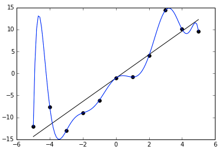
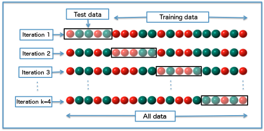
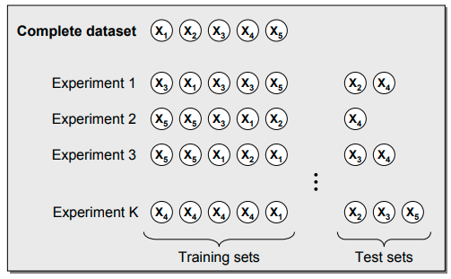

##### 泛化性能（generalization performance）

> 模型对未知数据的**预测能力**，是机器学习的**核心问题**
>
> * 一个问题的学习中，往往会出现**不同的模型**在**训练集上具有类似的性能**，这时就需要利用**模型验证**来从这些备选中**做出选择**。
> * 泛化性能  --  模型复杂度

##### 模型验证任务

* **确定**模型的**复杂度以避免过拟合**的发生

> 重要依据：模型在**训练数据集**上的**精度（accuracy）**
>
> * 不能太低
>   * 用**训练误差**去**估计测试误差**，得到的必然是**过于乐观**的结果
>   * 过低的正确率往往是**欠拟合的征兆**。训练数据集中的**数据量一定是有限**的，这些数据共同构成了**高维空间上一个点集**
>     * 模型的**参数足够多，形式足够复杂**，就必定**可以构造出经过所有数据点**的曲线或者曲面，在训练集上得到 **100% 的正确率**
>     * 这样的模型**对训练数据的拟合能力过强**，**不可能**具备**良好的泛化**特性
> * 
>   * **黑点代表的离散数据**可以看成是满足线性关系的**原始数据和随机噪声的叠加**，受噪声的影响，即使是生成数据的直线也不能完全拟合数据，总归存在一定的残留误差。如果要将残留误差降低为 0，在训练集上取得 100% 的正确率，得到的拟合结果就是龙飞凤舞的蓝色曲线。虽然这个多项式模型完美地覆盖了所有数据点，但它所代表的数据生成方式显然和黑色直线并不接近。此时，过高的训练集正确率反而与对模型优良泛化性能的追求背道而驰。

##### 训练误差的标准

* 分解误差：噪声、偏差和方差

> * 训练后
>   * **训练集上**就可以计算出模型 f ^ 的**训练误差**
>   * **测试集上**则可以计算出模型的**泛化误差**
>     * **训练数据已知**的，**验证数据未知**的，两者之间并**不存在交集**，所以泛化误差也被称为**样本外误差**（extra-sample error）
>     * **样本内误差**（in-sample error）：刻画**噪声**影响
>       * **训练集的数据**中既包含由潜在的**概率分布所决定的确定部分，**也包含受**噪声干扰产生的随机部分**
>       * 训练过程中，模型 f 将**不可避免地把噪声的一部分随机特性**也**纳入建模**的范畴。
>       * **考虑噪声**，当训练数据的**自变量不变**，它的**因变量也会受发生变化**
>       * **训练数据集**是**一个样本**，它对应的**总体**是**自变量固定时**因变量所有**可能的取值**。利用样本训练出的模型 f 在**样本上的表现**和在**总体上的表现之间的差值**，就是所谓的样本内误差。
> * **训练误差已知**，对**样本内误差的估计**又可以转化成对**它和训练误差之间的差值的估计**
>   * **乐观度**（optimism）
> * **模型选择** == 计算**有效参数的数目**

* 以上理论估计过于复杂
  * 工程上
    * 验证方法：直接**估计样本外误差**
    * 估计手段：**数据重采样**（re-sampling）
      * 充分利用有限的数据来估算模型的泛化性能
      * **不能和训练集有交集**
        * 划分时，最**基本的原则就是确保训练集、验证集和测试集三者两两互不相交**。
      * **训练 / 验证 / 测试中样例分布的一致性**
        * 三个集合中**正例和负例的比例应该大致一致**，避免在数据集之间出现不平衡
          * **样例分布**相差较大，这种**分布差异**将不可避免地给**性能的估计带来偏差**，从而**模型选择造成影响**
  * 模型在**验证集上的性能**是**模型选择和评估**的**依据**

> 做老师的都知道，一次考试中的学生**成绩应该是近似满足正态分布**的，所以在评估教学效果时，**学生样本的构成**就至关重要：如果选的都是成绩较好的学生，那他们在自习室自学的效果可能还比上课更好；如果选的都是成绩较差的学生，那即使老师再苦口婆心掰开揉碎也可能白费功夫。这两种情况的共同特点就是都不能真实反映教学质量。**只有当学生样本的构成也是两头尖中间宽的纺锤形**时，**评估的结果**才能**忠实于实际情况，具有参考价值**。

* 充分利用有限数据
  * 验证数据的抽取方式
    * **留出法**（hold-out）：**随机采样**出**一部分数据作为训练集**，再采样出**另一部分作为验证集**
      * 若**不使用验证步骤**，拿出大部分数据做训练，剩下的全部留做测试
      * 问题：所留出的、用于模型验证的**数据是固定不变**
        * 通过留出法计算出来的**泛化误差本质上也是个随机变量**，**单次留出**得到的估计结果就相当于**对这个分布进行一次采样**，这**单次采样的结果**没办法体现出**随机变量的分布特性**
      * 一般采用**多次随机划分**，在**不同的训练 / 验证集上**评估模型性能**再取平均值**的方式，以此来得到关于**泛化误差更加精确的估计**
    * k折交叉验证法（k-fold cross validation）
      * 将**原始数据集随机划分**为 **k 个相同大小的子集**，并进行 **k 轮验证**。每一轮验证都**选择一个子集作为验证集**，而将**剩余的 k-1 个子样本用作训练集**。由于每一轮中选择的验证集都互不相同，每一轮验证得到的结果也是不同的，**k 个结果的均值就是对泛化性能的最终估计值**
      * 
      * k值的选择**直接决定估计结果的精确程度**
        * **较小的 k 值**意味着**更少的数据被用于训练模型**，这将导致**每一轮估计得到的结果更加集中，但都会偏离真正的泛化误差**，也就是**方差较小而偏差较大**
        * 随着 **k 的不断增加**，**越来越多的数据被用在模型拟合**上，计算出的**泛化误差也会越来越接近真实值**。但由于**训练数据的相似度越来越高**，训练出来的**模型也就越来越像**，这就会导致在**不同的验证集上产生较大的方差**
      * 特例：k 等于原始数据集的容量 N **留一法**（leave-one-out）
        * 每一轮中只有一个样本被用做测试，**不同轮次中**的**训练集则几乎完全一致**
        * 关于**真实泛化误差的近似无偏的估计**，其结果通常被认为**较为准确**
        * 缺点
          * **需要训练的模型数量**和**原始数据集的样本容量**相等的，当**数据量较大**时，使用留一法无疑会带来**庞大的计算开销**
    * **自助采样**（bootstrap）
      * 有放回的重采样
      * 每次**随机从原始数据集中随机抽取一个样本**并**拷贝到训练集**中，将这个样本放回到原始数据集，再重复以上的步骤
      * 导致某些数据可能在**同一轮验证中多次出现在训练集**内，而**另一些数据可能从头到尾都没有参与到模型的训练当中**
      * 每一轮次的自助采样中，**没有被采到的样本**会作为**测试数据使用**
      * 

* **模型验证**是模型原型**设计的最后完善**。一旦完成了模型验证，**模型就不能再做调整了**

* 总结
  * **模型验证的作用**是**选择最佳模型**并**确定其性能**
  * 对**数据的重采样**可以直接**实现对样本外误差**，也就是**泛化误差的估计**
  * **k 折交叉验证**是**无放回的重采样**方法；
  * **自助采样**是**有放回的重采样**方法

