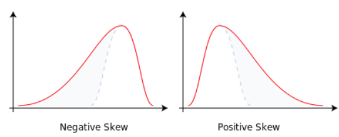

#### 数据量比算法更重要

* **数据**决定了机器学习的**上限**，而算法只是尽可能**逼近这个上限**
  * 并**不是**硬件采集或者软件抓取的**原始数据**，而是经过**特征工程处理**之后的 **精修数据**
  * **特征工程**（feature engineering）是机器学习的关键

> **特征**的本质是用于**预测分类结果的信息**
>
> * 特征工程：对**特征信息的编码**
>   * L1正则化项的LASSO回归	
>     * 将某些特征的权重系数缩小到 0 来实现特征的过滤
>   * 主成分分析
>     * 将具有相关性 的一组特征变换为另一组线性无关的特征

##### 特征工程之前的数据预处理（preprocessing）

> 比如在电商上买衣 服时，身高和体重就是不同尺度的特征。
>
> 假设我的身高 / 体重是 1.85 米 /64 公斤，而买了同款衣服的两个朋友，1.75 米 /80 公斤的穿 L 号合适，1.58 米 /52 公斤的穿 S 号正好。**直观判断的话，L 码应该更合适我**。可如果把**（身高， 体重）的二元组看作二维空间上的点**的话，**代表我自己的点显然和代表 S 码的点之间的欧式距离 更近。**如果电商不开眼的话，保不齐就会把 S 码推荐给我。
>
> * 不进行特征缩放
>   * 体重数据比身高数据高出一个数量级
>   * 计算欧氏距离时， 身高影响比之体重微不足道
>   * 起作用的相当于只有体重一个特征
>   * 算法自然将体重相近的划分到一个类别

* 特征缩放（feature scaling）

  * 保证所有的**特征数值**具有**相同的数量级**

  * 消除特征的**不同尺度**所造成的**偏差**

    * 变换方式

      * 标准化（standardization）：每组新数据都是均值为 0，方差为 1
        $$
        x_{st} = \dfrac{x - mean(x)}{std(x)}
        $$

      * 归一化（normalization）：所有数据都落在 [0, 1] 这个范围之内
        $$
        x_{norm} = \dfrac{x - \min (x)}{\max (x) - \min (x)}
        $$

      * 殊途同归

  * 数据偏度（skewness）：描述**概率分布** **非对称性**

    * 下图给出了两个分别具有负偏度和**正偏度**的概率分布示意图，从中可以看 出具有偏度的分布的形状都是类似的：**一侧是瘦高的形状，占据了概率分布的大部分，另一侧则 是比较长的拖尾。**
      * 
      * 正偏度：所在单位的工资分布
        * **左侧的瘦高形状**表示了**拿着低工资的绝大部分普通员工**，**右侧的拖尾**则表示了**工资更高、但人数更少的中层领导和高级主管**

* 数据服从有偏分布：数据当中可能存在着异常点（outlier）

  * 30 个维秘模 特的体重应该**近似地服从正态分布**，而正态分布是**无偏的对称分布**

  * 把其中一个模特的 体重换成**相扑运动员的体重**，这个数据集的**均值就会产生明显的上升**，数据的直方图也会朝新均 值的反方向产生**明显的偏移**

  * **少量异常点对样本整体的拉拽作用**

    * 面对偏度较大的数据，首先判断检查是否有异常点存在

      * 一般来说，如果**少量数据点和 其他数据点有明显区别**，就可以认为是异常点

    * 处理异常点

      * 检测这些**数据的可靠 性**，判断异常取值是不是**由错误或者失误导致**，比如那个混进维秘模特里的相扑选手

      * 没问题，考虑异常点和正常点是否**来源于不同的生成 机制**，从而**具有不同的概率分布**

        * 如果对异常点**所在的分布的采样数据较少**，就**不足以体现出分 布的特性**，导致**单个数据点看起来显得突兀**

      * 最直接的方式：**异常点移除**

        * 当数据量较少时，容易造成信息丢失

        * **“空间标识”（spatial sign）**：将所有的数据点都映射到**高维空间的球面上**

          * 对**所有的数据点进行标准化处理**

          * **用样本向量的 2 范数对样本中 的所有特征进行归一化**

            * $$
              x_{ij}^* = \dfrac{x_{ij}}{\sum_{j = 1}^N x_{ij}^2}
              $$

            * `N`是数据维度

          * 与标准化和归一化的区别：处理的对象并不是所有样本的同一个特征，而是 **同一个样本的所有特征，让所有样本呈现一致的尺度**

* 没有异常点，数据也可能呈现有偏分布

  * 明显特点是最大值和最小值之间相差较大，通常达到20倍或更大

  * 对数据进行去偏度处理常用方法：取对数变换（log transformation）

    * 对特征取值取对数，最大值和最小值之间的20倍差距经过对数变换变为
      $$
      \log_2 20 = 4.3
      $$

    * 差距变到一个可以接受的范围内

    * 求平方根和求倒数

* 缺失值处理

  * 人为的赋值（imputation）

    * 嵌套机器学习
      * 里层的机器学习被用于**估计未知的属性 值**，也要**使用训练数据**
      * **K 近邻算法**：选取离**具有缺失值的样本最近的 K 个 样本**，并以它们**对应特征的平均值为缺失值赋值**
      * 线性回归拟合缺失值

    * 带来不确定性，给模型性能造成影响

* 删除多余数据

  * 如果**两个特征之间的相关性较强**==**共线性（collinearity）**可以删除掉其中的一个
    * 主成分分析
  * 如果**某个特征在绝大多数数据中的取值都是相同**的，那这个特征就**没有存在的意义**， 因为它**体现不出对于不同分类结果的区分度**
    * **特征取值的总数**与样本数目的比 例在 **10% 以下**，这样的特征在 100 个样本里的取值数目不超过 10 个
    * **出现频率最高的特 征取值**的出现频率应该在出现频率**次高的特征取值频率的 20 倍以上**，如果有 90 个样本的特征 取值为 1，4 个样本的特征取值为 2，其余取值的样本数目都在 4 个以下，这样的特征（**出现频率最高的**）就**可以被 删除**了

* 总结
  * 特征缩放可以让不同特征的取值具有相同的尺度，方法包括标准化和归一化
  * 异常点会导致数据的有偏分布，对数变换和空间标识都可以去除数据的偏度
  * `k` 近邻方法和线性回归可以用来对特征的缺失值进行人为赋值
  * 删除不具备区分度的特征能够降低计算开销，增强可解释性

