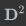

##### 维度规约 == **降维**（dimensionality reduction）

* 直接**降低输入属性的数目**来削减数据的维度

> 发表于《IEEE 模式分析与机器智能汇刊》（IEEE Transactions on Pattern Analysis and Machine Intelligence）第 1 卷第 3 期的论文《维数问题：一个简单实例（A Problem of Dimensionality: A Simple Example）》在数学上证明了**当所有参数都已知时，属性维数的增加可以让分类问题的错误率渐进为 0**；可当**未知的参数只能根据数量有限的样本来估计时，属性维数的增加会使错误率先降低再升高，最终收敛到 0.5**
>
> * 这就像一群谋士七嘴八舌在支招，当领导的要是对每个人的意见都深入考虑再来拍板的话，这样的决策也没什么准确性可言了
> * **数据样本的有限**
>   * 当**属性的维数增加**时，**每个属性每个可能取值的组合就会以指数形式增长**
>   * 一般的经验法则是**每个属性维度需要对应至少 5 个数据样本**，可当**属性维数增加而样本数目不变时**，**过少的数据就不足以体现出属性背后的趋势，从而导致过拟合的发生**

* 数据有限情况下解决维数灾难问题
  * **降维**
    * **特征选择（feature selection）**
      * 去除**“食之无味，弃之可惜”**的鸡肋属性
        * 和结果的相关性不强，或者和其他属性之间有较强的关联
        * 终究还包含一些独有的信息
    * **特征提取**（feature extraction）
      * 所有原始属性的信息一点儿不浪费地**整合到脱胎换骨的新属性**中

> 假设数据集中有 N 个样本，每个样本都有 p 个属性，则数据矩阵 X 的维度就是 N x p。将**中心化处理**后，也就是**减去每个属性平均值的** X 进行**奇异值分解（singular value decomposition）**可以得到
>
> 
>
> 其中 U 和 V 分别是 N x p 维和 p x p 维的正交矩阵，其各自的所有列向量可以张成一个子空间；D 是对角矩阵，对角线上的各个元素是数据矩阵 X 按从大到小顺序排列的奇异值（singular value）
>
> 可以证明，岭回归求出的最优系数可以写成 。将 X 的奇异值分解代入岭回归的预测输出中，就可以得到：
>
> 
>
> 其中  是矩阵 U 的列向量，也是 X 列空间的一组正交基，而岭回归计算出的结果正是将训练数据的输出  y 投影到以   为正交基的子空间上所得到的坐标
>
> 除了空间变换之外，岭回归的收缩特性也有体现，那就是上式中的系数。当正则化参数 λ 一定时，奇异值  越小，它对应的坐标被衰减地就越厉害
>
> 除了经历不同的收缩外，奇异值 还有什么意义呢？ 的平方可以写成对角矩阵 D 的平方，利用奇异值分解又可以推导出  和数据矩阵 X 如下的关系
>
> 
>
> 这个表达式实际上就是矩阵的**特征分解**（eigen decomposition）：等式左侧的表达式实际上就是数据的协方差矩阵（covariance matrix）乘以维度 N，V 中的每一列  都是协方差矩阵的特征向量， 中的每个对角元素  则是对应的特征值。如果你对主成分分析还有印象，就不难发现每一个  都是一个主成分（principal component)，第 j 个主成分上数据的方差就是 
>
> * **岭回归收缩系数的对象并非每个单独的属性，而是由属性的线性组合计算出来的互不相关的主成分，主成分上数据的方差越小，其系数收缩地就越明显**
> * 数据在**一个主成分上波动较大**意味着**主成分的取值对数据有较高的区分度**，“最大方差原理”。反之，**数据在另一个主成分上方差较小**就说明**不同数据的取值较为集中**，而**聚成一团的数据显然是不容易区分**的。岭回归正是通过**削弱方差较小的主成分**、**保留方差较大的主成分来简化模型**，实现正则化的。
>
> 

##### 主成分回归（principal component regression）

* 以每个主成分  作为输入计算回归参数。不同的主成分是两两正交的，因此这个看似多元线性回归的问题**实质上是多个独立的简单线性回归的组合**，每个主成分的权重系数可以表示为
  * 
  * 其中<>表示内积运算。y和每一列中的都要做去均值的处理，主成分分析的常数项是y，也就是所有数据输出结果的均值是
* 当主成分回归中使用的主成分数目等于数据的属性数目 p 时，主成分回归和岭回归的结果是一致的。可如果放弃方差最小的若干个主成分，得到的就是约化的回归结果，从而更加清晰地体现出主成分分析的思想。
* **典型的特征提取方法**，与收缩方法的本质区别在于**将原始的共线性特征转化为人为生成的正交特征**，从而带来了**数据维度的约简和数据压缩的可能性**。
  * 数字图像处理中的特征脸方法是主成分回归最典型的应用之一。
    * 所谓“**特征脸**”（eigenface）实际上就是用于人脸识别的主成分。用特征脸方法处理的人脸图像都具有相同的空间维度，假定图像的像素数目都是 100 x 100，那么每一个像素点都是一个属性，数字图像就变成了 10000 维空间中的一个点。可一般数字图像慢变特性决定了这 10000 个特征之间具有很强的关联，直接处理的话运算量较大不说，还未必有好的效果，可谓事倍功半。
    * 
  * 引入主成分分析
    * 主成分分析可以将 10000 个相互关联的像素维度精炼成 100～150 个特征脸，再用这些特征脸来重构相同形状的人脸图像
    * 这只是一组被**打成正方形的 10000 多维的相互正交的主成分**，而原始图像让它们碰巧具有了人脸的轮廓
      * 这些主成分可以用来分解任意一张面孔
  * 主成分分析可以看成**对高斯隐变量的概率描述**。隐变量（latent variable）是**不能直接观测但可以间接推断的变量**，虽然数据本身处在高维空间之中，但决定其变化特点的可能只是有限个参数，这些幕后的操纵者就是隐变量，**寻找隐变量的过程就是对数据进行降维的过程。**

* 总结
  * 在有限的数据集下，数据维度过高会导致维数灾难
  * 降维的方法包括特征选择和特征提取
  * 主成分分析将原始的共线性特征转化为新的正交特征，从而实现特征提取
  * 概率主成分分析是因子分析的一种，是数据的生成模型（略过，过于复杂）

