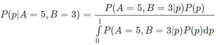

##### 概率：**概率表示的是客观上事件的可信程度（degree of belief），也可以说成是主观上主体对事件的信任程度，它是建立在对事件的已有知识基础上的。**

> 当一个球迷提出“明天皇家马德里**战胜**拉斯帕尔马斯的**概率**是 86%”的时候，可以理解成他对皇马**获胜有 86% 的把握程度**，要是买球的话自然就会在独胜上下出重注（其实贝叶斯概率正是来源于对赌博的分析）。

##### **贝叶斯定理（Bayes' theorem），用来解决“逆向概率问题”（inverse probability problem）。**

* 逆向概率 <===> 前向概率
  * 假定数据由一个**生成模型**给出，前向概率是在**已知生成过程**的前提下来**计算数据的概率分布和数字特征**，**逆向概率**则是在**已知数据(结果)**的前提下**反过来计算生成过程的未知特性**
    * 
      *  P(H) 被称为**先验概率**（prior probability）；P(D|H)被称为**似然概率**（likelihood probability）；P(H|D) 被称为**后验概率**（posterior probability）
    * **先验概率**是指根据以往**经验和分析得到的概率**，可以视为假设 H **初始的可信程度**
    * 与假设 H 相关的**数据 D 会作为证据**出现，将数据纳入考虑范围后，假设 H 的**可信程度**要么**会增强要么会削弱**。但不管增强还是削弱，得到的**结果都是经过数据验证的假设的可信程度**，这就是**后验概率**
* 贝叶斯的意义
  * **将先验概率和后验概率关联起来，刻画了数据对于知识和信念的影响**

> 纳粹德国的宣传部长保罗·约瑟夫·戈培尔有句名言：“如果你说的谎言范围够大，并且不断重复，人民终会开始相信它。”
>
> * 谎言的**先验概率 p(lie)**，也就是初始的**可信度接近于 0**，而p(lie¯)=1−p(lie)=1 接近于 1。
> * 似然概率**p(brainwash | lie)较大**， **p(brainwash | lie¯)较小。**
>   * 宣传对象**相信宣传者不说假话**，但宣传者**就是要说谎话**
> * 经过宣传（多次数据），**谎话成立**的**后验概率**
>   * 
>   * 只要 p(brainwash|lie)>0.5，谎言的后验概率就会大于先验概率
> * 本**次宣传得到的后验概率** (lie|brainwash)将作为**下次宣传的先验概率 p(lie)** 出现
> * 在后验概率与先验概率**不断迭代更新**的过程中，**p(lie|brainwash) 将持续上升**，谎言也就越来越接近真理了。

##### 与频率统计的对比

* 频率统计的核心
  * 认定**待估计的参数**是**固定不变的常量**，⽽⽤来估计的**数据是随机的变量**
  * 最大似然估计
    * 观测数据之所以会出现是因为它**出现的概率最大**，因此**最可能的参数**就是以**最大概率生成这一组训练数据的参数**
    * **参数为常量**，似然概率就**足以描述参数和数据**之间的关系
* 贝叶斯统计
  * 待估计的**参数视为随机变量**，用来估计的**数据反过来是确定的常数**，讨论观测**数据的概率分布才是没有意义**的
  * 任务
    * 根据这些确定的**观测数据**反过来**推断未知参数**的**概率分布**
  * 后验概率最大化，最大后验概率估计（maximum a posteriori estimation）
    * **参数**本身是**随机变量（服从先验分布）**，有许多**可能的取值**，而**不同取值生成这一组观测数据**（服从**似然分布**）也是**不同**的。因而最大后验概率推断的过程就是**结合参数自身的分布特性**，找到**最可能**产生**观测数据的那个参数**的过程。
    * **后验概率**正比于**先验概率和似然概率的乘积**
      * 后验概率实质上就是**用先验概率对似然概率做了个加权处理**
    * 参数为变量，**参数自身**也会**影响到参数和数据之间的关系**

> “Jo 去进行某种疾病的检查。令**随机变量 a 表示 Jo 的真实健康状况**，a=1 表示 Jo 生病，a=0 表示 Jo 没病；令**随机变量 b 表示 Jo 的检查结果**，b=1 表示阳性，b=0 表示阴性。已知**检查的准确率是 95%**，也就是此病患者的检查结果 95% 会出现阳性，非此病患者的检查结果 95% 会出现阴性，同时在 Jo 的类似人群中，此病的发病率是 1%。如果 Jo 的检查结果呈阳性，那么她患病的概率是多大呢？"
>
> * 直观理解，“检查的准确率是 95%”似乎说明了 Jo 患病的概率就是 95%。
> * 根据贝叶斯定理，患病概率
>   * 
>   * 式中的 p(b=1|a=1)=0.95 就是似然概率，p(a=1)=0.01 则是先验概率。不难求出，**Jo 患病的真正概率**，也就是**后验概率只有 16%!**
> * 为什么会出现诊断阳性，患病概率这么低？
>   * 频率学派来说，Jo 要么生病要么没病，概率的推演是在这两个确定的前提下分别进行的，所以似然概率就足以说明问题
>   * **阳性检查结果**既有**真阳性也有假阳性**（误诊），两者的比例是不同的
>     * 虽然真阳性基本意味着生病，但由于先验概率较小（1%），它在所有的阳性结果中依然是少数（16%）。相比之下，假阳性结果凭借其比较大的先验概率（99%），占据了阳性结果的大部分（84%）。
>   * **抛开先验概率谈似然概率，没有道理可言**

##### 先验信息从哪里来？

* 先验信息是在**使用数据之前**关于分析对象的已有知识，可当这种**已有知识并不存在**时，就**不能对先验做出合理的建模**
* **先验分布**不可避免地会**受到主观因素的影响**
* 当已有的知识实在**不足以形成先验信息**时，引入**无信息先验**（noninformative prior）
  * 认为**未知参数取到所有取值**的**可能性都是相等**的，也就是**满足均匀分布**
  * 先验概率是个常数，这个先验概率也被称为**平坦先验**（flat prior）
    * 此时，**最大后验估计和最大似然估计是等效的**

> 处理未知参数 p 的方式不应该是武断地把它看成一个常数，而是应该从**变量的角度去观察**，考虑它在 [0, 1] 上**所有可能的取值**，再计算在**所有可能的取值下 Bob 获胜概率的数学期望**，从而**消除 p 的不确定性对结果的影响**。
>
> * Bob 获胜的概率就可以写成
> * 贝叶斯定理可以将上式中的条件概率写成
>   * 先验概率 P(p) 是在观察到数据之前 p 的分布，因而是未知的。但由于 **p 服从均匀分布，所以是个常数**，也就**不会对 P(p|A=5,B=3) 产生影响**
>   * P(A=5,B=3|p) 可以用二项分布计算，其数值等于 8!/(5!3!)p5(1−p)3。将这一结果代入 E 的表达式，可以得到
> * 这与最大似然估计得到的结果是不同的。但这个结果却符合频率主义的阐释：如果用蒙特卡洛法（Monte Carlo method）进行数值仿真的话，你会发现这个 0.0909 才是符合真实情况的概率。

* 总结
  * 贝叶斯定理应用到机器学习之中，完成**模型预测和选择**的任务
  * **大量涉及各种显式变量与隐藏变量的依赖关系，通常用概率图模型来直观地描述**
  * 将未知参数视为随机变量，参数在学习之前的不确定性由先验概率描述，学习之后的不确定性则由后验概率描述，这中间不确定性的消除就是机器学习的作用。
  * 贝叶斯学习的输出不是简单的最优估计值 θ^，而是关于**参数的概率分布 p(θ)**
    * 在预测问题中，贝叶斯学习给出的也不仅仅是一个可能性最大的结果，而是将所有结果及其概率以**概率分布的形式完整地呈现出来**。
  * 模型选择
    * 所谓不同的模型其实就是不同概率分布的参数化表示，使用的参数也有它们自己的先验分布，但所有模型的共同点是它们都能生成训练数据集，而模型选择的任务就是从这些概率分布中挑出一个最好的。
      * “好”的标准就是**数据和模型的符合程度**，也叫**可信度（model evidence）**。可信度实际上就是**归一化的似然函数 p(D|M)**，表示的是**模型 M 生成数据 D 的条件概率**。当不同复杂度模型的经验风险接近的时候，就可以利用可信度来筛选模型了。
  * 缺点
    * 对未知变量的积分运算会导致极高的计算复杂度（computation complexity）
    * 对先验分布的设定（prior specification）包含一定的主观性，因而一直不招老派的统计学家待见

> 1. 在统计问题上，频率学派认为，参数是一个固定值（因为分布固定了嘛），数据是随机的，之后根据最大似然估计来求得参数值。但是这里有一个暗含的假设，就是如果参数固定那么分布也是固定的，也就是说我在讨论问题之前把模型固定好了，那么问题来了，模型是怎么确定的，你凭什么认为这个模型是最符合当下讨论问题的模型呢？于是就可以借此引出贝叶斯派的观点，贝叶斯学派认为，频率学派在选定模型的时候其实已然使用了先验的知识作为依据，相当于频率学派把问题人为简化成他们最优的一种情况。但是其实真实情况哪有那么简单，产生同一组数据的凭什么只能是一种模型，也有可能是多种模型，应该把所有可能产生样本数据的模型都纳入到考虑的范围之内，那么参数就变成了一个随机变量（因为分布不固定），而样本数据则是固定的，利用最大后验概率方法（所有可能产生这组数据的模型中，哪个模型生成这组数据的概率最大就选哪个模型）确定最优分布，进而得到参数。
> 2. 贝叶斯公式虽然简单，但是却揭示了一个深刻的道理，就是我们原有的知识以及现有的数据是如何影响我们对于某件事情的信念的。而且这个过程应该还是一个动态变化的过程。举一个粗浅的例子，一开始我不信中医，我对它的先验概率是20%，结果有一次生病，误打误撞被中医治好了，假设被中医治好是有一个概率的（而且我也知道），而且居然发生了，那么我就可以通过这两个概率得到一个新的后验概率，也就是我对中医的信任程度增加到40%，这个就作为下一次我再生病的时候的先验概率。这个更接近于现实。
> 3. 贝叶斯因为特别重视先验概率，而有的时候先验概率的获得极为困难，而且不一定客观，所以被频率主义诟病。
> 4. 贝叶斯计算的复杂度往往要比频率主义大得多，所以现实中退而求其次利用频率分布的方法来解决问题多一些。

