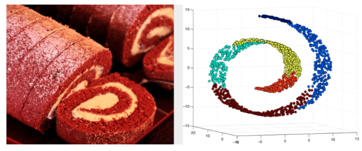
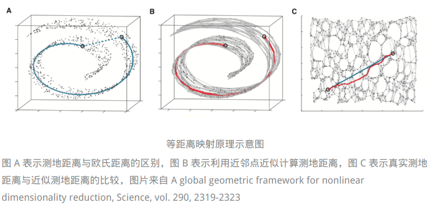
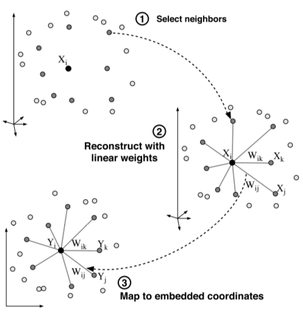
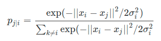
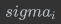
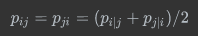
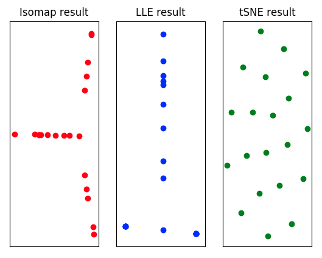

> 瑞士卷：一张**卷起来的薄蛋糕片**，虽然卷曲的操作将它从**二维形状升级成了三维形状**，但这个**多出来的空间维度并没有产生关于原始结构的新信息**，所以瑞士卷实际上就是**嵌入三维空间的二维流形。**
>
> 

* 流形（manifold）：嵌入在高维数据空间中的低维子空间

  * 维数 == 低维数据变化的自由度（degree of freedom of variability）/ 固有维度（intrinsic dimensionality）

  

##### **流形学习**（manifold learning）

* 挖掘数据的内在结构**实现向固有维度的降维**，从而找到**与高维原数据对应的低维嵌入流形**
* 流形可以是线性的，但更多是非线性的
  * **非线性降维方法的代表**
* 方法一般还是**非参数的**，这使流形能够**更加自由地表示数据的固有维度和聚类特性**，但也让它**对噪声更加敏感**

* 步骤
  * 确定低维流形的结构
    * 实际问题中，流形结构还是流形维数都不已知 --> 先验假设缩小问题解空间
      * 假设聚焦于数据几何性质 --> **多维缩放**（multiple dimensional scaling）算法
        * 高维空间上的样本之间的距离在低维空间上尽可能得以保持，以距离重建误差的最小化为原则计算所有数据点两两之间的距离矩阵
        * 根据降维前后距离保持不变的特点，距离矩阵又可以转化为内积矩阵
  * 确定高维空间到低维流形的映射关系
    * 原始高维空间与约化低维空间距离的等效性是不是一个合理的假设呢？

> 地球仪，这个三维的球体实际上也是由二维的世界地图卷成，因而可以约化成一个二维的流形。如果要在流形上计算北京和纽约两个城市的距离，就要在地球仪上勾出两点之间的“直线”，也就是沿着地球表面计算出的两个城市之间的直线距离。但需要注意的是，这条地图上的直线在二维流形上是体现为曲线的。
>
> 计算出的流形上的距离是否等于三维空间中的距离呢？答案是否定的
>
> 北京和纽约两点**在三维空间中的欧氏距离对应的是三维空间中的直线**，而**这条直线位于地球仪的内部**——按照这种理解距离的方式，从北京去纽约应该坐一趟穿越地心的直达地铁。这说明多维缩放方法虽然考虑了距离的等效性，却没能将这种等效性放在数据特殊结构的背景下去考虑。它忽略了高维空间中的直线距离在低维空间上不可到达的问题，得到的结果也就难以真实反映数据的特征。

* **等度量映射**（isometric mapping）

  * 以数据所在的低维流形与欧氏空间子集的等距性为基础
  * 在流形上，描述距离的指标是**测地距离**（geodesic distance），它就是在地图上连接北京和纽约那条直线的距离，也就是流形上两点之间的固有距离。
  * 在**流形结构和维度未知**的前提下，**测地距离是没法直接计算**的
    * 利用流形与欧氏空间局部同胚的性质，根据欧氏距离为每个点找到近邻点（neighbors），直接用欧氏距离来近似近邻点之间的测地距离
    * 测地距离的计算就像是**奥运火炬**，在每一个火炬手，也就是**每一个近邻点之间传递**。将**每个火炬手所走过的路程**，也就是**每两个近邻点之间的欧氏距离求和**，得到的就是**测地距离的近似**（积分思想？）
    * 在**每一组近邻点之间建立连接**就可以让所有数据点**共同构成一张带权重的近邻连接图**
      * **相距较远的两点的测地距离**就被**等效为连接这两点的最短路径**
    * 

* 关注数据局部结构 -- **局部线性嵌入（locally linear embedding）**

  * **待求解的低维流形在局部上是线性的，每个数据点都可以表示成近邻点的线性组合**
    * 求解流形的降维过程就是在保持每个邻域中的线性系数不变的基础上重构原数据点，使重构误差最小。
  * 步骤
    * 在**确定一个数据点的近邻点**后，首先根据**最小均方误差来计算用近邻点表示数据点的最优权值**，需要注意的是**所有权值之和是等于 1** 的
    * 接下来就要**根据计算出的权值来重构原数据点在低维空间上的表示**，其准则是**重构的近邻点在已知权值下的线性组合与重构数据点具有最小均方误差**
      * 重构映射的求解最终也可以转化为矩阵的特征值求解
    * 

* **等度量映射**理如其名，它**将距离视为空间变换过程中的不变量**，强调的是**不同数据点关系的不变性**，以及**数据全局结构的完整保持**

  * 如果把全局结构看作一个拼图玩具，等度量映射的任务就是将**每一块拼图所代表的邻域正确组合，从而构成完美的完整图案**

* **局部线性嵌入**在乎的只有数据关系在某个邻域上的不变性

  * 数据点可以用它的**邻近点在最小二乘意义下最优的线性组合表示**，这个**局部几何性质是不会改变的**
  * 可是在**邻域之外**，局部线性嵌入并**不考虑相距较远的数据点之间关系的保持**，颇有些**“各人自扫门前雪，莫管他人瓦上霜”**的意味。
  * 局部线性嵌入在拼图时更加随意，只要把所有的拼图块按嵌入关系连成一片就可以了，至于拼出什么奇形怪状都不在话下

* 

* 两者都以**几何性质作为同构的基础**

  * **随机近邻嵌入**（stochastic neighbor embedding）

    * 保持降维前后数据的概率分布不变，它将高维空间上数据点之间的欧氏距离转化为服从正态分布的条件概率

    * 

      * 其中是困惑度参数（perplexity)，近似地看成近邻点的数目

      * 描述**不同数据点之间的相似性**

      * **相距越近的点形成近邻的概率越大，相似的概率也就越大**。这就像我们在上学时按照身高排队一样，站在一起的人身高会更加接近，位于队首和队尾两个极端的人则会有较大的身高差。

      * 映射到低维空间后，随机近邻嵌入按照和高维空间相同的方式计算低维空间上的**条件概率**，并要求两者尽可能地相似，也就是**尽可能地保持数据间的相似性**。**重构的依据**是**让交叉熵（cross entropy），也就是 KL 散度（Kullback-Leibler divergence）最小化。**

        * 但 KL 散度不对称的特性会导致**相聚较远的点体现为较大的散度差**，为了使 **KL 散度最小化，数据点映射到低维空间之后就会被压缩到极小的范围中**
        * 一群学生突然被紧急集合到操场上，挤在一起之后根本分不清哪些人来自于哪个班，这就是所谓的**拥挤问题**（crowding problem）

      * $$
        p_{ij} = p_{ji} = (p_{i | j} + p_{j | i}) / 2
        $$

* **拥挤问题**（crowding problem）
  * t 分布随机近邻嵌入（t-distributed stochastic neighbor embedding）
    * 将由欧氏距离推导出的条件概率改写成对称的形式
      * 
    * 令低维空间中的条件概率服从 t 分布（高维空间中的正态分布保持不变）
  * **让相同结构的数据点在低维空间上更加致密，不同结构的数据点则更加疏远**
* **线性可以看成是非线性的特例**，**概率主成分分析**其实也可以归结到**广义的流形学习**范畴中
  * **两个满足正态分布的隐变量使数据分布呈现出类似煎饼的椭圆形状**，这张煎饼实际上就是**流形**。煎饼所在的**超平面显示的只是数据的投影**，之所以**选择这个平面来投影是因为数据的变化集中在这里**。相比之下，**数据在垂直于超平面的方向上方差较小，因而这些变化在降维时可以忽略不计**
* **以主成分分析为代表的线性方法和以流形学习为代表的非线性方法各自的优缺点**在哪里呢？一言以蔽之，**线性方法揭示数据的规律，非线性方法则揭示数据的结构。**
  * 主成分分析可以去除属性之间的共线性，通过特征提取揭示数据差异的本质来源，这为数据的分类提供了翔实的依据
  * 流形学习虽然不能解释非线性变化的意义，却可以挖掘出高维数据的隐藏结构并在二维或三维空间中直观显示，是数据可视化的利器，而不同的隐藏结构又可以作为特征识别的参考。
* Scikit-learn 中包括了执行流形学习的 manifold 模块，将常用的流形学习方法打包成内置类，调用 Isomap、LocallyLinearEmbedding 和 TSNE 等类就可以计算对应的流形，算法的细节都被隐藏在函数内部，只需要输入对应的参数即可。
  * 用以上算法将多元线性回归的英超数据集投影到二维流形上，由于数据集中的数据点较少，各种算法中近邻点的数目都被设置为 2 个，得到的结果如下。可以看出，三种方式计算出的流形中似乎都存在这一些模式，但说明这些模式的意义可就不像将它们计算出来那么简单了。
  * 
* 总结
  * 流形学习是非线性的降维方法，目的在于找到与高维数据对应的低维嵌入流形
  * 等度量映射是基于全局信息的流形学习方法，通过测地距离和欧氏距离的等效性计算流形
  * 局部线性嵌入是基于局部信息的流形学习方法，通过局部线性系数的不变性计算流形
  * t 分布随机近邻嵌入将欧氏距离映射为相似性，利用相似性的保持计算流形

