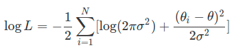

#### 机器学习：通过计算的手段利用经验来改善系统自身性能

> 经验以**数据**形式出现
>
> 机器学习任务
>
> * 基于已知**数据**构造**概率模型**，反过来再**运用概率模型**对**未知数据进行预测**与分析
>
>   
>
>   ---> 对**概率**的**认知**

#### 概率（probability）

> 解读方式：
>
> 1. **频率学派**（Frequentist）
>    1. 概率是随机事件发生频率的极限值
> 2. **贝叶斯学派**（Bayesian）

---

##### 频率学派

1. 根据频率**计算概率**
   1. 有个病人找医生看病，医生检查之后对他说：“你这病说得上是九死一生，但多亏到我这里来看了。不瞒你说，在你之前我已经看了九个得一同样病的患者，结果他们都死了，那你这第十个就一定能看得好啦，妥妥的！”
      1. 频率主义：九死一生 == 十次手术九次失败一次成功
      2. 缺陷：病人数量过少
   2. **重复试验的次数趋近于无穷大时，事件发生的频率会收敛到真实的概率之上**
      1. 前提：概率是一个确定的值，不会受到单次观察结果的影响
         1. 将一枚均匀的硬币抛掷 10 次，结果可能是 10 次都是正面，也可能 10 次都是反面，写成频率的话就对应着 0% 和 100% 这两个极端，代表着**最大范围的波动**。可如果将抛掷次数增加到 100 次，出现正面的次数依然会发生变化，但波动的范围更可能会**收缩到 40% 到 60%** 之间。再将抛掷次数增加到 1000，10000 的话，频率波动的现象不会消失，但**波动的范围**会进一步**收缩到越来越小**的区间之内。
2. 频率统计**估计参数**
   1. 认定**待估计的参数**是**固定不变**的常量，讨论参数的**概率分布是没有意义**的；而用来估计参数的**数据是随机的变量**，每个**数据**都是**参数支配**下一次独立重复**试验的结果**
   2. 参数（如概率）本身确定，**频率波动**只是源于**有限次观察**造成的干扰
      1. 根据这些不精确的数据就可以对未知参数的精确取值做出**有效的推断**
      2. 数据中包含的只是**关于参数不完全的信息**，所以从样本估计整体就必然会**产生误差**。

> ##### 统计学核心任务之一
>
> * 根据从总体中抽取出的**样本**，也就是**数据**来**估计未知的总体参数。**
>
> ##### 参数的最优估计
>
> * 通过样本数据的分布，也就是**采样分布**（sampling distribution）来求解，由于频率统计将数据看作随机变量，所以计算采样分布没有问题
> * 参数估计 == 最优化问题 
>   * 最常用最优化方法：最大似然估计（maximum likelihood estimation）
>     * **目标是让似然概率最大化，也就是固定参数的前提之下，数据出现的条件概率最大化**
>       * 一组数据之所以能够在单次试验中出现，是因为它出现的可能性最大

##### 参数估计的过程

* 赋予观测数据最大似然概率的过程

> “如果观测到的数据 θi 是真实值 θ 和方差为 σ^2，但形式未知的噪声 ei 的叠加，那么如何得出 θ 的最优估计值？”
>
> * 对似然函数进行建模
>   * 重要假设：未知形式的**噪声满足高斯分布**
>     * 从理论上说，在功率有限的条件下，**高斯噪声的信源熵最大**，因而带来的**不确定性**也就越大，换句话说，这是**最恶劣的噪声**；从实践上说，**真实的噪声**通常来源于**多个独立的物理过程**，都具有**不同的概率分布**，中心极限定理告诉我们，当**噪声源的数目越来越多**时，它们的**叠加就趋近于高斯分布**，因而高斯噪声就是对真实情况的一个**合理的模拟**。
>   * 每个观测数据 θi 满足的概率分布写成
>     * 
> * 计算**所有数据的概率分布的乘积**，得到的就是**似然函数**（likelihood function)
>   * 
> * 求解**似然函数的对数**，就可以将**乘法运算转换为加法运算**
>   * 
> * 令对数似然函数的**导数为 0**，就求出了使**似然概率最大的最优估计**
>   * 
>
> **虽然真实值 θ 是个固定值，但估计值 θ^ 却是数据(θ)的函数，因而也是个随机变量。**
>
> * 估计值本质上是利用**数据构造**出来的函数，既然**数据是随机分布**的，**估计值肯定也是随机的**。这意味着如果每次估计使用的数据不同，得到的估计值也不会相同。那么如何来度量作为**随机变量的估计值和作为客观常量的真实值之间的偏差**呢？**置信区间**（confidence interval）就是频率学派给出的答案。
>
> ###### 置信区间
>
> * 意义：划定了**真值的取值范围**，真实的参数会以**一定的概率 α** 落入根据**样本计算出的置信区间**之内
>   * 从同一个总体中进行 100 次采样可以得到 100 个不同的样本，根据这 100 个不同的样本又可以计算出 100 个不同的置信区间。在这么多个置信区间之中，包含真值的有多少个呢？100×α 个，剩下的 100×(1−α) 个置信区间就把真值漏掉了。这有点像乱枪打鸟：每一枪都乱打一梭子，打了 100 枪之后统计战果，发现打下来 100×α 只鸟。如果把参数的真实值比喻成鸟，那么每一枪轰出的一梭子子弹就是置信区间。显然，置信区间的上下界和估计值一样，也是随机变量。

#### 频率主义总结

* **参数确定，数据随机**，利用随机数据推断确定参数，得到结果也随机。

* 把**可能的参数空间**压缩成为**一个点**
  * 参数本身可能满足这样或者那样的概率分布，但一旦**试验的条件确定**，参数表现出来的就是一个**固定的取值**，让所有的**概率分布都失去了意义**
    * 即使上帝真的掷骰子，但从骰子脱手那一刻起，它的点数就不再受上帝的控制，也就变成了确定不变的取值
* 频率主义者关注的就是这个**真实存在的唯一参数**，通过计算它对数据的影响来实现估计
* 统计机器学习（statistical learning）
  * 通过对给定的指标（比如似然函数或者均方误差）进行最优化，来估计模型中参数的取值，估计时并不考虑参数的不确定性，也就是不考虑未知参数的先验分布。**和参数相关的信息全部来源于数据，输出的则是未知参数唯一的估计结果，这是统计机器学习的核心特征**。
  * 受到噪音和干扰影响，观测数据不是未知参数的准确反映
    * 如何**衡量估计结果的精确程度**
      * **损失函数**（loss function）定义了模型性能的度量方式，其数学期望被称为**风险**（risk），风险最小化就是参数估计的依据和准则。
      * 估计最优参数需要计算风险，计算风险时需要在数据的概率分布上对损失函数进行积分，可表示数据的分布又需要依赖未知参数的精确取值。这就给频率主义出了一个无解的问题：风险函数是没有办法精确求解的。
      * 引入了**经验风险**（empirical risk），**用训练数据的经验分布替换掉原始表达式中数据的真实分布**，借此将风险函数转化成了可计算的数值
      * 分类问题中的误分类率，还是回归问题的中的均方误差，都是经验风险的实例，而所谓的最优模型也就是使经验风险最小化（empirical risk minimization）的那个模型