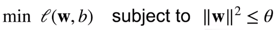
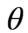
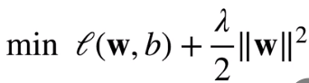
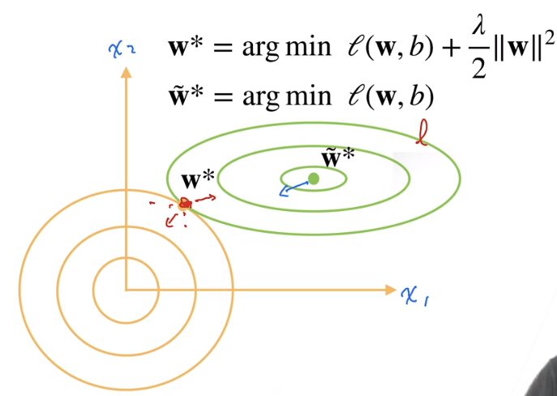
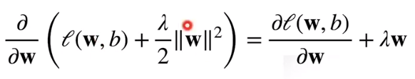
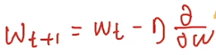
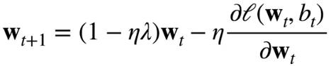
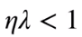

* 权重衰退（weight decay） -- 处理过拟合问题
  * 使用均方范数作为硬性限制（控制模型容量）
    * 通过限制参数值的选择范围
      * 
      * 通常不限制b
      * 小的意味着更强的正则项（限制比较紧)
  * 使用均方范数作为柔性限制
    * 对每个，都可以找到λ使得之前的目标函数等价于
      * 可以通过拉格朗日乘子来证明与前面限制参数大小一样（只是换了种形式）
    * 超参数λ控制正则项（惩罚项）的重要程度（控制模型复杂度的超参数）
      * λ=0：无作用
      * λ->∞，w*->0
        * 通过慢慢增加λ来控制模型复杂度不会增加太快
    * 例子
      * 
* 参数更新法则
  * 计算梯度
    * 
  * 时间t更新参数
    * 
    * 
    * 通常，在深度学习中叫做权重衰退
    * 主要区别在于前半部分，每次更新梯度时，将wt乘以一个小于1的正常数
      * 值变小，沿着梯度方向再走一点

