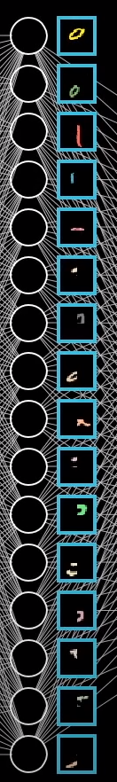
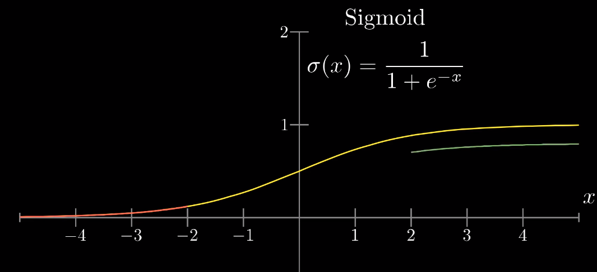

#### Why the layers?

* 来源于人脑
  * what are the neurons?
    * Neuron -> Thing that holds a number
    * 
      * 值取决于输入，将其当做一个函数
    * eg
      * 
      * 784神经元，每个神经元存储一个灰度值（激活值）（0-1）
        * 值越大，神经元越亮
        * 784个神经元构成网络的第一层
      * 最后一层  10个神经元存储激活值（0-1）
        * 
        * 系统则认为这些就激活值代表对应哪个数字的可能性
      * 中间则是“隐含层”
        * 进行处理识别数字的具体工作
        * 
        * 随意选择放两层每层16个神经元的隐藏层
          * why 2 layers？
            * 一层提取横竖撇拿
              * 
            * 一层提取偏旁部首
              * 
            * 层层组合起来成一个字
      * 怎么识别区域内的一条边？
        * 将隐藏层每个神经元与输入层每个神经元一一连接起来
        * 给每条线设置权重，算加权和
          * 
          * 正的权重为绿色，负的则为红色，颜色越深，权重越接近0
        * 将要关注区域权重赋值为正数，其他区域都是0
          * 对所有像素值取加权和，就会累加关注区域的权重值
            * 
          * eg：识别出横线
            * 周围一圈设置负的权重，中间亮，周围暗时，加权和达到最大
              * 
      * 加权和映射到[0,1]
        * 
        * 设置阈值（加权和大于0时，也不想把神经元点亮）
          * 偏置
      * 
      * 
  * how are they connected?

