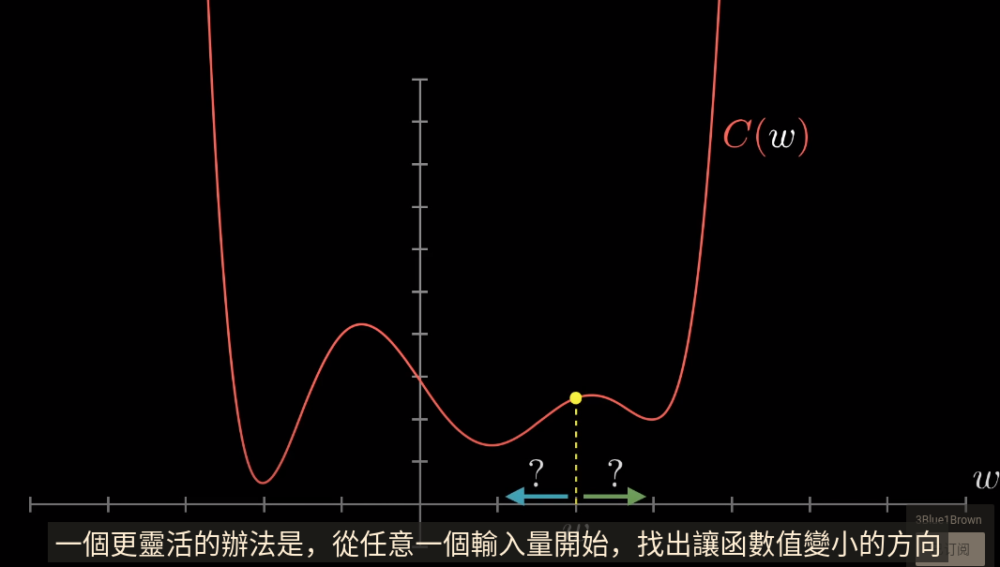
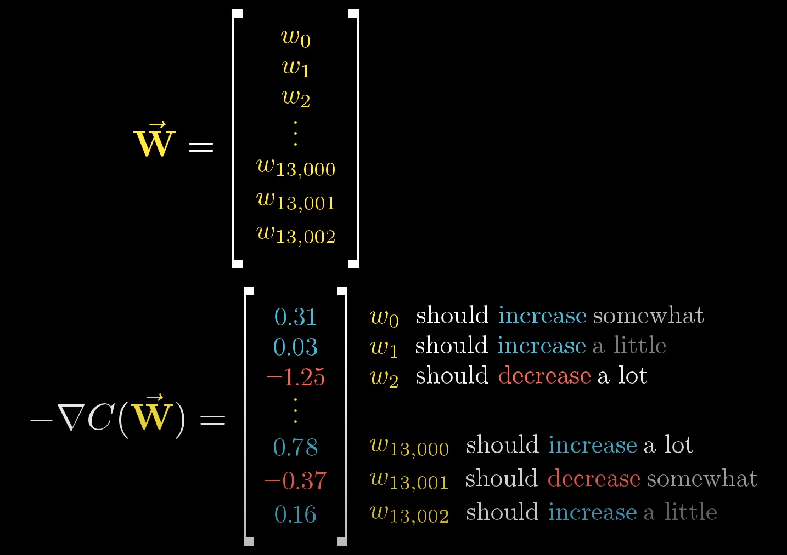

#### 大量训练数据

> 很多**手写数字图像** 和 标明了数字是几的**标记**

#### 权值与神经元连接强度

* **每个**神经元都与前一层**所有神经元**相连
  * 加**权值**相当于神经元**连接强度**参考值
  * **偏差**值代表某个神经元**倾向**于**激活还是不激活**并且关闭

#### 正确输出与参数校正

* 单个训练例子中的成本
  * 将每个**垃圾输出** 与 想要的**正确输出** 的**差的平方**相加
* 神经网络 **表现好坏** 的衡量值
  * 上万个训练案例中的平均成本

#### 成本函数的复杂性

* 将成千上万的权重和偏差作为输入，并输出一个数字反映这些权重质量好坏
* 由上万次训练后的表现决定

> 如何解决这种问题？
>
> 找到成本函数的最小值
>
> 
>
> * 往使得**函数输出变小**的**方向**走
>   * 当某点**斜率为正**，往**左**走
>   * 当某点**斜率为负**，往**右**走
> * 使用**合适的步骤**不断**重复检查**每一点的**斜率**
>   * 找到函数的局部最小值
>     * 一个球从山上滚落
>     * 从**随机的位置**出发得到**多个山谷**
>   * 使得步长与斜率成反比
>     * 越接近最小值，步长越小，避免**找过头**
>
> * 多个自变量时，函数梯度就是**最陡峭**的**上升方向**
>   * 梯度向量的**长度**就是斜坡多**陡的指标**

#### 加快梯度计算

* 传播（see 3.md）

---

#### 神经网络学习==缩小成本函数

* 梯度下降
  * **反复**将函数输入按**负梯度倍数**来**输入**
  * 成本函数向局部最小值收敛
    * 沿山谷下降
* 重要信息
  * 梯度符号
    * 输入向量的方向（向上还是向下）
  * 幅度大小
    * 
    * **一些权重**改变对成本函数**影响很大**
      * 每个方向上的梯度值对应了相对重要性
      * 

