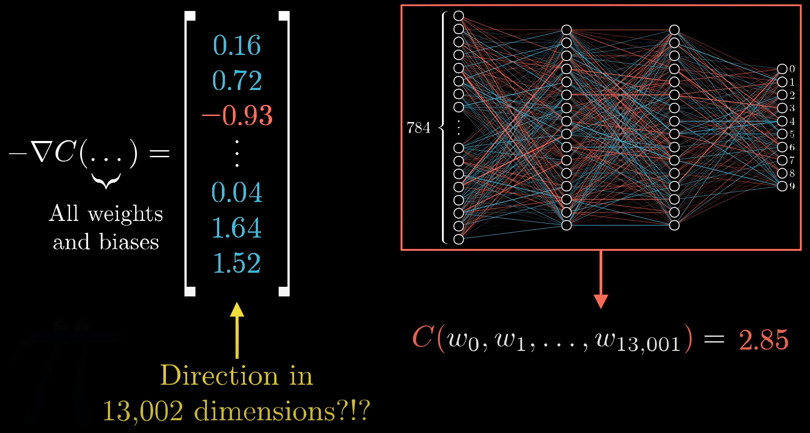

> **梯度**向量的**每一项大小** == **代价**函数对于**每个参数**的**敏感度**

#### 成本函数 == 所有样本的代价平均

* 积少成多
  * 讨论一个样本对权重和偏置的影响
    * 初始状态
      * 权重和偏置参数 随机生成
    * 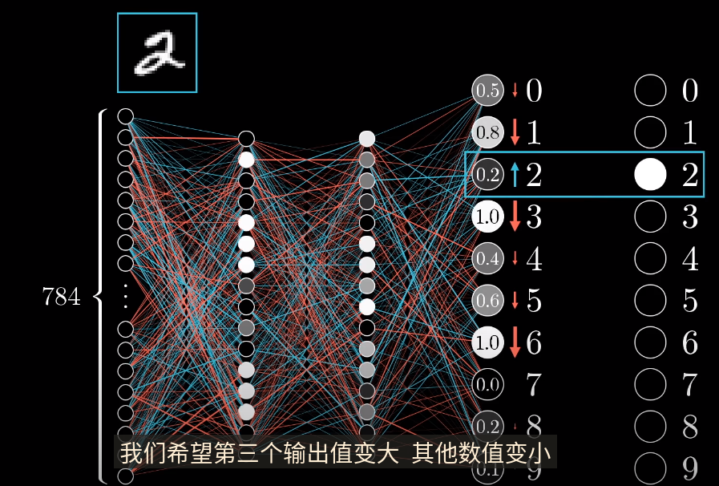
      * 这里是有有监督的，所以知道最终分类正确结果应该是2
* 希望第3个分类的激活值变大，而其他的激活值变小
  * **变动大小**应该与 **现在值和目标值之间的差** 呈**正比**
  * 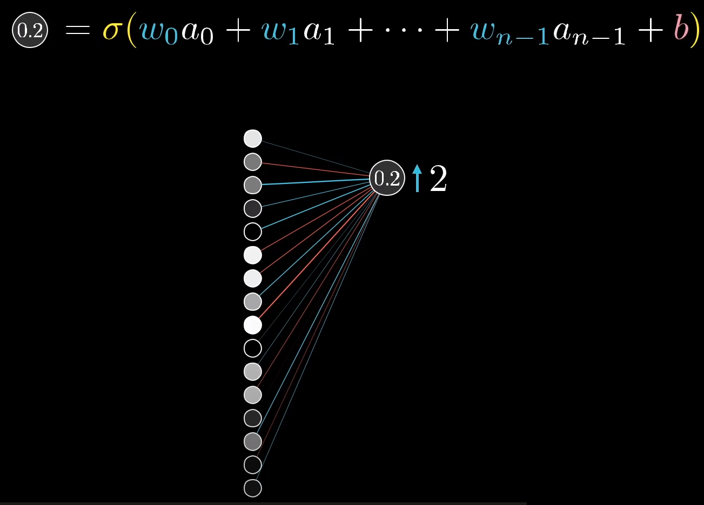
    * 0.2来源于前一层的所有激活值的加权和 加上一个偏置，外层套上一个sigmoid ReLU之类的挤压函数
* 增加这个激活值 
  * 三种方案
    * 增加偏置
    * 增加权重
    * 改变上一层激活值

> ##### 调整权重
>
> * 连接前一层**最亮神经元**的**权重**，影响力也最大
>   * 这些权重与**大的激活值**（亮神经元）相乘
> * 增加这几个**亮神经元的权重**，对于**最终成本函数**的影响，比增大连接**暗淡神经元权重**造成影响**更大**
> * “赫布”理论：一同激活的神经元关联在一起
>   * 权重的最大增长 == 连接变得更强的部分
>   * 另外需要对**其余神经元**的**激发变弱**
>   * 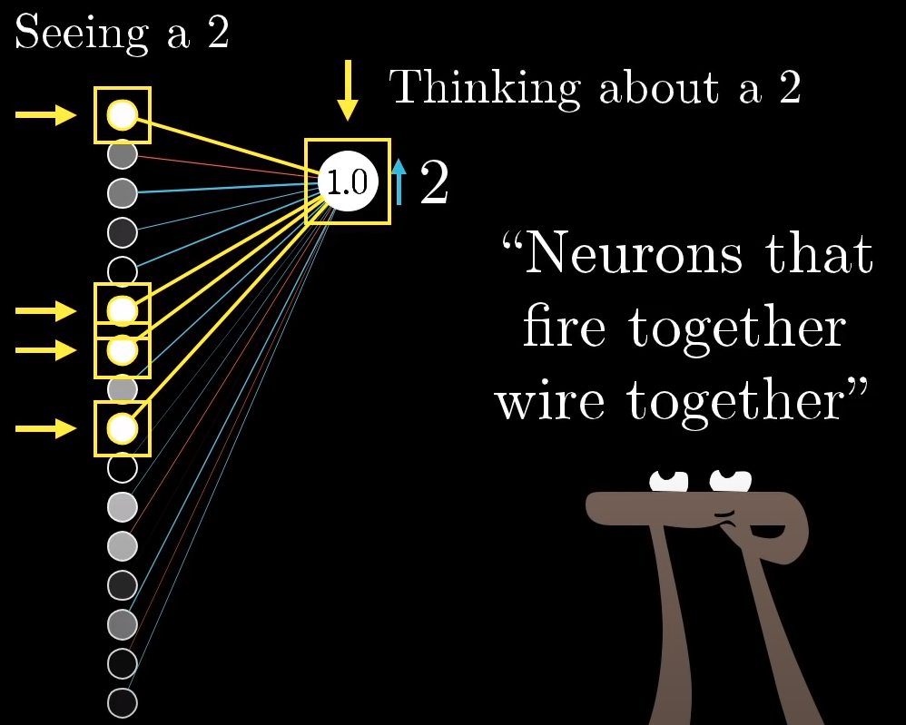
>   * 把对**数2神经元的期待**（提高）和**别的输出神经元的期待**（减弱）加起
>     * 作为如何改变**倒数第二层神经元的指示** == 倒数第二层**改动的变化量**
>     * 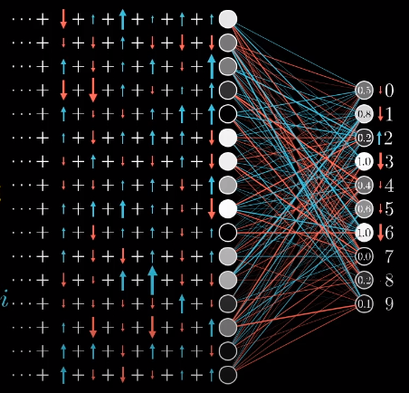
>     * 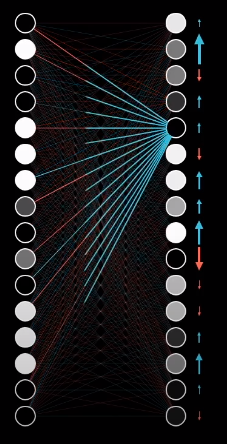
>     * 通过这些改变量，**不断改变**前一层**激活值的相关参数**
> * 对**所有**的训练样本进行**同样的BP**
>   * 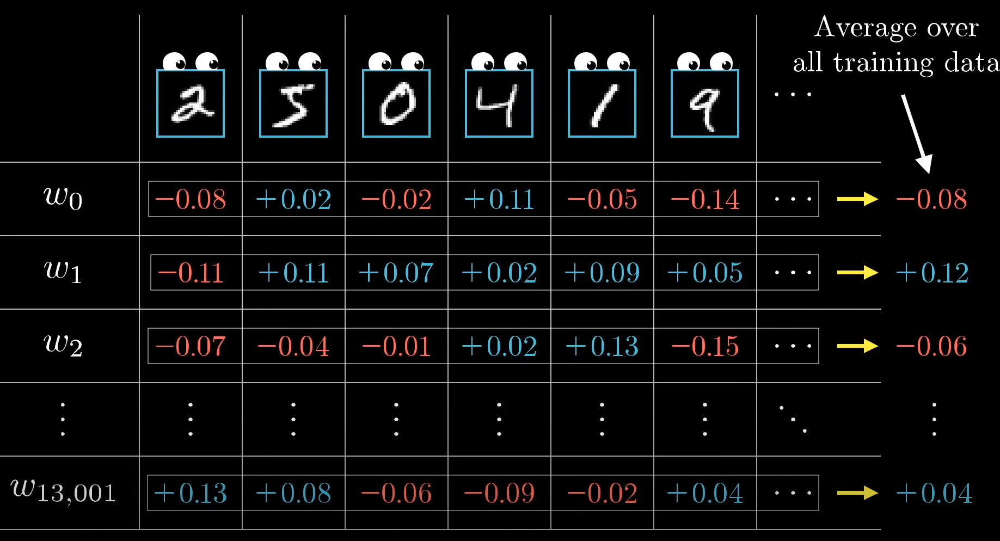
>   * 一系列参数的**平均微调大小** == **代价函数负梯度**的倍数
>     * 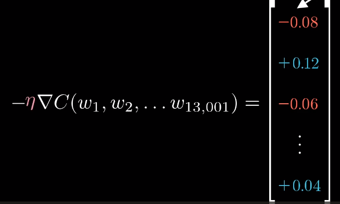
>
> ##### 改变上一层激活值
>
> * 只能通过**改变权重偏置**等参数**间接改变**激活值
> * 根据对应**权重的大小**，对激活值做出**呈比例的改变**

##### 随机梯度下降

* 所有训练样本都进行这样计算，耗费**时间过长**
* 改良 -- **随机梯度下降**
  * 打乱训练样本，分成很多组mini-batch
  * 使用mini-batch组中样本进行梯度下降算法
    * 相当于醉汉下山
    * 减轻计算量

---

##### BP想法

* 单个训练样本怎样修改权重和偏置
  * 参数变大变小
  * 变化比例多大，最快降低代价
* 对所有的训练样本

#### 梯度下降想法

* 对所有的训练样本进行BP，将变化值取平均（太慢）
* 做法
  * 计算mini-batch的梯度，调整参数，不断循环
  * 收敛到局部最优

---

#### BP演算（可选）

* 以每层一个神经元为例
  * 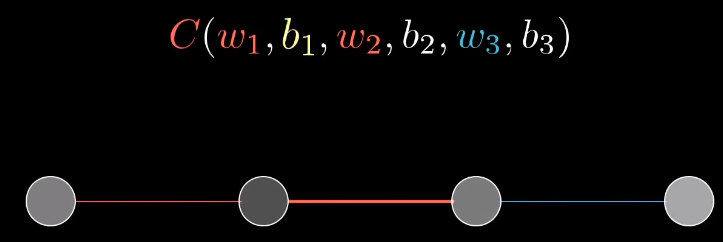
  * 代价函数由这些参数决定
* 目标：**理解**代价函数C对于这些变量的**敏感程度**  借此**调整参数** 使得代价**降低最快**
* 先看最后两层
  * 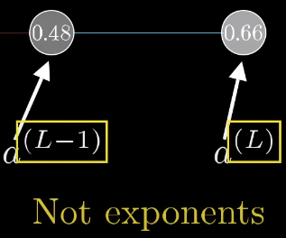
    * 最后一个神经元激活值上标L代表处于第L层
  * 给定训练样本，最终层激活值需要接近的目标为y
    * 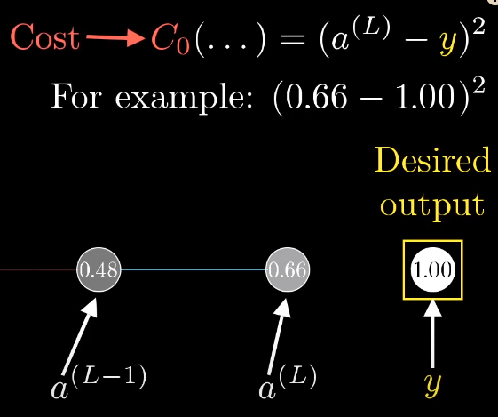
      * 网络对于单个训练样本的代价 == C0
    * 最终层激活值 
      * 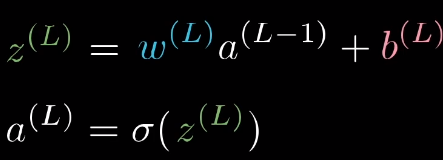
    * 链式
      * 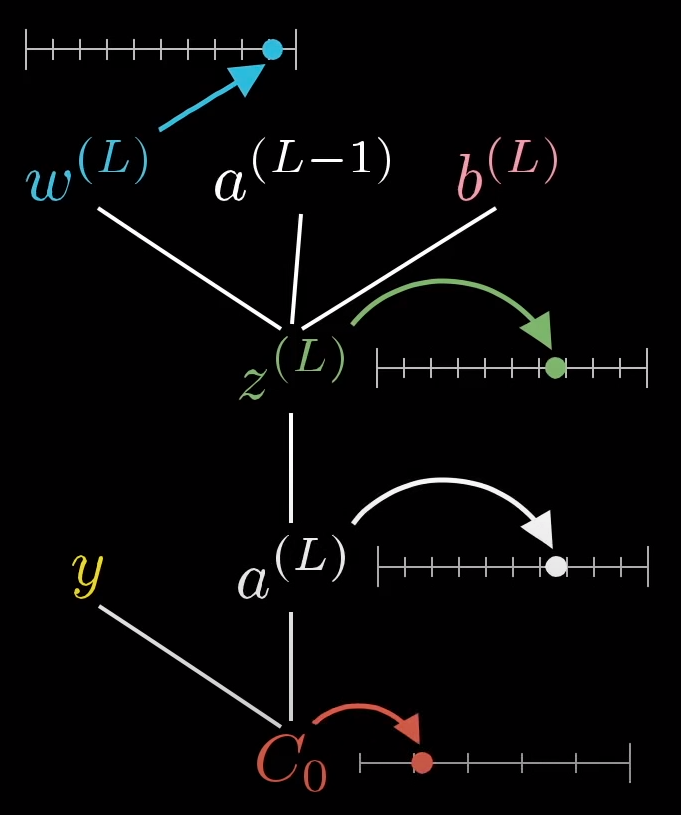
      * 4个地方都是数字，对应一个数轴
* 目标1：理解代价函数对权重w^L的微小变化敏感程度
  * 求C对W^L的偏导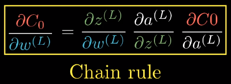
    * 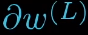可以当做对于w^L的微小扰动，比如变化0.01
    * 当做“改变w对c的值造成的变化”
    * w^L的微小变化会导致z^L产生变化，z^L变化导致对a^L产生变化，最终变化影响到代价值C
  * 逐项求导
    * 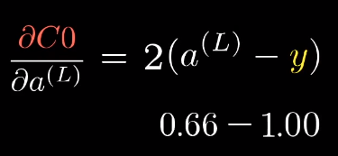
      * 导数大小与最终输出减目标结果的差成正比
    * 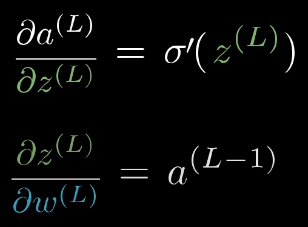
      * 权重该变量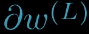对最后一层影响大小取决于前一层的激活值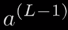
        * 一同激活的神经元关联在一起
  * 以上只是一个训练样本代价对于w^L的导数
* 总代价函数 == 所有训练样本所有代价平均
  * 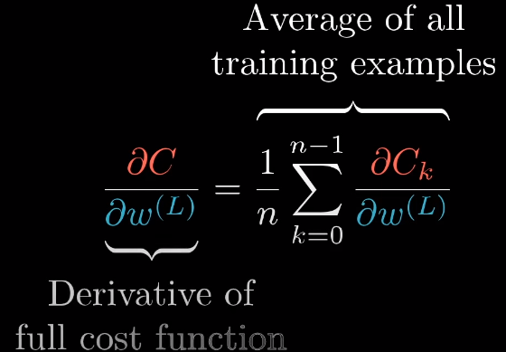
  * 这也只是梯度向量的一个分量
    * 梯度 == 代价函数对每个权重和每个偏置求偏导构成
      * 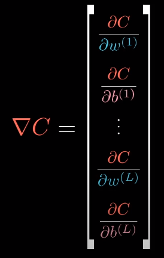

