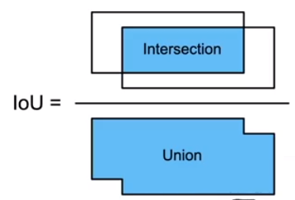
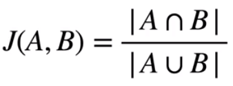
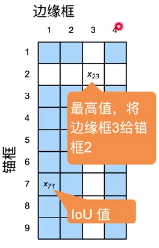
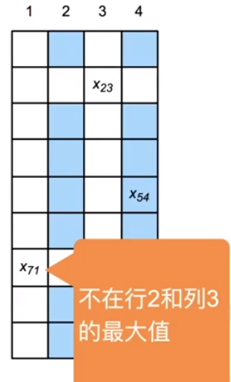
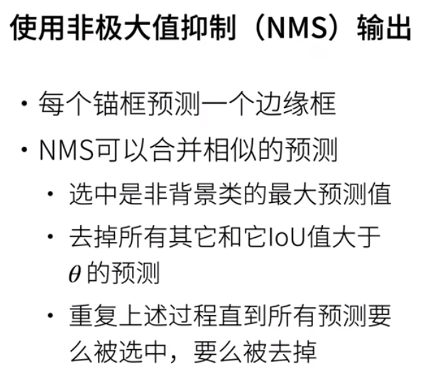
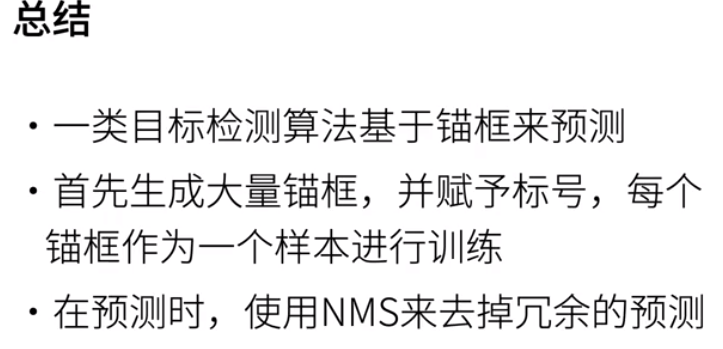

##### 锚框

* 一类目标检测算法 基于锚框
  * **提出**多个被称为锚框的区域（边缘框）
  * 预测每个锚框中是否有关注的物体
  * 如果是，预测从这个锚框到真实边缘框的偏移

##### `IoU` - 交并比

* `IoU`用来计算两个框之间的相似度
  * 0表示无重叠，1表示重合
* Jacquard 指数的特殊情况
  * 给定两个集合
  * 

##### 赋予锚框标号

* 每个锚框是一个训练样本
* 将每个锚框，要么标注成背景，要么关联一个真实边缘框
* 可能生成大量的锚框
  * 导致大量的负样本
* 
* 赋予标号过程
  * 首先有一个矩阵，初始有4个边缘框，4个物体，对应4个边缘框
  * 假设生成了9个锚框
    * 每个锚框去跟边缘框算`IoU`值
    * 算好值就直接把值填入
  * 将整个矩阵中最大的值挑出来
    * 此时是`x23`，将其边缘框3标号2
    * 锚框2就是任务：预测边缘框3的位置它的物体
  * 将该行该列删除，因为此时边缘框和锚框相似度最高
  * 
    * loop之前的步骤
  * 最后所有边缘框都至少找到一个锚框关联
* 关键点
  * 锚框固定生成
  * 边缘框属于是标号
    * 赋予锚框标号的过程是每次把图片读进去要做一次的操作
    * 1张图片进来，有9个锚框，就会有生成9个训练样本

##### 其他做法

* 