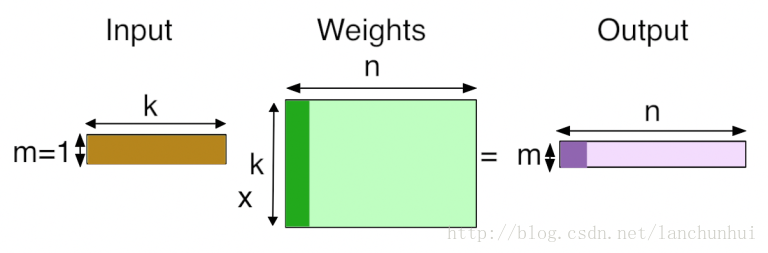
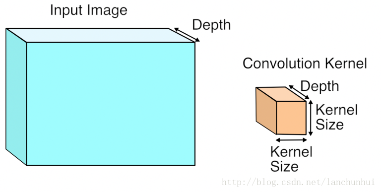
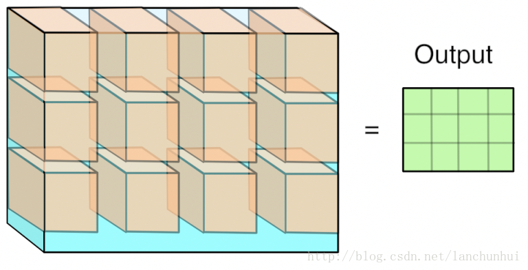
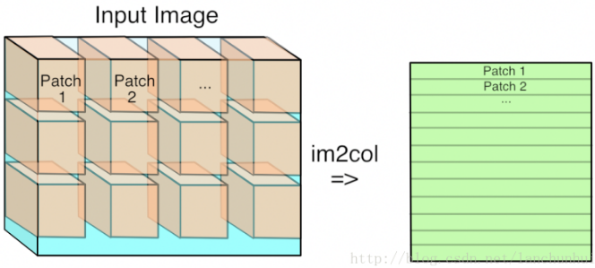
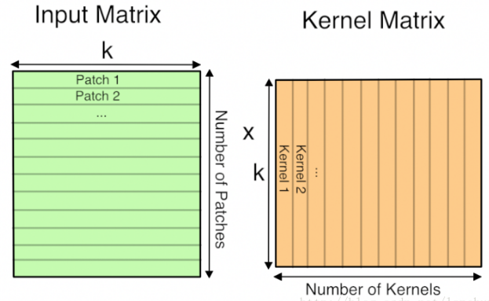

> 卷积操作中的矩阵乘法（`gemm`）-- 为什么**矩阵乘法**是**深度学习核心**

##### 全连接

* 
  * `1xk` `kxn`  `==>` `1xn`
    * `k`个选项，`n`个人来给每个选择做权重，最后计算出综合的选择期望
      * 最开始的选择权重是自己给的
      * 被周围的人影响
  * 类比矩阵乘法
    * `k`个输入
    * `n`个神经元
      * 每个神经元都会学习一组**权值向量**，和**输入**进行**内积运算**
    * `n`个输出

##### 卷积

* 对于高维（多个平面）的输入，单个卷积核的深度应和**输入**的**深度（`depth`）保持一致**
  * 
* 3 维卷积运算执行完毕，得一个 2 维的平面
  * 
  * `n` 个3维卷积核以得到 `n`个 `feature maps`

##### 卷积操作中的矩阵乘法

* 按` [kernel_height, kernel_width, kernel_depth]` ⇒ 将输入分成 3 维的 `patch`，并将其**展成一维向量**
  * 
  * 此时的卷积操作就可转化为矩阵乘法
* 

